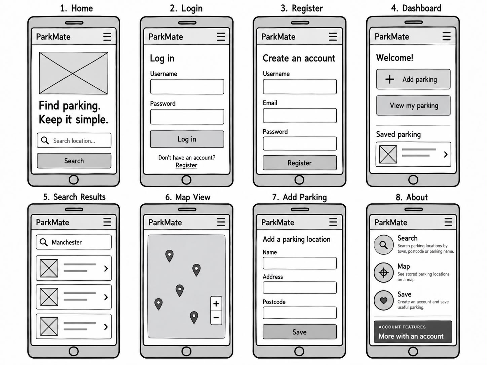
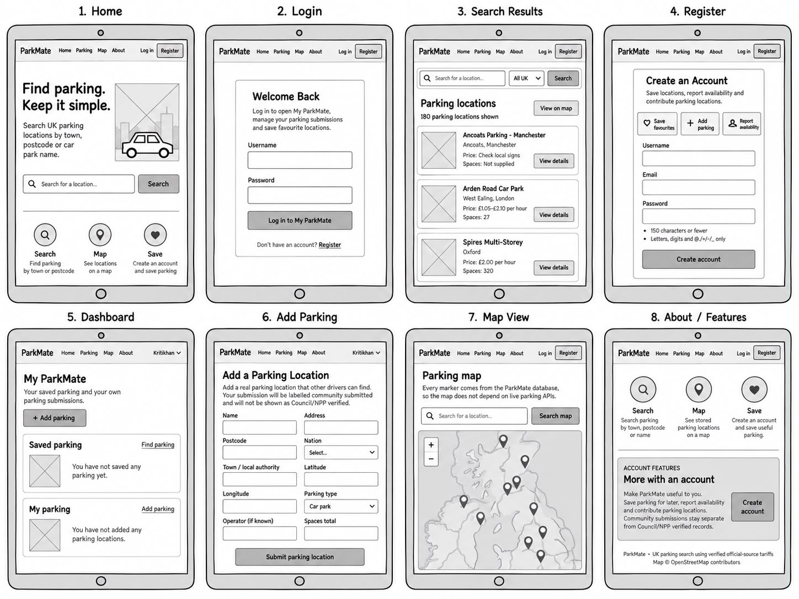
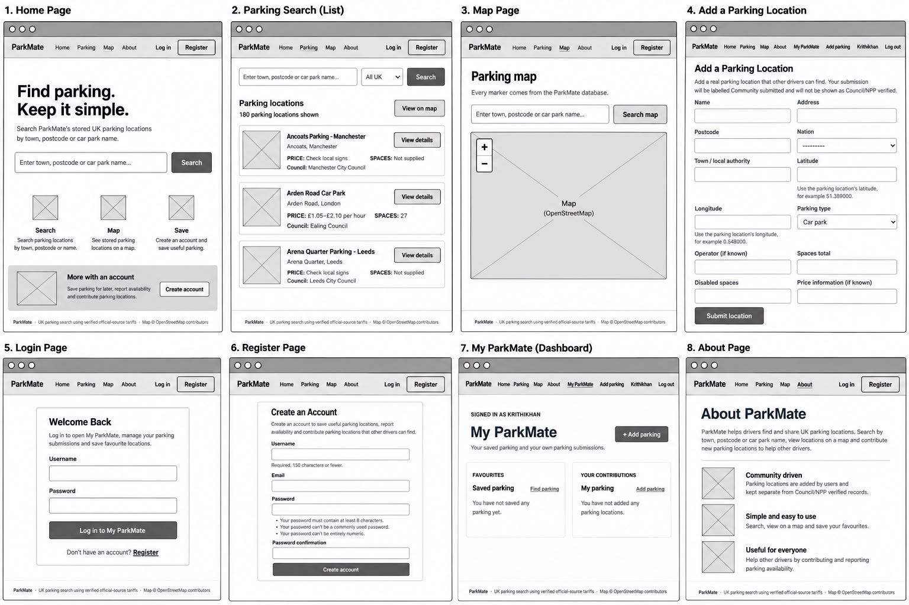

# ParkMate App

## Description

ParkMate is a web application built using Python and the Django framework for my MS3 project.

It is designed for drivers across the UK, including commuters, delivery drivers, local residents and people travelling to unfamiliar areas.

The application allows users to search parking locations stored in the ParkMate database using a town, district, postcode or parking name.

Search results are displayed using parking cards and users can also view parking locations on an interactive Leaflet map using OpenStreetMap.

Visitors can search and view parking information without creating an account.

Registered users have access to additional features including:

- saving favourite parking locations
- viewing saved parking through My ParkMate
- adding community parking locations
- editing their own parking submissions
- deleting their own parking submissions

ParkMate also separates **Council/NPP price verified** parking from **Mapped parking** so users can understand whether parking information has an official source.

## Purpose

The purpose of ParkMate is to make finding parking easier and clearer for UK drivers.

Parking information can be spread across council websites, parking provider websites and mapping services.

This can make it difficult for drivers to quickly find out:

- where a parking location is
- what it is called
- how much it costs
- how many spaces it has
- what restrictions apply
- when charges apply
- how payment works

ParkMate brings useful parking information together in one web application.

A driver can enter information they already know, such as a postcode, town or parking name, and view matching parking locations stored in the database.

Another purpose of ParkMate is to make the source of parking information clear.

Parking records that contain a suitable official council, GOV.UK or National Parking Platform source can be shown as:

**Council/NPP price verified**

Other records are shown as:

**Mapped parking**

This prevents unverified parking information from being presented as officially verified.

User accounts also have a clear purpose.

Registered users can save parking locations and contribute their own parking locations to ParkMate.

## Technologies Used

| Technology            | Use in ParkMate                                                                           |
| --------------------- | ----------------------------------------------------------------------------------------- |
| Python 3.13.15        | Runs the backend Python code                                                              |
| Django 5.2.17         | Provides routing, templates, authentication, forms, validation and database functionality |
| HTML                  | Structures the website pages                                                              |
| CSS                   | Controls the appearance and responsive layouts                                            |
| JavaScript            | Controls interactive map behaviour and parking image loading                              |
| SQLite                | Used as the local development database                                                    |
| PostgreSQL            | Supported as the production database                                                      |
| Django ORM            | Handles database queries and relationships                                                |
| Leaflet               | Displays the interactive parking map                                                      |
| OpenStreetMap         | Provides the map tiles                                                                    |
| Wikimedia Commons API | Attempts to find relevant parking and location images                                     |
| WhiteNoise            | Serves static files in production                                                         |
| Gunicorn              | Runs the Django application in production                                                 |
| dj-database-url       | Reads the production database connection                                                  |
| Heroku                | Used as the intended deployment platform                                                  |
| Git                   | Tracks changes made during development                                                    |
| GitHub                | Stores the project repository and commit history                                          |

# User Experience Design (UX)

## User Studies - Planning

User studies are used to understand whether users can complete the main ParkMate tasks without needing extra instructions.

The main tasks include:

1. Search using a UK town.
2. Search using a postcode.
3. Search using a postcode district.
4. Search using a parking name.
5. View parking results.
6. Open a parking detail page.
7. View parking on the map.
8. Identify a Council/NPP price verified parking location.
9. Identify a mapped parking location.
10. Register for an account.
11. Log in.
12. Log out.
13. Save a favourite parking location.
14. Remove a favourite.
15. Open My ParkMate.
16. Add a community parking location.
17. Edit their own parking submission.
18. Delete their own parking submission.

Feedback from these tasks is used to improve:

- navigation
- search
- forms
- buttons
- parking cards
- map usability
- responsive layouts

# Target Users

ParkMate mainly targets three groups of UK drivers:

1. Commuters
2. Drivers Attending Appointments or Events
3. Delivery Drivers

## 1. Commuters

Commuters regularly travel to work, train stations, town centres or other places of employment.

They may use ParkMate regularly and benefit from being able to save useful parking locations.

### First-Time Users

- As a first-time commuter, I want to search using a town or city so I can find parking close to where I work.
- As a first-time commuter, I want to search using a postcode so I can find parking without knowing the parking location name.
- As a first-time commuter, I want to compare parking prices so I can find a suitable option.
- As a first-time commuter, I want to view parking on a map so I can see where it is located.

### Returning Users

- As a returning commuter, I want to register for an account so I can use the personal features.
- As a returning commuter, I want to log in so I can access My ParkMate.
- As a returning commuter, I want to save useful parking locations so I can find them again.
- As a returning commuter, I want to view my favourites so I do not have to search for the same parking every time.

### Frequent Users

- As a frequent commuter, I want to quickly return to my saved parking locations.
- As a frequent commuter, I want to add a useful parking location that is missing from ParkMate.
- As a frequent commuter, I want to edit a parking location I submitted if the information needs correcting.
- As a frequent commuter, I want to delete one of my own parking submissions if it is no longer needed.

## 2. Drivers Attending Appointments or Events

These users may be travelling to an unfamiliar hospital, medical centre, event venue or town centre.

They may mainly use ParkMate when travelling somewhere they do not normally visit.

### First-Time Users

- As a first-time visitor, I want to search using the postcode of my destination so I can find nearby parking.
- As a first-time visitor, I want to view parking locations on the map so I can understand where they are.
- As a first-time visitor, I want to check parking restrictions so I know important conditions before travelling.
- As a first-time visitor, I want to see whether parking information is Council/NPP price verified so I understand where the information comes from.

### Returning Users

- As a returning visitor, I want to check parking details again before starting my journey.
- As a returning visitor, I want to check charging times so I know when parking charges apply.
- As a returning visitor, I want to check payment information so I know how the parking location accepts payment.
- As a returning visitor, I want to save a suitable parking location so I can easily find it again.

### Frequent Users

- As a frequent visitor, I want to compare different parking locations before choosing one.
- As a frequent visitor, I want to access previously saved parking from My ParkMate.
- As a frequent visitor, I want to follow an official source when one is available so I can check the original parking information.
- As a frequent visitor, I want to contribute a useful parking location if I find one that is missing from ParkMate.

## 3. Delivery Drivers

Delivery drivers regularly travel to different towns, streets and postcodes.

They may need to find parking information quickly while travelling between different areas.

### First-Time Users

- As a first-time delivery driver, I want to search using a postcode so I can quickly find parking near a delivery address.
- As a first-time delivery driver, I want to search using a town so I can see parking options in an unfamiliar area.
- As a first-time delivery driver, I want to view several parking results so I can choose a suitable location.
- As a first-time delivery driver, I want to open a parking detail page so I can check the address and restrictions.

### Returning Users

- As a returning delivery driver, I want to use the map so I can see where stored parking locations are positioned.
- As a returning delivery driver, I want to search directly for parking locations I have previously used.
- As a returning delivery driver, I want to save useful parking locations so they are easier to find later.
- As a returning delivery driver, I want to view saved locations from My ParkMate so I can access them quickly.

### Frequent Users

- As a frequent delivery driver, I want to add useful parking locations that may help other drivers.
- As a frequent delivery driver, I want to edit parking locations I personally submitted when information changes.
- As a frequent delivery driver, I want to delete one of my own parking submissions when it is no longer useful.
- As a frequent delivery driver, I want to compare verified and mapped parking records so I can understand which information has an official source.

# Research

Research is used to make sure ParkMate solves a realistic problem rather than me guessing what users may need.

Drivers may search for parking using different information.

One user may know a postcode while another user may only know:

- a town
- a district
- an address
- a parking name

Because of this, ParkMate searches different database fields including:

- parking name
- address
- postcode
- postcode area
- local authority

Official council parking information commonly contains information such as:

- prices
- spaces
- charging times
- restrictions

These types of information are stored in ParkMate where they are available.

The map is also important because location information can be easier to understand visually.

ParkMate uses Leaflet and OpenStreetMap to display parking locations stored in the database.

## Research Findings and Features

| Research Finding                                                | Evidence Source                           | ParkMate Response                                                                                               |
| --------------------------------------------------------------- | ----------------------------------------- | --------------------------------------------------------------------------------------------------------------- |
| Drivers may search using a location, postcode or parking name.  | Medway Council Car Park Directory         | ParkMate supports location, postcode and parking-name searching.                                                |
| Official parking pages provide prices and charging information. | Lewisham Council Car Parks                | ParkMate stores tariff information, charging times and official source details.                                 |
| Parking restrictions depend on signs and operating conditions.  | GOV.UK Highway Code - Waiting and Parking | Parking detail pages contain restriction information and users are reminded that mapped information can change. |
| Drivers benefit from having parking information in one place.   | GOV.UK Plan for Drivers                   | ParkMate brings different parking information together in one application.                                      |
| Interactive maps help users understand where a location is.     | Leaflet Documentation                     | ParkMate uses a Leaflet map with OpenStreetMap tiles.                                                           |

## Competitor Research

I look at other parking and mapping services to understand what users already expect from this type of website.

The main examples include:

- Parkopedia
- JustPark
- RingGo
- council parking websites
- OpenStreetMap

## Parkopedia

Parkopedia allows users to search for parking and compare information about different locations.

Useful ideas include:

- location searching
- clear parking information
- parking maps
- simple comparison of parking locations

## JustPark

JustPark focuses on finding and booking parking.

Useful design ideas include:

- clear search
- location-based results
- simple parking cards
- easy-to-understand parking information

ParkMate does not include parking booking because this is outside the scope of the project.

## RingGo

RingGo focuses more on parking payments and parking sessions.

It shows that drivers value:

- clear location information
- parking prices
- simple mobile interfaces

ParkMate does not process parking payments.

## Council Parking Websites

Council parking websites are important because they can provide official information including:

- car park names
- tariffs
- charging hours
- parking spaces
- restrictions

Official council information is useful when deciding whether a ParkMate record can be shown as Council/NPP price verified.

## OpenStreetMap

OpenStreetMap provides geographic map information.

ParkMate uses OpenStreetMap tiles through Leaflet to create the interactive parking map.

## Competitor Research Conclusion

The competitor research shows that the most useful features for ParkMate are:

- search
- map
- price information
- parking details
- clear parking cards

ParkMate remains smaller than large commercial parking services.

Features such as:

- booking
- payment
- guaranteed live parking availability

are not included in the current project.

# Strategy

The Strategy plane defines what ParkMate is trying to achieve, who the website is for and what problems it needs to solve.

## Target Audience

The target audience is UK drivers including:

- commuters
- delivery drivers
- local residents
- drivers attending appointments
- drivers attending events
- people travelling to unfamiliar locations

Visitors can use the main parking search without creating an account.

Accounts are mainly used for additional personal features.

## Content

The main parking content includes:

- parking name
- address
- postcode
- local authority
- price
- parking spaces
- disabled spaces
- charging times
- restrictions
- operator
- payment information
- verification
- official source
- parking image
- map location

Account content includes:

- registration
- login
- logout
- favourites
- My ParkMate
- personal parking submissions

## Problems and Solutions

| Problem                                                        | ParkMate Solution                                    |
| -------------------------------------------------------------- | ---------------------------------------------------- |
| Parking information can be spread across several websites.     | ParkMate brings useful parking information together. |
| A user may only know a postcode.                               | ParkMate supports postcode searching.                |
| A user may only know the town or area.                         | ParkMate searches location-related database fields.  |
| Users may not know where parking is.                           | Parking locations are displayed on a map.            |
| Users may not know whether information has an official source. | ParkMate shows verification labels.                  |
| Users may want to remember a useful location.                  | Registered users can save favourites.                |
| Useful parking may be missing.                                 | Registered users can add community parking.          |
| Users should not change another person's parking record.       | Ownership checks restrict editing and deleting.      |
| A parking image may fail to load.                              | ParkMate uses a local fallback image.                |

## Business Goals

The main goals of ParkMate are to:

- solve a realistic parking problem
- create a full-stack Django project
- demonstrate Python
- demonstrate relational database functionality
- demonstrate CRUD
- use authentication
- provide responsive design
- provide interactive map functionality
- provide useful search functionality
- make parking information easier to understand
- create a project that is realistic for MS3

## User Needs

Users need to:

- search quickly
- search without registering
- search using different information
- compare parking
- view parking details
- view parking on a map
- understand parking verification
- use the website on different devices
- save favourite parking
- add community parking
- manage their own submissions

# Scope

The Scope plane defines the features that are included in ParkMate.

I keep the scope focused on the main parking problem instead of adding features that are not needed for the project.

## Minimum Viable Product (MVP)

The MVP contains:

- parking search
- postcode search
- parking result cards
- parking detail pages
- Leaflet map
- OpenStreetMap
- parking prices
- parking restrictions
- verification status
- registration
- login
- logout
- My ParkMate
- favourites
- community parking
- CRUD
- responsive design

## Features

### Parking Search

Users can search using:

- parking name
- address
- postcode
- postcode district or area
- local authority

### Parking Results

Results can display:

- parking name
- address
- postcode
- price
- spaces
- local authority
- verification
- image
- detail-page link

### Parking Details

Parking details can display:

- name
- address
- postcode
- tariff information
- total spaces
- charging times
- operator
- restrictions
- payment information
- official source
- parking image

### Interactive Map

The map uses:

- Leaflet
- OpenStreetMap
- parking coordinates stored in the database

Map markers are created from parking records stored in ParkMate.

### Parking Images

Parking images can come from:

1. a stored parking image URL
2. Wikimedia Commons
3. a local fallback image

### Accounts

Accounts include:

- registration
- login
- logout
- authenticated pages

### My ParkMate

My ParkMate gives registered users access to:

- favourite parking
- their own parking submissions

### Favourites

Registered users can:

- save a parking location
- remove a favourite
- view saved parking

### Community Parking

Registered users can add community parking locations.

Community parking is not automatically marked as Council/NPP price verified.

## CRUD Functionality

ParkMate demonstrates all four CRUD operations.

| CRUD Operation | ParkMate Function                                            |
| -------------- | ------------------------------------------------------------ |
| **Create**     | A registered user adds a parking location.                   |
| **Read**       | Users search and view parking locations.                     |
| **Update**     | A user edits a parking location they personally submitted.   |
| **Delete**     | A user deletes a parking location they personally submitted. |

Ownership checks stop normal users from editing or deleting parking records submitted by somebody else.

## Functional Requirements

ParkMate needs to:

- accept parking searches
- search several database fields
- return matching results
- display parking cards
- display parking detail pages
- display parking locations on the map
- allow registration
- allow login
- allow logout
- protect account-only pages
- save favourites
- remove favourites
- display favourites
- allow parking locations to be added
- allow owners to edit parking
- allow owners to delete parking
- validate parking forms
- display verification information
- display a fallback image when required

## Non-Functional Requirements

ParkMate also needs to:

- work on mobile
- work on tablet
- work on desktop
- be easy to navigate
- use readable text
- have consistent buttons
- have consistent parking cards
- use secure authentication
- protect forms
- validate user input
- stop unauthorised editing
- use suitable colour contrast
- load static files correctly
- work when deployed

## Further Developments

Possible future improvements include:

- adding more parking records
- adding more Council/NPP verified records
- improving parking image matching
- adding more search filters
- increasing automated test coverage
- completing the availability-reporting workflow

Features that are outside the current project scope include:

- parking booking
- parking payments
- guaranteed live parking-space information

# Python and Django Files

ParkMate will use several Python and Django files because Django will separate different parts of the application into different files.

Each file will have its own purpose, which will make the project easier to organise, understand and maintain.

Instead of placing all backend logic in one Python file, ParkMate will separate:

- project settings
- URL routing
- database models
- backend logic
- forms
- validation
- tests
- deployment configuration
- database migrations
- custom management commands

## Python and Django File Functions

| File                               | Function in ParkMate                                                                                                                                                                               |
| ---------------------------------- | -------------------------------------------------------------------------------------------------------------------------------------------------------------------------------------------------- |
| `manage.py`                        | This file will be used to run Django commands from the terminal. It will allow me to start the development server, apply migrations, run tests and use custom management commands.                 |
| `parkmate/settings.py`             | This file will contain the main Django settings. It will control the installed apps, database, static files, security settings, allowed hosts and deployment configuration.                        |
| `parkmate/urls.py`                 | This file will contain the main project URL configuration and will connect the project to the parking app URLs and Django authentication URLs.                                                     |
| `parking/urls.py`                  | This file will contain the ParkMate page routes. It will connect URLs such as Home, Parking, Map, My ParkMate, Add, Edit and Delete to the correct views.                                          |
| `parking/models.py`                | This file will define the database models used by ParkMate. It will contain the structure for parking locations, favourites and availability reports.                                              |
| `parking/views.py`                 | This file will contain most of the backend logic. It will process searches, retrieve parking data, display pages, handle favourites, manage user parking submissions and enforce ownership checks. |
| `parking/forms.py`                 | This file will define Django forms. It will collect and validate user input when parking records are created or edited.                                                                            |
| `parking/admin.py`                 | This file will register the database models with Django Admin so authorised staff can manage stored records.                                                                                       |
| `parking/apps.py`                  | This file will contain the configuration for the parking Django application.                                                                                                                       |
| `parking/tests.py`                 | This file will contain automated tests for important ParkMate functionality.                                                                                                                       |
| `parking/error_handlers.py`        | This file will contain custom error-handling functions used when ParkMate displays error pages.                                                                                                    |
| `parkmate/wsgi.py`                 | This file will provide the WSGI entry point used by Gunicorn when ParkMate is deployed.                                                                                                            |
| `parkmate/asgi.py`                 | This file will provide Django's ASGI application configuration.                                                                                                                                    |
| `__init__.py`                      | These files will allow Python to recognise the folders as Python packages.                                                                                                                         |
| `parking/migrations/*.py`          | These files will record changes to the database structure when models or fields are changed.                                                                                                       |
| `parking/management/commands/*.py` | These files will contain custom Django terminal commands such as the command used to seed parking records.                                                                                         |

## Main Files I Will Work With

### `models.py`

`models.py` will define the structure of the database.

It will contain models including:

- `ParkingLocation`
- `Favourite`
- `AvailabilityReport`

The models will define what information is stored and how database records are connected.

### `views.py`

`views.py` will contain much of the main application logic.

It will be responsible for:

- processing parking searches
- handling postcode-area searches
- retrieving parking records
- displaying parking results
- displaying parking details
- displaying the map
- handling favourites
- handling My ParkMate
- creating parking records
- editing parking records
- deleting parking records
- checking whether the signed-in user owns a submission

### `forms.py`

`forms.py` will control the forms used by ParkMate.

It will be used for:

- adding parking
- editing parking
- validating submitted information
- preventing invalid data from being saved

### `urls.py`

The URL files will decide which view opens when a user visits a particular address.

They will connect routes for:

- home
- parking list
- parking details
- parking map
- My ParkMate
- registration
- adding parking
- editing parking
- deleting parking
- favourites

### `tests.py`

`tests.py` will contain automated tests.

The tests will help check:

- parking search
- authentication
- favourites
- Create functionality
- Read functionality
- Update functionality
- Delete functionality
- ownership protection

## Django Generated Files

Some Python files will be created automatically when the Django project or application is created.

These include:

- `apps.py`
- `asgi.py`
- `wsgi.py`
- `__init__.py`

Migration files will also be generated by Django when the database structure changes.

These files will still be important to ParkMate even though much of their starting content will be generated automatically.

## Why ParkMate Will Use Several Python Files

ParkMate will use more Python files than a small standalone Python program because Django will follow a structured project layout.

Separating the code will make it easier to understand where different functionality belongs.

For example:

- database code will go in `models.py`
- page and backend logic will go in `views.py`
- form logic will go in `forms.py`
- routes will go in `urls.py`
- automated tests will go in `tests.py`
- configuration will go in `settings.py`

This structure will make ParkMate easier to manage as the project develops.

# Structure

The Structure plane defines how the different pages and features connect together.

## Information Architecture

```text
ParkMate
│
├── Home
│   └── Main Search
│
├── Parking
│   ├── Search Results
│   └── Parking Detail
│
├── Map
│   ├── Map Search
│   └── Parking Markers
│
├── Account
│   ├── Register
│   ├── Login
│   └── Logout
│
└── My ParkMate
    ├── Favourites
    └── My Parking
        ├── Add
        ├── Edit
        └── Delete
```

## Logical Organisation

The main feature is parking search, so it is kept easy to reach.

The normal user journey is:

1. Search
2. View results
3. Select parking
4. View details

The map provides another way to view stored parking locations.

Account features are kept separate because visitors do not need an account to search for parking.

## User Flow

### Visitor Flow

```text
Home
 ↓
Search
 ↓
Parking Results
 ↓
Parking Detail
```

### Map Flow

```text
Map
 ↓
Search / View Markers
 ↓
Select Parking
 ↓
View Parking Information
```

### Account Flow

```text
Register
 ↓
Login
 ↓
My ParkMate
```

### Favourite Flow

```text
Parking
 ↓
Save Favourite
 ↓
My ParkMate
 ↓
Saved Parking
```

### CRUD Flow

```text
Login
 ↓
My ParkMate
 ↓
My Parking
 ↓
Add / Edit / Delete
```

# Skeleton
ParkMate follows a mobile-first approach.


## Mobile Wireframes


## Tablet Wireframes



## Desktop Wireframes


## Design Decisions

The main design decisions are:

- search is kept easy to find
- parking cards use a consistent layout
- navigation stays consistent
- verified, mapped and community parking are visually separated
- forms are kept simple
- buttons are easy to recognise
- delete actions are clearly separated from normal actions
- users do not need an account to search
- map controls remain familiar
- layouts work across different screen sizes


# Surface

## Colour

### How I Choose the Colours

I first thought about what suits a parking and navigation website and then looked at existing design guidance to see how colours are used for different types of information.

I looked at the GOV.UK Design System because it is designed for clear public-facing digital services. One thing I noticed is that colours are given clear purposes. Green is used for positive or success information, red is used for errors and dark text is used against light backgrounds to keep information easy to read.


For ParkMate itself, I choose navy as the main navigation colour because I want the website to have a professional and trustworthy appearance. I use green for the main actions because it stands out clearly against the navy and white backgrounds. I use white and light grey for the main content because I want parking cards and information to remain easy to scan.

I then use blue for mapped parking because it makes it clearly different from verified parking. Red is kept for errors and delete actions so it is not confused with normal actions.

The exact colour shades are my own ParkMate colour choices. The external research mainly helps me decide how the colours are used.


### Colour Research Evidence

| Evidence Source | What I Find | How I Use It in ParkMate |
| --- | --- | --- |
| GOV.UK Design System - Colour | Colours are given specific purposes and the guidance includes success, error, text, background and interactive colours. | This supports my use of green for positive/verified information and red for destructive or error information. |
| GOV.UK Design System - Colour Contrast | Text and interactive elements need enough contrast against their backgrounds. | I will use dark text on white/light backgrounds and white text on the dark navy navigation. |
| Department for Education Design System - Typography | The DfE uses Inter for digital services and describes it as suitable for readable digital interfaces. | This supports my choice of Inter as the preferred ParkMate typeface. |
| GOV.UK Design System - Type Scale | Typography changes depending on screen size and uses a clear hierarchy. | ParkMate will use a responsive font sizes and different sizes for headings, supporting information and labels. |


### Main ParkMate Colour Palette

These are the main colour variables that will be used in my ParkMate CSS:

| CSS Variable | Colour | Use |
| --- | --- | --- |
| `--navy` | `#072742` | Main navigation and dark branded areas |
| `--navy-2` | `#0B3557` | Secondary navy shade |
| `--green` | `#13A957` | Main buttons and primary actions |
| `--green-dark` | `#0C8543` | Hover states and smaller green highlights |
| `--green-soft` | `#E8F7EE` | Soft green status backgrounds |
| `--ink` | `#0E2235` | Main text |
| `--muted` | `#63717F` | Secondary text |
| `--line` | `#DFE6EB` | Borders and dividers |
| `--page` | `#F7F9FA` | Main page background |
| `--card` | `#FFFFFF` | Cards and content panels |
| `--danger` | `#DE342D` | Delete and destructive actions |
| `--danger-soft` | `#FFE9E7` | Error and delete-warning backgrounds |
| `--info-soft` | `#E9F4FF` | Informational message backgrounds |


### Navigation Colours

The navigation uses:

```css
background: linear-gradient(100deg, #072742, #082C4A);
```

I use a darker navigation because it clearly separates the header from the lighter page content.

The normal navigation text uses:

```text
#FFFFFF
```

The **Mate** part of the ParkMate brand uses:

```text
#37D77A
```

The navigation hover colour is:

```text
#70E8A0
```

I use the brighter green on the ParkMate name and hover states because it gives the website a small branded highlight without making the whole header too bright.


### Button Colours

The main buttons use a green gradient:

```css
linear-gradient(#19B85F, #0D9B4D)
```

The main green CSS variable is:

```text
#13A957
```

The darker hover colour is:

```text
#0C8543
```

I use green for the main actions because I want actions such as searching, viewing details and submitting forms to stand out from the normal page content.


### Verified Parking Colours

Council/NPP price verified information uses a soft green background:

```text
#E8F7EE
```

with darker green text:

```text
#08753A
```

The verified map marker also uses:

```text
#19B77D
```

with a darker border:

```text
#075B3E
```

I use green because I want verified information to be easy to identify as a positive status.

The written verification label is still shown so the user does not need to rely only on colour.


### Mapped Parking Colours

Mapped parking uses:

```text
#E8F3FF
```

for the light background and:

```text
#174F91
```

for the text.

Mapped map markers use:

```text
#5AA6EF
```

with:

```text
#174F91
```

as the darker border.

Some mapped parking sections also use:

```text
#397FC1
```

as the blue accent.

I use blue because it is clearly different from the green used for verified parking.


### Community Parking Colours

Community-submitted parking uses amber colours including:

```text
#D99A32
```

for the accent and:

```text
#FFF8EC
```

for a light background.

Darker community text uses:

```text
#6D4200
```

I use amber because community submissions need to look different from both verified and mapped parking.


### Availability Status Colours

The project also contains styles for availability statuses.

Available:

```text
Background: #E5F7EC
Text: #08753A
```

Busy:

```text
Background: #FFF4D6
Text: #7E5C00
```

Full:

```text
Background: #FFE6E4
Text: #A62720
```

Neutral:

```text
Background: #EDF2F5
Text: #506473
```

These status colours are designed to make different states visually clear.


### Colour Scheme

The final ParkMate design will mainly use navy, green, white and light grey.

I will use navy for the navigation because it gives the website a strong and professional appearance.

Green is used for main actions and verified information because it stands out clearly from the navy and light backgrounds.

White and light grey are used for most of the content because I want parking cards and information to be easy to read.

Blue is used for mapped parking and amber is used for community parking so these types of records remain visually different.

Red is mainly kept for errors and destructive actions.


## Typography

### Research

For typography, I want ParkMate to be easy to read rather than using decorative fonts.

I look at the Department for Education Design System as an example of a public digital service that uses Inter. It uses Inter for digital products because it works well for readable interfaces across different screen sizes.

I also look at the GOV.UK type scale. It uses a clear hierarchy between headings and normal text and changes sizes depending on the screen width.

This influences my decision to use a simple sans-serif font stack and responsive heading sizes.


### Typography Research Evidence

| Evidence Source | What I Find | How I Use It in ParkMate |
| --- | --- | --- |
| Department for Education Design System - Typography | Inter is used as a digital typeface for DfE services. | I set Inter as the first font in my ParkMate font stack. |
| GOV.UK Design System - Type Scale | Different sizes and line heights create a clear text hierarchy. | ParkMate uses larger headings and smaller supporting information. |
| GOV.UK Design System - Responsive Type Scale | Font sizes change depending on screen size. | ParkMate uses `clamp()` for important headings. |
| W3C Accessibility Guidance | Text needs to remain readable and understandable. | I keep the typography simple and avoid using lots of different fonts. |

### Typography chosen

The main typography used in ParkMate is:

```css
font-family: Inter, ui-sans-serif, -apple-system, BlinkMacSystemFont, "Segoe UI", sans-serif;
```

I choose a sans-serif font style because ParkMate is mainly an information and search website.

I want users to be able to quickly scan parking names, prices, addresses and restrictions without decorative text getting in the way.

`Inter` is set as my preferred font.

The CSS also contains system font fallbacks:

- `ui-sans-serif`
- `-apple-system`
- `BlinkMacSystemFont`
- `"Segoe UI"`
- `sans-serif`

This means if Inter is not available on the device, the browser can use the next suitable system font.


### ParkMate Brand

The ParkMate brand uses:

```css
font-size: 1.35rem;
font-weight: 800;
letter-spacing: -0.03em;
```

I use a heavier weight for the ParkMate name because I want it to stand out from the navigation links.


### Main Home Heading

The main heading uses:

```css
font-size: clamp(3rem, 6vw, 5.2rem);
line-height: 0.98;
letter-spacing: -0.055em;
```

I use a large heading because it is the first text I want users to notice.

I use `clamp()` so the size can change depending on the screen width.


### Supporting Home Text

The supporting paragraph uses:

```css
font-size: 1.08rem;
```

This keeps it smaller than the main heading while still making the description easy to read.


### Navigation

Navigation links use:

```css
font-size: 0.9rem;
font-weight: 600;
```

I keep the navigation clear without making it compete with the main page headings.


### Parking Result Names

Parking result names use:

```css
font-size: 1.12rem;
```

The parking name is made larger than secondary information because this is one of the first things the user needs to identify.


### Supporting Parking Information

Smaller parking information uses font sizes such as:

```css
font-size: 0.82rem;
```

and:

```css
font-size: 0.84rem;
```

This is used for information that is useful but not as important as the parking name.


### Parking Detail Heading

The detail heading uses:

```css
font-size: clamp(2rem, 4vw, 3.1rem);
letter-spacing: -0.035em;
```

This makes the selected parking location clear while still allowing the heading to resize.


### Labels

Small labels use:

```css
font-size: 0.75rem;
font-weight: 800;
text-transform: uppercase;
letter-spacing: 0.08em;
```

I use uppercase labels and a heavier weight to separate small status information from normal paragraph text.


### Buttons

Buttons use:

```css
font-weight: 750;
```

I use a heavier button weight because important actions need to look clickable and stand out from normal text.

