# ParkMate App

## Description

ParkMate is a web application built using Python and the Django framework for my MS3 project.

It is designed for drivers across the UK, including commuters, delivery drivers, local residents and people travelling to unfamiliar areas.

The application allows users to search parking locations stored in the ParkMate database using a town, district, postcode or parking name.

Search results are displayed using parking cards and users can also view parking locations on an interactive Leaflet map using OpenStreetMap.

Visitors can search and view parking information without creating an account.

Registered users have access to additional features including:

- saving favourite parking locations
- viewing saved parking through My ParkMate
- adding community parking locations
- editing their own parking submissions
- deleting their own parking submissions

ParkMate also separates **Council/NPP price verified** parking from **Mapped parking** so users can understand whether parking information has an official source.

## Purpose

The purpose of ParkMate is to make finding parking easier and clearer for UK drivers.

Parking information can be spread across council websites, parking provider websites and mapping services.

This can make it difficult for drivers to quickly find out:

- where a parking location is
- what it is called
- how much it costs
- how many spaces it has
- what restrictions apply
- when charges apply
- how payment works

ParkMate brings useful parking information together in one web application.

A driver can enter information they already know, such as a postcode, town or parking name, and view matching parking locations stored in the database.

Another purpose of ParkMate is to make the source of parking information clear.

Parking records that contain a suitable official council, GOV.UK or National Parking Platform source can be shown as:

**Council/NPP price verified**

Other records are shown as:

**Mapped parking**

This prevents unverified parking information from being presented as officially verified.

User accounts also have a clear purpose.

Registered users can save parking locations and contribute their own parking locations to ParkMate.

## Technologies Used

| Technology            | Use in ParkMate                                                                           |
| --------------------- | ----------------------------------------------------------------------------------------- |
| Python 3.13.15        | Runs the backend Python code                                                              |
| Django 5.2.17         | Provides routing, templates, authentication, forms, validation and database functionality |
| HTML                  | Structures the website pages                                                              |
| CSS                   | Controls the appearance and responsive layouts                                            |
| JavaScript            | Controls interactive map behaviour and parking image loading                              |
| SQLite                | Used as the local development database                                                    |
| PostgreSQL            | Supported as the production database                                                      |
| Django ORM            | Handles database queries and relationships                                                |
| Leaflet               | Displays the interactive parking map                                                      |
| OpenStreetMap         | Provides the map tiles                                                                    |
| Wikimedia Commons API | Attempts to find relevant parking and location images                                     |
| WhiteNoise            | Serves static files in production                                                         |
| Gunicorn              | Runs the Django application in production                                                 |
| dj-database-url       | Reads the production database connection                                                  |
| Heroku                | Used as the intended deployment platform                                                  |
| Git                   | Tracks changes made during development                                                    |
| GitHub                | Stores the project repository and commit history                                          |

# Deployment

## Live Site

The deployed version of ParkMate can be viewed here:

[View the live ParkMate application](https://parkmate-4d1d2b372f8e.herokuapp.com/)

ParkMate was deployed using **Heroku** so that the final Django application could be accessed online.

ParkMate was deployed using **Heroku** so that the final Django application could be accessed online.

## Heroku Deployment

The following steps were used to deploy the project:

1. Create a new application on [Heroku](https://www.heroku.com/).

2. Connect the Heroku application to the GitHub repository containing the ParkMate project.

3. Add a PostgreSQL database for the deployed application. Heroku provides the database connection through the `DATABASE_URL` environment variable.

4. In **Heroku → Settings → Config Vars**, add the required environment variables for the project. Sensitive information, such as the Django secret key and database credentials, should be stored as environment variables rather than committed to GitHub.

5. Ensure that all required Python packages are included in the `requirements.txt` file.

6. ParkMate uses a `Procfile` in the root directory of the project to tell Heroku how to run the Django application:

    ```text
    web: gunicorn parkmate.wsgi:application
    ```

7. The Django settings are configured to use the Heroku `DATABASE_URL` when the application is running in the deployed environment.

8. WhiteNoise is used to manage and serve static files in the deployed application.

9. Push the latest version of the project to GitHub.

10. From Heroku, deploy the application using the connected GitHub repository.

11. After deployment, run the Django migrations so that the production database contains the required database tables:

    ```bash
    python manage.py migrate
    ```

12. Open the deployed application and test the live version to ensure that it works correctly and matches the development version.

The deployed application was checked to ensure that navigation, authentication, parking searches, database functionality, forms, static files and the interactive map worked correctly.

## Updating the Deployment

When changes are made to ParkMate, the changes are committed and pushed to GitHub. The latest version can then be deployed through Heroku so that the live application contains the most recent updates.


# User Experience Design (UX)

## User Studies - Planning

User studies are used to understand whether users can complete the main ParkMate tasks without needing extra instructions.

The main tasks include:

1. Search using a UK town.
2. Search using a postcode.
3. Search using a postcode district.
4. Search using a parking name.
5. View parking results.
6. Open a parking detail page.
7. View parking on the map.
8. Identify a Council/NPP price verified parking location.
9. Identify a mapped parking location.
10. Register for an account.
11. Log in.
12. Log out.
13. Save a favourite parking location.
14. Remove a favourite.
15. Open My ParkMate.
16. Add a community parking location.
17. Edit their own parking submission.
18. Delete their own parking submission.

Feedback from these tasks is used to improve:

- navigation
- search
- forms
- buttons
- parking cards
- map usability
- responsive layouts

# Target Users

ParkMate mainly targets three groups of UK drivers:

1. Commuters
2. Drivers Attending Appointments or Events
3. Delivery Drivers

## 1. Commuters

Commuters regularly travel to work, train stations, town centres or other places of employment.

They may use ParkMate regularly and benefit from being able to save useful parking locations.

### First-Time Users

- As a first-time commuter, I want to search using a town or city so I can find parking close to where I work.
- As a first-time commuter, I want to search using a postcode so I can find parking without knowing the parking location name.
- As a first-time commuter, I want to compare parking prices so I can find a suitable option.
- As a first-time commuter, I want to view parking on a map so I can see where it is located.

### Returning Users

- As a returning commuter, I want to register for an account so I can use the personal features.
- As a returning commuter, I want to log in so I can access My ParkMate.
- As a returning commuter, I want to save useful parking locations so I can find them again.
- As a returning commuter, I want to view my favourites so I do not have to search for the same parking every time.

### Frequent Users

- As a frequent commuter, I want to quickly return to my saved parking locations.
- As a frequent commuter, I want to add a useful parking location that is missing from ParkMate.
- As a frequent commuter, I want to edit a parking location I submitted if the information needs correcting.
- As a frequent commuter, I want to delete one of my own parking submissions if it is no longer needed.

## 2. Drivers Attending Appointments or Events

These users may be travelling to an unfamiliar hospital, medical centre, event venue or town centre.

They may mainly use ParkMate when travelling somewhere they do not normally visit.

### First-Time Users

- As a first-time visitor, I want to search using the postcode of my destination so I can find nearby parking.
- As a first-time visitor, I want to view parking locations on the map so I can understand where they are.
- As a first-time visitor, I want to check parking restrictions so I know important conditions before travelling.
- As a first-time visitor, I want to see whether parking information is Council/NPP price verified so I understand where the information comes from.

### Returning Users

- As a returning visitor, I want to check parking details again before starting my journey.
- As a returning visitor, I want to check charging times so I know when parking charges apply.
- As a returning visitor, I want to check payment information so I know how the parking location accepts payment.
- As a returning visitor, I want to save a suitable parking location so I can easily find it again.

### Frequent Users

- As a frequent visitor, I want to compare different parking locations before choosing one.
- As a frequent visitor, I want to access previously saved parking from My ParkMate.
- As a frequent visitor, I want to follow an official source when one is available so I can check the original parking information.
- As a frequent visitor, I want to contribute a useful parking location if I find one that is missing from ParkMate.

## 3. Delivery Drivers

Delivery drivers regularly travel to different towns, streets and postcodes.

They may need to find parking information quickly while travelling between different areas.

### First-Time Users

- As a first-time delivery driver, I want to search using a postcode so I can quickly find parking near a delivery address.
- As a first-time delivery driver, I want to search using a town so I can see parking options in an unfamiliar area.
- As a first-time delivery driver, I want to view several parking results so I can choose a suitable location.
- As a first-time delivery driver, I want to open a parking detail page so I can check the address and restrictions.

### Returning Users

- As a returning delivery driver, I want to use the map so I can see where stored parking locations are positioned.
- As a returning delivery driver, I want to search directly for parking locations I have previously used.
- As a returning delivery driver, I want to save useful parking locations so they are easier to find later.
- As a returning delivery driver, I want to view saved locations from My ParkMate so I can access them quickly.

### Frequent Users

- As a frequent delivery driver, I want to add useful parking locations that may help other drivers.
- As a frequent delivery driver, I want to edit parking locations I personally submitted when information changes.
- As a frequent delivery driver, I want to delete one of my own parking submissions when it is no longer useful.
- As a frequent delivery driver, I want to compare verified and mapped parking records so I can understand which information has an official source.

# Research

Research is used to make sure ParkMate solves a realistic problem rather than me guessing what users may need.

Drivers may search for parking using different information.

One user may know a postcode while another user may only know:

- a town
- a district
- an address
- a parking name

Because of this, ParkMate searches different database fields including:

- parking name
- address
- postcode
- postcode area
- local authority

Official council parking information commonly contains information such as:

- prices
- spaces
- charging times
- restrictions

These types of information are stored in ParkMate where they are available.

The map is also important because location information can be easier to understand visually.

ParkMate uses Leaflet and OpenStreetMap to display parking locations stored in the database.

## Research Findings and Features

| Research Finding                                                | Evidence Source                           | ParkMate Response                                                                                               |
| --------------------------------------------------------------- | ----------------------------------------- | --------------------------------------------------------------------------------------------------------------- |
| Drivers may search using a location, postcode or parking name.  | Medway Council Car Park Directory         | ParkMate supports location, postcode and parking-name searching.                                                |
| Official parking pages provide prices and charging information. | Lewisham Council Car Parks                | ParkMate stores tariff information, charging times and official source details.                                 |
| Parking restrictions depend on signs and operating conditions.  | GOV.UK Highway Code - Waiting and Parking | Parking detail pages contain restriction information and users are reminded that mapped information can change. |
| Drivers benefit from having parking information in one place.   | GOV.UK Plan for Drivers                   | ParkMate brings different parking information together in one application.                                      |
| Interactive maps help users understand where a location is.     | Leaflet Documentation                     | ParkMate uses a Leaflet map with OpenStreetMap tiles.                                                           |

## Competitor Research

I look at other parking and mapping services to understand what users already expect from this type of website.

The main examples include:

- Parkopedia
- JustPark
- RingGo
- council parking websites
- OpenStreetMap

## Parkopedia

Parkopedia allows users to search for parking and compare information about different locations.

Useful ideas include:

- location searching
- clear parking information
- parking maps
- simple comparison of parking locations

## JustPark

JustPark focuses on finding and booking parking.

Useful design ideas include:

- clear search
- location-based results
- simple parking cards
- easy-to-understand parking information

ParkMate does not include parking booking because this is outside the scope of the project.

## RingGo

RingGo focuses more on parking payments and parking sessions.

It shows that drivers value:

- clear location information
- parking prices
- simple mobile interfaces

ParkMate does not process parking payments.

## Council Parking Websites

Council parking websites are important because they can provide official information including:

- car park names
- tariffs
- charging hours
- parking spaces
- restrictions

Official council information is useful when deciding whether a ParkMate record can be shown as Council/NPP price verified.

## OpenStreetMap

OpenStreetMap provides geographic map information.

ParkMate uses OpenStreetMap tiles through Leaflet to create the interactive parking map.

## Competitor Research Conclusion

The competitor research shows that the most useful features for ParkMate are:

- search
- map
- price information
- parking details
- clear parking cards

ParkMate remains smaller than large commercial parking services.

Features such as:

- booking
- payment
- guaranteed live parking availability

are not included in the current project.

# Strategy

The Strategy plane defines what ParkMate is trying to achieve, who the website is for and what problems it needs to solve.

## Target Audience

The target audience is UK drivers including:

- commuters
- delivery drivers
- local residents
- drivers attending appointments
- drivers attending events
- people travelling to unfamiliar locations

Visitors can use the main parking search without creating an account.

Accounts are mainly used for additional personal features.

## Content

The main parking content includes:

- parking name
- address
- postcode
- local authority
- price
- parking spaces
- disabled spaces
- charging times
- restrictions
- operator
- payment information
- verification
- official source
- parking image
- map location

Account content includes:

- registration
- login
- logout
- favourites
- My ParkMate
- personal parking submissions

## Problems and Solutions

| Problem                                                        | ParkMate Solution                                    |
| -------------------------------------------------------------- | ---------------------------------------------------- |
| Parking information can be spread across several websites.     | ParkMate brings useful parking information together. |
| A user may only know a postcode.                               | ParkMate supports postcode searching.                |
| A user may only know the town or area.                         | ParkMate searches location-related database fields.  |
| Users may not know where parking is.                           | Parking locations are displayed on a map.            |
| Users may not know whether information has an official source. | ParkMate shows verification labels.                  |
| Users may want to remember a useful location.                  | Registered users can save favourites.                |
| Useful parking may be missing.                                 | Registered users can add community parking.          |
| Users should not change another person's parking record.       | Ownership checks restrict editing and deleting.      |
| A parking image may fail to load.                              | ParkMate uses a local fallback image.                |

## Business Goals

The main goals of ParkMate are to:

- solve a realistic parking problem
- create a full-stack Django project
- demonstrate Python
- demonstrate relational database functionality
- demonstrate CRUD
- use authentication
- provide responsive design
- provide interactive map functionality
- provide useful search functionality
- make parking information easier to understand
- create a project that is realistic for MS3

## User Needs

Users need to:

- search quickly
- search without registering
- search using different information
- compare parking
- view parking details
- view parking on a map
- understand parking verification
- use the website on different devices
- save favourite parking
- add community parking
- manage their own submissions

# Scope

The Scope plane defines the features that are included in ParkMate.

I keep the scope focused on the main parking problem instead of adding features that are not needed for the project.

## Minimum Viable Product (MVP)

The MVP contains:

- parking search
- postcode search
- parking result cards
- parking detail pages
- Leaflet map
- OpenStreetMap
- parking prices
- parking restrictions
- verification status
- registration
- login
- logout
- My ParkMate
- favourites
- community parking
- CRUD
- responsive design

## Features

### Parking Search

Users can search using:

- parking name
- address
- postcode
- postcode district or area
- local authority

### Parking Results

Results can display:

- parking name
- address
- postcode
- price
- spaces
- local authority
- verification
- image
- detail-page link

### Parking Details

Parking details can display:

- name
- address
- postcode
- tariff information
- total spaces
- charging times
- operator
- restrictions
- payment information
- official source
- parking image

### Interactive Map

The map uses:

- Leaflet
- OpenStreetMap
- parking coordinates stored in the database

Map markers are created from parking records stored in ParkMate.

### Parking Images

Parking images can come from:

1. a stored parking image URL
2. Wikimedia Commons
3. a local fallback image

### Accounts

Accounts include:

- registration
- login
- logout
- authenticated pages

### My ParkMate

My ParkMate gives registered users access to:

- favourite parking
- their own parking submissions

### Favourites

Registered users can:

- save a parking location
- remove a favourite
- view saved parking

### Community Parking

Registered users can add community parking locations.

Community parking is not automatically marked as Council/NPP price verified.

## CRUD Functionality

ParkMate demonstrates all four CRUD operations.

| CRUD Operation | ParkMate Function                                            |
| -------------- | ------------------------------------------------------------ |
| **Create**     | A registered user adds a parking location.                   |
| **Read**       | Users search and view parking locations.                     |
| **Update**     | A user edits a parking location they personally submitted.   |
| **Delete**     | A user deletes a parking location they personally submitted. |

Ownership checks stop normal users from editing or deleting parking records submitted by somebody else.

## Functional Requirements

ParkMate needs to:

- accept parking searches
- search several database fields
- return matching results
- display parking cards
- display parking detail pages
- display parking locations on the map
- allow registration
- allow login
- allow logout
- protect account-only pages
- save favourites
- remove favourites
- display favourites
- allow parking locations to be added
- allow owners to edit parking
- allow owners to delete parking
- validate parking forms
- display verification information
- display a fallback image when required

## Non-Functional Requirements

ParkMate also needs to:

- work on mobile
- work on tablet
- work on desktop
- be easy to navigate
- use readable text
- have consistent buttons
- have consistent parking cards
- use secure authentication
- protect forms
- validate user input
- stop unauthorised editing
- use suitable colour contrast
- load static files correctly
- work when deployed

## Further Developments

Possible future improvements include:

- adding more parking records
- adding more Council/NPP verified records
- improving parking image matching
- adding more search filters
- increasing automated test coverage
- completing the availability-reporting workflow

Features that are outside the current project scope include:

- parking booking
- parking payments
- guaranteed live parking-space information

# Python and Django Files

ParkMate will use several Python and Django files because Django will separate different parts of the application into different files.

Each file will have its own purpose, which will make the project easier to organise, understand and maintain.

Instead of placing all backend logic in one Python file, ParkMate will separate:

- project settings
- URL routing
- database models
- backend logic
- forms
- validation
- tests
- deployment configuration
- database migrations
- custom management commands

## Python and Django File Functions

| File                               | Function in ParkMate                                                                                                                                                                               |
| ---------------------------------- | -------------------------------------------------------------------------------------------------------------------------------------------------------------------------------------------------- |
| `manage.py`                        | This file will be used to run Django commands from the terminal. It will allow me to start the development server, apply migrations, run tests and use custom management commands.                 |
| `parkmate/settings.py`             | This file will contain the main Django settings. It will control the installed apps, database, static files, security settings, allowed hosts and deployment configuration.                        |
| `parkmate/urls.py`                 | This file will contain the main project URL configuration and will connect the project to the parking app URLs and Django authentication URLs.                                                     |
| `parking/urls.py`                  | This file will contain the ParkMate page routes. It will connect URLs such as Home, Parking, Map, My ParkMate, Add, Edit and Delete to the correct views.                                          |
| `parking/models.py`                | This file will define the database models used by ParkMate. It will contain the structure for parking locations, favourites and availability reports.                                              |
| `parking/views.py`                 | This file will contain most of the backend logic. It will process searches, retrieve parking data, display pages, handle favourites, manage user parking submissions and enforce ownership checks. |
| `parking/forms.py`                 | This file will define Django forms. It will collect and validate user input when parking records are created or edited.                                                                            |
| `parking/admin.py`                 | This file will register the database models with Django Admin so authorised staff can manage stored records.                                                                                       |
| `parking/apps.py`                  | This file will contain the configuration for the parking Django application.                                                                                                                       |
| `parking/tests.py`                 | This file will contain automated tests for important ParkMate functionality.                                                                                                                       |
| `parking/error_handlers.py`        | This file will contain custom error-handling functions used when ParkMate displays error pages.                                                                                                    |
| `parkmate/wsgi.py`                 | This file will provide the WSGI entry point used by Gunicorn when ParkMate is deployed.                                                                                                            |
| `parkmate/asgi.py`                 | This file will provide Django's ASGI application configuration.                                                                                                                                    |
| `__init__.py`                      | These files will allow Python to recognise the folders as Python packages.                                                                                                                         |
| `parking/migrations/*.py`          | These files will record changes to the database structure when models or fields are changed.                                                                                                       |
| `parking/management/commands/*.py` | These files will contain custom Django terminal commands such as the command used to seed parking records.                                                                                         |

## Main Files I Will Work With

### `models.py`

`models.py` will define the structure of the database.

It will contain models including:

- `ParkingLocation`
- `Favourite`
- `AvailabilityReport`

The models will define what information is stored and how database records are connected.

### `views.py`

`views.py` will contain much of the main application logic.

It will be responsible for:

- processing parking searches
- handling postcode-area searches
- retrieving parking records
- displaying parking results
- displaying parking details
- displaying the map
- handling favourites
- handling My ParkMate
- creating parking records
- editing parking records
- deleting parking records
- checking whether the signed-in user owns a submission

### `forms.py`

`forms.py` will control the forms used by ParkMate.

It will be used for:

- adding parking
- editing parking
- validating submitted information
- preventing invalid data from being saved

### `urls.py`

The URL files will decide which view opens when a user visits a particular address.

They will connect routes for:

- home
- parking list
- parking details
- parking map
- My ParkMate
- registration
- adding parking
- editing parking
- deleting parking
- favourites

### `tests.py`

`tests.py` will contain automated tests.

The tests will help check:

- parking search
- authentication
- favourites
- Create functionality
- Read functionality
- Update functionality
- Delete functionality
- ownership protection

## Django Generated Files

Some Python files will be created automatically when the Django project or application is created.

These include:

- `apps.py`
- `asgi.py`
- `wsgi.py`
- `__init__.py`

Migration files will also be generated by Django when the database structure changes.

These files will still be important to ParkMate even though much of their starting content will be generated automatically.

## Why ParkMate Will Use Several Python Files

ParkMate will use more Python files than a small standalone Python program because Django will follow a structured project layout.

Separating the code will make it easier to understand where different functionality belongs.

For example:

- database code will go in `models.py`
- page and backend logic will go in `views.py`
- form logic will go in `forms.py`
- routes will go in `urls.py`
- automated tests will go in `tests.py`
- configuration will go in `settings.py`

This structure will make ParkMate easier to manage as the project develops.

# Structure

The Structure plane defines how the different pages and features connect together.

## Information Architecture

```text
ParkMate
│
├── Home
│   └── Main Search
│
├── Parking
│   ├── Search Results
│   └── Parking Detail
│
├── Map
│   ├── Map Search
│   └── Parking Markers
│
├── Account
│   ├── Register
│   ├── Login
│   └── Logout
│
└── My ParkMate
    ├── Favourites
    └── My Parking
        ├── Add
        ├── Edit
        └── Delete
```

## Logical Organisation

The main feature is parking search, so it is kept easy to reach.

The normal user journey is:

1. Search
2. View results
3. Select parking
4. View details

The map provides another way to view stored parking locations.

Account features are kept separate because visitors do not need an account to search for parking.

## User Flow

### Visitor Flow

```text
Home
 ↓
Search
 ↓
Parking Results
 ↓
Parking Detail
```

### Map Flow

```text
Map
 ↓
Search / View Markers
 ↓
Select Parking
 ↓
View Parking Information
```

### Account Flow

```text
Register
 ↓
Login
 ↓
My ParkMate
```

### Favourite Flow

```text
Parking
 ↓
Save Favourite
 ↓
My ParkMate
 ↓
Saved Parking
```

### CRUD Flow

```text
Login
 ↓
My ParkMate
 ↓
My Parking
 ↓
Add / Edit / Delete
```

# Skeleton

ParkMate follows a mobile-first approach.

## Mobile Wireframes


## Tablet Wireframes


## Desktop Wireframes


## Design Decisions

The main design decisions are:

- search is kept easy to find
- parking cards use a consistent layout
- navigation stays consistent
- verified, mapped and community parking are visually separated
- forms are kept simple
- buttons are easy to recognise
- delete actions are clearly separated from normal actions
- users do not need an account to search
- map controls remain familiar
- layouts work across different screen sizes

# Surface

## Colour

### How I Choose the Colours

I first thought about what suits a parking and navigation website and then looked at existing design guidance to see how colours are used for different types of information.

I looked at the GOV.UK Design System because it is designed for clear public-facing digital services. One thing I noticed is that colours are given clear purposes. Green is used for positive or success information, red is used for errors and dark text is used against light backgrounds to keep information easy to read.

For ParkMate itself, I choose navy as the main navigation colour because I want the website to have a professional and trustworthy appearance. I use green for the main actions because it stands out clearly against the navy and white backgrounds. I use white and light grey for the main content because I want parking cards and information to remain easy to scan.

I then use blue for mapped parking because it makes it clearly different from verified parking. Red is kept for errors and delete actions so it is not confused with normal actions.

The exact colour shades are my own ParkMate colour choices. The external research mainly helps me decide how the colours are used.

### Colour Research Evidence

| Evidence Source                                     | What I Find                                                                                                             | How I Use It in ParkMate                                                                                       |
| --------------------------------------------------- | ----------------------------------------------------------------------------------------------------------------------- | -------------------------------------------------------------------------------------------------------------- |
| GOV.UK Design System - Colour                       | Colours are given specific purposes and the guidance includes success, error, text, background and interactive colours. | This supports my use of green for positive/verified information and red for destructive or error information.  |
| GOV.UK Design System - Colour Contrast              | Text and interactive elements need enough contrast against their backgrounds.                                           | I will use dark text on white/light backgrounds and white text on the dark navy navigation.                    |
| Department for Education Design System - Typography | The DfE uses Inter for digital services and describes it as suitable for readable digital interfaces.                   | This supports my choice of Inter as the preferred ParkMate typeface.                                           |
| GOV.UK Design System - Type Scale                   | Typography changes depending on screen size and uses a clear hierarchy.                                                 | ParkMate will use a responsive font sizes and different sizes for headings, supporting information and labels. |

### Main ParkMate Colour Palette

These are the main colour variables that will be used in my ParkMate CSS:

| CSS Variable    | Colour    | Use                                       |
| --------------- | --------- | ----------------------------------------- |
| `--navy`        | `#072742` | Main navigation and dark branded areas    |
| `--navy-2`      | `#0B3557` | Secondary navy shade                      |
| `--green`       | `#13A957` | Main buttons and primary actions          |
| `--green-dark`  | `#0C8543` | Hover states and smaller green highlights |
| `--green-soft`  | `#E8F7EE` | Soft green status backgrounds             |
| `--ink`         | `#0E2235` | Main text                                 |
| `--muted`       | `#63717F` | Secondary text                            |
| `--line`        | `#DFE6EB` | Borders and dividers                      |
| `--page`        | `#F7F9FA` | Main page background                      |
| `--card`        | `#FFFFFF` | Cards and content panels                  |
| `--danger`      | `#DE342D` | Delete and destructive actions            |
| `--danger-soft` | `#FFE9E7` | Error and delete-warning backgrounds      |
| `--info-soft`   | `#E9F4FF` | Informational message backgrounds         |

### Navigation Colours

The navigation uses:

```css
background: linear-gradient(100deg, #072742, #082c4a);
```

I use a darker navigation because it clearly separates the header from the lighter page content.

The normal navigation text uses:

```text
#FFFFFF
```

The **Mate** part of the ParkMate brand uses:

```text
#37D77A
```

The navigation hover colour is:

```text
#70E8A0
```

I use the brighter green on the ParkMate name and hover states because it gives the website a small branded highlight without making the whole header too bright.

### Button Colours

The main buttons use a green gradient:

```css
linear-gradient(#19B85F, #0D9B4D)
```

The main green CSS variable is:

```text
#13A957
```

The darker hover colour is:

```text
#0C8543
```

I use green for the main actions because I want actions such as searching, viewing details and submitting forms to stand out from the normal page content.

### Verified Parking Colours

Council/NPP price verified information uses a soft green background:

```text
#E8F7EE
```

with darker green text:

```text
#08753A
```

The verified map marker also uses:

```text
#19B77D
```

with a darker border:

```text
#075B3E
```

I use green because I want verified information to be easy to identify as a positive status.

The written verification label is still shown so the user does not need to rely only on colour.

### Mapped Parking Colours

Mapped parking uses:

```text
#E8F3FF
```

for the light background and:

```text
#174F91
```

for the text.

Mapped map markers use:

```text
#5AA6EF
```

with:

```text
#174F91
```

as the darker border.

Some mapped parking sections also use:

```text
#397FC1
```

as the blue accent.

I use blue because it is clearly different from the green used for verified parking.

### Community Parking Colours

Community-submitted parking uses amber colours including:

```text
#D99A32
```

for the accent and:

```text
#FFF8EC
```

for a light background.

Darker community text uses:

```text
#6D4200
```

I use amber because community submissions need to look different from both verified and mapped parking.

### Availability Status Colours

The project also contains styles for availability statuses.

Available:

```text
Background: #E5F7EC
Text: #08753A
```

Busy:

```text
Background: #FFF4D6
Text: #7E5C00
```

Full:

```text
Background: #FFE6E4
Text: #A62720
```

Neutral:

```text
Background: #EDF2F5
Text: #506473
```

These status colours are designed to make different states visually clear.

### Colour Scheme

The final ParkMate design will mainly use navy, green, white and light grey.

I will use navy for the navigation because it gives the website a strong and professional appearance.

Green is used for main actions and verified information because it stands out clearly from the navy and light backgrounds.

White and light grey are used for most of the content because I want parking cards and information to be easy to read.

Blue is used for mapped parking and amber is used for community parking so these types of records remain visually different.

Red is mainly kept for errors and destructive actions.

## Typography

### Research

For typography, I want ParkMate to be easy to read rather than using decorative fonts.

I look at the Department for Education Design System as an example of a public digital service that uses Inter. It uses Inter for digital products because it works well for readable interfaces across different screen sizes.

I also look at the GOV.UK type scale. It uses a clear hierarchy between headings and normal text and changes sizes depending on the screen width.

This influences my decision to use a simple sans-serif font stack and responsive heading sizes.

### Typography Research Evidence

| Evidence Source                                     | What I Find                                                     | How I Use It in ParkMate                                              |
| --------------------------------------------------- | --------------------------------------------------------------- | --------------------------------------------------------------------- |
| Department for Education Design System - Typography | Inter is used as a digital typeface for DfE services.           | I set Inter as the first font in my ParkMate font stack.              |
| GOV.UK Design System - Type Scale                   | Different sizes and line heights create a clear text hierarchy. | ParkMate uses larger headings and smaller supporting information.     |
| GOV.UK Design System - Responsive Type Scale        | Font sizes change depending on screen size.                     | ParkMate uses `clamp()` for important headings.                       |
| W3C Accessibility Guidance                          | Text needs to remain readable and understandable.               | I keep the typography simple and avoid using lots of different fonts. |

### Typography chosen

The main typography used in ParkMate is:

```css
font-family:
  Inter,
  ui-sans-serif,
  -apple-system,
  BlinkMacSystemFont,
  "Segoe UI",
  sans-serif;
```

I choose a sans-serif font style because ParkMate is mainly an information and search website.

I want users to be able to quickly scan parking names, prices, addresses and restrictions without decorative text getting in the way.

`Inter` is set as my preferred font.

The CSS also contains system font fallbacks:

- `ui-sans-serif`
- `-apple-system`
- `BlinkMacSystemFont`
- `"Segoe UI"`
- `sans-serif`

This means if Inter is not available on the device, the browser can use the next suitable system font.

### ParkMate Brand

The ParkMate brand uses:

```css
font-size: 1.35rem;
font-weight: 800;
letter-spacing: -0.03em;
```

I use a heavier weight for the ParkMate name because I want it to stand out from the navigation links.

### Main Home Heading

The main heading uses:

```css
font-size: clamp(3rem, 6vw, 5.2rem);
line-height: 0.98;
letter-spacing: -0.055em;
```

I use a large heading because it is the first text I want users to notice.

I use `clamp()` so the size can change depending on the screen width.

### Supporting Home Text

The supporting paragraph uses:

```css
font-size: 1.08rem;
```

This keeps it smaller than the main heading while still making the description easy to read.

### Navigation

Navigation links use:

```css
font-size: 0.9rem;
font-weight: 600;
```

I keep the navigation clear without making it compete with the main page headings.

### Parking Result Names

Parking result names use:

```css
font-size: 1.12rem;
```

The parking name is made larger than secondary information because this is one of the first things the user needs to identify.

### Supporting Parking Information

Smaller parking information uses font sizes such as:

```css
font-size: 0.82rem;
```

and:

```css
font-size: 0.84rem;
```

This is used for information that is useful but not as important as the parking name.

### Parking Detail Heading

The detail heading uses:

```css
font-size: clamp(2rem, 4vw, 3.1rem);
letter-spacing: -0.035em;
```

This makes the selected parking location clear while still allowing the heading to resize.

### Labels

Small labels use:

```css
font-size: 0.75rem;
font-weight: 800;
text-transform: uppercase;
letter-spacing: 0.08em;
```

I use uppercase labels and a heavier weight to separate small status information from normal paragraph text.

### Buttons

Buttons use:

```css
font-weight: 750;
```

I use a heavier button weight because important actions need to look clickable and stand out from normal text.

## Images and Visuals

Visuals include:

- parking images
- OpenStreetMap
- Leaflet map markers
- parking cards
- status badges
- interface icons
- ParkMate hero artwork

Parking images can use:

- stored image URLs
- Wikimedia Commons
- local fallback images

## Animations and Effects

Effects are kept simple.

They include:

- navigation hover colours
- button hover states
- form focus states
- card shadows
- smooth scrolling

Large animations are avoided because the main purpose of ParkMate is to find information quickly.

## Accessibility Planning

Accessibility planning includes:

- readable text sizes
- clear colour contrast
- visible form labels
- meaningful button text
- keyboard-accessible controls
- responsive layouts
- form validation feedback
- suitable alternative text
- not relying only on colour

I also use written labels alongside status colours.

For example:

- **Council/NPP price verified**
- **Mapped parking**

During accessibility testing I check the colour combinations and adjust any areas that do not meet the required contrast standard.

# Database Design

ParkMate uses Django ORM with a relational database.

SQLite is used during local development.

PostgreSQL is supported for the production version.

## Database Overview

The main database models are:

- `ParkingLocation`
- `Favourite`
- `AvailabilityReport`
- Django `User`

The main data in the application is based around parking locations.

Users are connected to parking locations through:

- parking submissions
- favourites

## Entity Relationship Diagram (ERD)

```text
┌──────────────────────┐
│     Django User      │
└──────────┬───────────┘
           │
           │ submits
           ▼
┌──────────────────────────┐
│     ParkingLocation      │
├──────────────────────────┤
│ name                     │
│ address                  │
│ postcode                 │
│ nation                   │
│ local_authority          │
│ latitude                 │
│ longitude                │
│ parking_type             │
│ operator_name            │
│ spaces_total             │
│ disabled_spaces          │
│ tariff_info              │
│ charging_times           │
│ restrictions             │
│ payment_info             │
│ source information       │
│ verification             │
│ image information        │
│ submitted_by             │
│ timestamps               │
└────────────┬─────────────┘
             │
             │ saved through
             ▼
      ┌───────────────┐
      │   Favourite   │
      ├───────────────┤
      │ user          │
      │ parking       │
      │ created_at    │
      └───────┬───────┘
              │
              ▼
        Django User
```

## Database Models

### ParkingLocation

`ParkingLocation` is the main database model.

It stores information including:

- name
- address
- postcode
- nation
- local authority
- latitude
- longitude
- parking type
- operator
- total spaces
- disabled spaces
- tariff information
- charging times
- restrictions
- payment information
- payment location code
- official source name
- official source URL
- verification status
- last checked date
- image URL
- image source
- image credit
- submitting user
- active status
- timestamps

### Favourite

The `Favourite` model connects a registered user with a parking location they save.

A database constraint prevents the same user from saving the same parking location more than once.

### Django User

Django's built-in User model handles:

- user accounts
- usernames
- passwords
- authentication

The user is connected to:

- favourite parking locations
- parking locations they submit

### AvailabilityReport

The project contains an `AvailabilityReport` model.

It stores:

- parking location
- user
- status
- spaces available
- note
- date and time

The current URL configuration does not contain a completed user-facing availability-report submission route.

Because of this, availability reporting is not treated as one of the completed MVP user features.

## Database Relationships

### User to ParkingLocation

One user can submit multiple parking locations.

Each submitted parking record can store the user who created it.

### User to Favourite

One user can have multiple favourite records.

### ParkingLocation to Favourite

One parking location can be saved by multiple users.

### User to AvailabilityReport

One user can be linked to multiple availability reports in the database model.

### ParkingLocation to AvailabilityReport

One parking location can contain multiple availability reports.

## Database Fields and Data Types

| Field                   | Django Type              |
| ----------------------- | ------------------------ |
| `name`                  | `CharField`              |
| `address`               | `CharField`              |
| `postcode`              | `CharField`              |
| `nation`                | `CharField` with choices |
| `local_authority`       | `CharField`              |
| `latitude`              | `DecimalField`           |
| `longitude`             | `DecimalField`           |
| `parking_type`          | `CharField` with choices |
| `operator_name`         | `CharField`              |
| `spaces_total`          | `PositiveIntegerField`   |
| `disabled_spaces`       | `PositiveIntegerField`   |
| `tariff_info`           | `TextField`              |
| `charging_times`        | `CharField`              |
| `restrictions`          | `TextField`              |
| `payment_info`          | `CharField`              |
| `payment_location_code` | `CharField`              |
| `source_name`           | `CharField`              |
| `source_url`            | `URLField`               |
| `council_verified`      | `BooleanField`           |
| `last_checked`          | `DateTimeField`          |
| `image_url`             | `URLField`               |
| `image_source_url`      | `URLField`               |
| `image_credit`          | `CharField`              |
| `submitted_by`          | `ForeignKey`             |
| `is_active`             | `BooleanField`           |
| `created_at`            | `DateTimeField`          |
| `updated_at`            | `DateTimeField`          |

# Validation and Security Planning

Validation will be used to reduce incorrect parking information being added to the database.

Validation includes:

- UK latitude range checks
- UK longitude range checks
- disabled-space validation
- official source URL validation
- verified-record requirements
- Django form validation
- authentication checks
- ownership checks

Verified parking records require:

- an official source URL
- a last checked date
- tariff information

Security includes:

- Django CSRF protection
- password validation
- authenticated routes
- ownership protection
- secure production cookies
- HTTPS redirect
- HSTS
- content type protection

Normal registered users cannot edit or delete another user's parking submission.

# Responsive Design Planning

ParkMate will follow a mobile-first approach.

The design supports:

- mobile phones
- tablets
- desktop computers

The following remain consistent across different screen sizes:

- navigation
- forms
- parking cards
- buttons
- spacing
- typography
- verification badges

The layout changes depending on the available screen width while the main functionality stays the same.

# Data and Map Planning

ParkMate will use parking records stored in its database.

The parking map will use:

- Leaflet
- OpenStreetMap

Each map marker will use coordinates stored with a parking record.

ParkMate does not depend on a live parking API to create its stored parking markers.


# Image Planning

ParkMate will use parking images to help users recognise locations.

The image system will use:

1. a stored image URL where available
2. Wikimedia Commons
3. a local fallback parking image

The fallback image prevents broken images from being displayed.

# Verification Planning

ParkMate separates parking records into:

- **Council/NPP price verified**
- **Mapped parking**
- community-submitted parking

Parking should only be shown as officially price verified when suitable official source information is stored.

Verified records require:

- an official council/GOV.UK or NPP source
- official tariff information
- a last checked date

Community parking is not automatically marked as verified.

This makes the source of the parking information clearer to the user.

# Authentication and Authorisation Planning

Authentication controls whether a user is signed into ParkMate.

Authorisation controls what the signed-in user is allowed to do.


## Visitors

Visitors can:

- search parking
- view parking results
- view parking details
- view the map


## Registered Users

Registered users can also:

- save favourites
- remove favourites
- view My ParkMate
- add parking
- edit their own parking
- delete their own parking


# Testing Planning

Testing covers the backend functionality and the visible website.


## Automated Testing

Django tests are stored in:

```text
parking/tests.py
```

The test suite is run using:

```bash
python3 manage.py test
```

Django system checks are run using:

```bash
python3 manage.py check
```


## Manual Testing

Manual testing covers:

- registration
- login
- logout
- parking search
- postcode search
- postcode-area search
- parking results
- parking detail pages
- map display
- favourites
- Create
- Read
- Update
- Delete
- form validation
- mobile layout
- tablet layout
- desktop layout
- browser compatibility


## Validation Testing

The final website is also checked using:

- HTML validation
- CSS validation
- Lighthouse


# Success Criteria

ParkMate is successful when a user can:

- search using a town or city
- search using a postcode
- search using a postcode area
- search using a parking name
- view matching parking results
- open parking details
- view parking on a map
- identify Council/NPP price verified parking
- identify mapped parking
- register
- log in
- log out
- save favourites
- remove favourites
- view My ParkMate
- add parking
- edit their own parking
- delete their own parking
- use the website on mobile
- use the website on tablet
- use the website on desktop

The technical success criteria include demonstrating:

- Python
- Django
- relational database functionality
- Django ORM
- authentication
- CRUD
- forms
- validation
- security
- responsive design
- interactive maps
- testing
- deployment

# Changes During Development

During the development of ParkMate, some parts of the original plan changed as the application was built and tested. These changes were made as new requirements became clearer, features were developed and the structure of the Django application evolved.

Documenting these changes shows how the project developed from the original planning stage into the final application.

| Original Plan | Change During Development | Reason for the Change |
| --- | --- | --- |
| ParkMate would use the main Django files such as `models.py`, `views.py`, `forms.py`, `urls.py` and `tests.py`. | Additional project files and functionality were introduced, including custom error handlers, Django Admin configuration, custom management commands and deployment configuration. | As the project became more complex, additional files were needed to separate responsibilities and keep the application organised. |
| Parking data would mainly be added and managed through the application. | A custom Django management command was created to import official parking data from CSV files. A separate command was also used to seed parking data during development. | Importing structured parking data through management commands was more efficient and reliable than manually creating every record. |
| Users would be able to create and manage parking information. | Community parking submissions were separated from trusted/official parking information. Community submissions cannot automatically mark themselves as Council/NPP verified. | This prevents normal users from falsely marking submitted parking information as officially verified. |
| Basic Django authentication would be used for user accounts. | A custom registration form was added using Django's `UserCreationForm`, including email validation and checks for duplicate email addresses. | This provided additional validation and improved the account registration process. |
| Users would be able to manage their own parking submissions. | Ownership checks were added so that users can only edit or delete parking records that they submitted, while authorised staff can also manage records. | This improved security and prevented users from changing another user's parking information. |
| Parking search would allow users to locate parking records. | Search functionality was expanded to work with parking names, addresses, postcodes, postcode areas, local authorities and nations. | Testing showed that users may search for parking using different types of location information, so broader search functionality improved usability. |
| Parking locations would be displayed to users. | An interactive Leaflet map was developed so that database parking locations could also be viewed geographically. | A map provides a more intuitive way for users to understand where parking locations are positioned. |
| Users would be able to save parking locations. | A `Favourite` model and favourite toggle functionality were implemented and connected to the My ParkMate dashboard. | This allowed logged-in users to save useful parking locations and access them again easily. |
| Availability reporting was planned as part of the parking system. | The `AvailabilityReport` model and `AvailabilityReportForm` were created, including validation, but the complete user-facing availability-reporting workflow was not implemented in the final version. | Development time was prioritised towards completing and testing the core parking search, map, favourites and CRUD functionality. Completing availability reporting has therefore been included as a future development. |
| Standard Django error behaviour would initially be used. | Custom error handlers were added for HTTP 400, 403, 404 and 500 errors. | Custom error pages provide clearer feedback and maintain a consistent ParkMate user experience when an error occurs. |
| The application would contain the main user-facing routes. | An application health-check route was also added. | This provides a simple way to confirm that the deployed application is running successfully. |
| The project would use Django's standard database structure. | The database developed into three connected ParkMate models: `ParkingLocation`, `Favourite` and `AvailabilityReport`, alongside Django's built-in `User` model. | The additional models were required to support saved parking locations, user submissions and the planned availability-reporting functionality. |
| The application would eventually be deployed online. | ParkMate was configured for production deployment using Heroku, Gunicorn, WhiteNoise, environment variables and a production database configuration. | These changes were required to run the Django application securely on a cloud-hosting platform rather than only in the local development environment. |

## Features Not Fully Implemented

One planned feature was not completed as a full user-facing feature during the development period.

### Availability Reporting

The database model and Django form for availability reporting were implemented. The form also contains validation to prevent the number of reported available spaces from exceeding the stored capacity of a parking location.

However, the final version does not currently contain a complete user-facing URL, view and template workflow for submitting availability reports.

Rather than presenting this as a completed feature, it has been retained as part of the project's future development plans.

This allowed development and testing to focus on the core functionality of ParkMate, including:

- parking search and filtering
- interactive map functionality
- user authentication
- parking details
- favourites
- My ParkMate
- creating parking records
- editing parking records
- deleting parking records
- ownership and permission checks

The availability-reporting workflow could be completed in a future version by connecting the existing model and form to dedicated views, URLs and user-interface controls.

# Manual Functional Testing

Manual functional testing was used to check that the main ParkMate features work as expected from a user's point of view. Testing covered navigation, parking search, parking information, the interactive map, user authentication, favourites, the My ParkMate dashboard, CRUD functionality, form validation and authorisation.

The tests below were carried out using the deployed version of ParkMate.

| Feature | Test | Expected Result | Actual Result | Status |
| --- | --- | --- | --- | --- |
| Home page | Open the ParkMate home page | The home page loads successfully with the main navigation, search area and account options visible | Home page loaded correctly | Pass |
| Navigation | Use the Home, Parking and Map navigation links | Each navigation link opens the correct page | All navigation links opened the expected pages | Pass |
| Parking list | Open the Parking page without entering a search | Active parking locations are displayed as parking cards | Parking locations displayed correctly | Pass |
| Town/city search | Search using a supported town or city, such as Birmingham | Parking locations matching the town or city are displayed | Matching parking locations were returned | Pass |
| Postcode search | Search using a postcode, such as `ME1` | Parking locations matching the postcode are displayed | Relevant postcode results were returned | Pass |
| Postcode-area search | Search using a supported postcode area | ParkMate identifies the associated area and returns relevant parking locations | Relevant parking locations were displayed | Pass |
| Parking name search | Search using the name or part of the name of a parking location | Matching parking locations are displayed | Matching parking locations were returned | Pass |
| Case-insensitive search | Enter a search using different upper/lower-case characters | Search continues to return matching parking locations | Search worked regardless of letter case | Pass |
| No search results | Enter a search term that does not match any parking location | A clear message is displayed explaining that no parking was found | No-results message displayed correctly | Pass |
| Nation filter | Select a nation from the available parking filters | Only parking locations belonging to the selected nation are displayed | Parking results were filtered correctly | Pass |
| Parking details | Select a parking location from the parking results | The parking detail page opens and displays information about the selected location | Correct parking details were displayed | Pass |
| Verification status | View official and community/mapped parking records | Officially verified parking is clearly distinguished from other parking records | Verification information displayed correctly | Pass |
| Map page | Open the Map page | The interactive Leaflet map loads and displays stored parking locations | Map and parking locations loaded correctly | Pass |
| Map search | Search for a location using the map search | The map data is filtered to parking locations matching the search | Matching parking locations were shown | Pass |
| Map marker information | Select a parking marker on the map | Information for the selected parking location is displayed | Correct parking information was displayed | Pass |
| Registration | Register using a new username, valid email address and valid matching passwords | A new account is created, the user is logged in and redirected to My ParkMate | Account was successfully created and user was redirected | Pass |
| Duplicate email | Attempt to register using an email address already associated with another account | Registration is rejected and an error explains that the email address is already in use | Duplicate email was rejected correctly | Pass |
| Password validation | Attempt to register using passwords that do not meet Django's password requirements | Registration is rejected and validation feedback is displayed | Invalid password was rejected | Pass |
| Password confirmation | Enter two different passwords during registration | Registration is rejected and the user is informed that the passwords do not match | Password mismatch was detected correctly | Pass |
| Login | Log in using a valid username and password | User is successfully authenticated and account-only functionality becomes available | Login worked correctly | Pass |
| Invalid login | Attempt to log in using incorrect credentials | Login is rejected and the user remains unauthenticated | Invalid credentials were rejected | Pass |
| Logout | Select the logout option while signed in | The user is logged out and account-only functionality is no longer available | Logout worked correctly | Pass |
| Protected dashboard | Attempt to access My ParkMate while logged out | The user is redirected to the login page | Unauthenticated access was prevented | Pass |
| Save favourite | Log in and save a parking location | The parking location is added to the user's saved parking | Parking location was successfully saved | Pass |
| Favourite button | Save a parking location | The favourite control changes from `Save` to `Saved` | Favourite state updated correctly | Pass |
| My ParkMate favourites | Open My ParkMate after saving a parking location | The saved parking location appears in the user's favourites | Saved parking was displayed correctly | Pass |
| Remove favourite | Select a previously saved parking location again to remove it | The location is removed from the user's saved parking | Favourite was successfully removed | Pass |
| Add parking access | Attempt to open the Add Parking page while logged out | The user is required to log in before adding parking | Unauthenticated user was prevented from adding parking | Pass |
| Add parking | Log in and submit the Add Parking form using valid information | A new parking record is created and the user is redirected to its detail page | Parking location was successfully created | Pass |
| Community verification | Add a parking location as a normal registered user | The new record is stored as community-submitted parking and is not marked Council/NPP verified | Community parking remained unverified | Pass |
| Required fields | Attempt to submit the parking form without completing required fields | The form is not submitted and validation messages identify the missing information | Required-field validation worked correctly | Pass |
| UK latitude validation | Enter a latitude outside the permitted UK range | The parking location is not saved and a validation error is displayed | Invalid latitude was rejected | Pass |
| UK longitude validation | Enter a longitude outside the permitted UK range | The parking location is not saved and a validation error is displayed | Invalid longitude was rejected | Pass |
| Disabled spaces validation | Enter a disabled-space value greater than the total number of spaces | The parking location is not saved and a validation error is displayed | Invalid space values were rejected | Pass |
| Postcode formatting | Enter a postcode using lowercase characters when adding parking | The postcode is stored using uppercase formatting | Postcode was formatted correctly | Pass |
| Edit own parking | Edit a parking location created by the logged-in user | The changes are saved and displayed on the parking detail page | Parking location updated successfully | Pass |
| Edit authorisation | Attempt to edit a parking location submitted by another normal user | The change is prevented and the user is informed that they can only edit their own parking locations | Unauthorised editing was prevented | Pass |
| Delete page | Select Delete for a parking location owned by the logged-in user | A confirmation page is displayed before deletion | Delete confirmation page displayed correctly | Pass |
| Delete own parking | Confirm deletion of a parking location owned by the logged-in user | The parking record is deleted and the user is redirected to My ParkMate | Parking location was successfully deleted | Pass |
| Delete authorisation | Attempt to delete a parking location submitted by another normal user | Deletion is prevented and the original parking record remains unchanged | Unauthorised deletion was prevented | Pass |
| My Parking | Add a parking location and open My ParkMate | The user's own parking submissions are displayed separately from saved favourites | User submissions displayed correctly | Pass |
| Authentication state | Compare navigation while logged in and logged out | Account-related navigation changes appropriately depending on authentication state | Correct navigation options were displayed | Pass |
| Form data retention | Submit a form containing invalid information | Validation messages are displayed without unnecessarily clearing the other entered information | Form remained usable after validation failure | Pass |
| Invalid parking URL | Attempt to open a parking record that does not exist | ParkMate returns the custom 404 error page instead of exposing a server error | Invalid record handled correctly | Pass |
| CRUD workflow | Create, view, edit and finally delete a parking location | The complete Create, Read, Update and Delete workflow works for the logged-in owner | Full CRUD workflow completed successfully | Pass |

### Manual Functional Testing Result

The manual functional testing confirmed that ParkMate's main user-facing functionality operates as intended. Users can search and view parking without an account, while registered users can save favourites and manage their own community parking submissions.

Authentication and authorisation checks also prevent unauthenticated users from accessing protected functionality and prevent normal users from editing or deleting parking records belonging to another user.

Form validation prevents invalid parking data from being stored, including coordinates outside the supported UK range and disabled-space values greater than the total number of spaces. Community-created parking records also remain separate from Council/NPP verified parking so that normal users cannot incorrectly mark their own submissions as officially verified.

All core manual functional tests passed.


## Registration Testing

Registration testing was carried out to ensure that users can create a ParkMate account successfully and that invalid registration details are handled correctly.

The registration form was tested with valid and invalid inputs to confirm that Django's authentication and validation rules work as expected.

| Test | Expected Result | Actual Result | Status |
| --- | --- | --- | --- |
| Register with valid details | A new account should be created successfully and the user should be logged in | Account was created successfully and the user was logged in | Pass |
| Enter a unique username | The username should be accepted when it is not already registered | Unique username was accepted | Pass |
| Enter a username that already exists | Registration should be prevented and an error message should be displayed | Duplicate username was rejected and validation feedback was displayed | Pass |
| Enter a valid email address | The email address should be accepted | Valid email address was accepted | Pass |
| Enter an email address already registered | Registration should be prevented and the user should be informed that the email address is already in use | Duplicate email address was rejected | Pass |
| Leave the username field empty | Registration should not continue and a required-field message should be displayed | Required-field validation was displayed | Pass |
| Leave the email field empty | Registration should not continue and a required-field message should be displayed | Required-field validation was displayed | Pass |
| Leave the password field empty | Registration should not continue and a required-field message should be displayed | Required-field validation was displayed | Pass |
| Leave the password confirmation field empty | Registration should not continue and a required-field message should be displayed | Required-field validation was displayed | Pass |
| Enter two matching valid passwords | The passwords should be accepted and registration should continue | Matching passwords were accepted | Pass |
| Enter two different passwords | Registration should be prevented and the user should be informed that the passwords do not match | Password mismatch validation was displayed | Pass |
| Enter a password that is too short | Registration should be prevented according to Django's password validation requirements | Short password was rejected | Pass |
| Enter a commonly used password | Registration should be prevented according to Django's password validation requirements | Common password was rejected | Pass |
| Enter an entirely numeric password | Registration should be prevented according to Django's password validation requirements | Numeric-only password was rejected | Pass |
| Enter a password too similar to the user's personal information | Registration should be prevented according to Django's password validation requirements | Similar password was rejected | Pass |
| Submit invalid registration details | The form should remain on the registration page and display validation messages | Validation messages were displayed and the account was not created | Pass |
| Correct invalid details and resubmit | Registration should succeed once all details meet the validation requirements | Account was successfully created after correcting the details | Pass |
| Successful registration redirect | After successful registration, the user should be authenticated and redirected to My ParkMate | User was logged in and redirected to My ParkMate | Pass |
| Registration authentication state | After registration, account-only navigation and features should become available | Logged-in navigation and account features were displayed correctly | Pass |
| Registered user login | Log out and sign back in using the newly created account | The user should be able to log in using the registered credentials | New account successfully logged in | Pass |

### Registration Testing Result

Registration testing confirmed that new users can successfully create a ParkMate account when valid information is provided.

The registration form correctly prevents duplicate usernames and email addresses and applies Django's built-in password validation requirements. Required fields and password confirmation are also validated before an account can be created.

When registration is successful, the new user is authenticated and redirected to My ParkMate, where registered-user functionality becomes available.

All registration tests passed.


## Login and Logout Testing

Login and logout testing was carried out to ensure that registered users can securely access and leave their ParkMate accounts.

Testing included valid and invalid login attempts, protected pages, authentication state changes and successful logout behaviour.

| Test | Expected Result | Actual Result | Status |
| --- | --- | --- | --- |
| Log in with valid username and password | The user should be authenticated successfully | User was successfully logged in | Pass |
| Log in with an incorrect username | Login should be rejected and the user should remain unauthenticated | Login was rejected and the user remained logged out | Pass |
| Log in with an incorrect password | Login should be rejected and the user should remain unauthenticated | Incorrect password was rejected | Pass |
| Log in with both username and password incorrect | Login should be rejected and authentication should not take place | Invalid credentials were rejected | Pass |
| Leave the username field empty | Login should not continue and required-field validation should be displayed | Required-field validation was displayed | Pass |
| Leave the password field empty | Login should not continue and required-field validation should be displayed | Required-field validation was displayed | Pass |
| Leave both login fields empty | Login should not continue and validation feedback should be displayed | Login was prevented and validation feedback was displayed | Pass |
| Submit invalid login credentials | The user should remain on the login page and receive appropriate feedback | User remained unauthenticated and login feedback was displayed | Pass |
| Correct invalid login details and resubmit | Login should succeed once the correct credentials are entered | User successfully logged in after correcting the credentials | Pass |
| Successful login redirect | After successful login, the user should be redirected to the appropriate ParkMate page | User was successfully redirected after login | Pass |
| Logged-in navigation | Account-related navigation options should become available after login | Logged-in navigation options were displayed correctly | Pass |
| Access My ParkMate while logged in | The user should be able to access their My ParkMate dashboard | My ParkMate loaded successfully | Pass |
| Access Add Parking while logged in | The logged-in user should be able to access the Add Parking page | Add Parking page was accessible | Pass |
| Access My ParkMate while logged out | The user should be redirected to the login page | Unauthenticated user was redirected to login | Pass |
| Access Add Parking while logged out | The user should be required to log in before accessing the page | Unauthenticated user was redirected to login | Pass |
| Access protected edit functionality while logged out | The user should be required to log in before editing parking | Protected edit functionality was inaccessible while logged out | Pass |
| Access protected delete functionality while logged out | The user should be required to log in before deleting parking | Protected delete functionality was inaccessible while logged out | Pass |
| Log out while authenticated | The user should be logged out successfully | User was successfully logged out | Pass |
| Navigation after logout | Logged-in account options should no longer be displayed | Navigation changed correctly after logout | Pass |
| Access My ParkMate after logout | The user should no longer be able to access the protected dashboard without logging in again | User was redirected to the login page | Pass |
| Access protected functionality after logout | Protected features should no longer be available until the user logs in again | Protected functionality was no longer accessible | Pass |
| Log back in after logout | The user should be able to authenticate again using valid credentials | User successfully logged back in | Pass |
| Session authentication | The user's authenticated state should remain active while navigating between ParkMate pages until logout | Authentication remained active while navigating the site | Pass |
| Logout authentication state | After logout, the user's authenticated session should end | User session ended successfully | Pass |

### Login and Logout Testing Result

Login and logout testing confirmed that registered users can successfully authenticate using valid credentials and that invalid login attempts are rejected.

Protected ParkMate functionality, including My ParkMate and parking management features, is only available to authenticated users. Users who attempt to access protected pages while logged out are redirected to the login page.

Logging out successfully ends the authenticated session and removes access to account-only functionality until the user logs in again.

All login and logout tests passed.


## Parking Search Testing

Parking search testing was carried out to ensure that users can search for parking locations using different types of search terms and receive relevant results.

Testing included searching by town or city, postcode, parking name and local authority, as well as checking how ParkMate handles case differences and searches with no matching results.

| Test | Expected Result | Actual Result | Status |
| --- | --- | --- | --- |
| Open the Parking page without entering a search | All active parking locations should be displayed | Parking locations were displayed correctly | Pass |
| Search using a valid town or city | Parking locations matching the entered town or city should be displayed | Relevant parking locations were returned | Pass |
| Search for Birmingham | Parking locations associated with Birmingham should be displayed | Birmingham parking locations were displayed correctly | Pass |
| Search using a valid postcode | Parking locations matching the entered postcode should be displayed | Relevant postcode results were returned | Pass |
| Search using a postcode area such as `ME1` | ParkMate should return parking locations associated with the postcode area | Relevant parking locations were displayed | Pass |
| Search using a parking location name | Parking locations matching the entered name should be displayed | Matching parking locations were returned | Pass |
| Search using part of a parking location name | ParkMate should return locations containing the entered search text | Partial-name search returned relevant results | Pass |
| Search using a local authority name | Parking locations associated with the local authority should be displayed | Relevant local authority parking was returned | Pass |
| Search using lowercase text | Search should work regardless of letter case | Lowercase search returned the correct results | Pass |
| Search using uppercase text | Search should work regardless of letter case | Uppercase search returned the correct results | Pass |
| Search using mixed uppercase and lowercase text | Search should continue to return matching parking locations | Mixed-case search worked correctly | Pass |
| Search using a term with leading or trailing spaces | Search should still process the useful search text correctly | Relevant results were returned | Pass |
| Search for a location with several matching parking records | All relevant matching parking locations should be displayed | Multiple matching parking locations were displayed | Pass |
| Search for an exact parking location | The matching parking location should appear in the results | Exact parking location was displayed | Pass |
| Search for a term that does not exist | No parking locations should be returned and a clear no-results message should be displayed | No-results message was displayed correctly | Pass |
| Submit an empty search | The Parking page should continue to display the available parking locations | Available parking locations remained visible | Pass |
| Change the search term after a previous search | Results should update to match the new search term | Search results updated correctly | Pass |
| Clear the search term | The full parking list should become available again | Parking list returned correctly | Pass |
| Select a parking result | The user should be taken to the correct parking detail page | Correct parking detail page opened | Pass |
| Search while logged out | Parking search should remain available to guest users | Search worked correctly without authentication | Pass |
| Search while logged in | Parking search should continue to work for authenticated users | Search worked correctly while logged in | Pass |
| Search and then save a parking location while logged in | The matching location should be available to save to favourites | Parking location was successfully available for saving | Pass |
| Search after adding a community parking location | The newly added parking record should appear when searched using matching details | Community parking location appeared in search results | Pass |
| Search results display parking information | Each result should display enough information for the user to identify the parking location | Parking information was displayed correctly | Pass |
| Search results link to the correct record | Selecting a search result should not open a different parking location | Correct parking record was opened | Pass |

### Parking Search Testing Result

Parking search testing confirmed that ParkMate can successfully return relevant parking locations using different search terms, including town or city names, postcodes, parking names and local authority information.

The search functionality works regardless of uppercase or lowercase input and supports partial search terms where appropriate. Searches with no matching parking locations are handled by displaying clear feedback instead of an empty or broken page.

Parking search is available to both guest and registered users, allowing visitors to find and view parking without needing to create an account.

All parking search tests passed.


## Favourites Testing

Favourites testing was carried out to ensure that registered users can save parking locations, view their saved parking and remove locations from their favourites.

Testing also confirmed that favourite functionality is only available to authenticated users and that saved parking is correctly linked to the individual user account.

| Test | Expected Result | Actual Result | Status |
| --- | --- | --- | --- |
| View parking while logged out | Parking locations should be viewable without needing an account | Parking locations were displayed correctly | Pass |
| Attempt to save a favourite while logged out | The user should be required to log in before saving a parking location | Unauthenticated user was redirected to login | Pass |
| Log in and open a parking location | Favourite functionality should become available to the authenticated user | Favourite option was displayed correctly | Pass |
| Save a parking location | The selected parking location should be added to the user's favourites | Parking location was successfully saved | Pass |
| Favourite button after saving | The favourite control should update to show that the parking location is saved | Favourite button changed to `Saved` | Pass |
| Open My ParkMate after saving a favourite | The saved parking location should appear in the user's favourites section | Saved parking location appeared correctly | Pass |
| Save multiple parking locations | All selected parking locations should appear in the user's favourites | Multiple favourites were saved successfully | Pass |
| Save different parking locations | Each selected parking location should be stored separately | Different parking locations were saved correctly | Pass |
| Attempt to save the same parking location again | The existing favourite should not be duplicated | Duplicate favourite was not created | Pass |
| View a saved favourite from My ParkMate | Selecting the favourite should open the correct parking detail page | Correct parking detail page opened | Pass |
| Remove a saved favourite | The parking location should be removed from the user's favourites | Favourite was successfully removed | Pass |
| Favourite button after removal | The favourite control should return to its unsaved state | Favourite button updated correctly | Pass |
| Open My ParkMate after removing a favourite | The removed parking location should no longer appear in the favourites section | Removed favourite was no longer displayed | Pass |
| Remove one favourite when several are saved | Only the selected favourite should be removed | Selected favourite was removed while other favourites remained | Pass |
| Save a favourite, log out and log back in | The saved favourite should remain associated with the user's account | Favourite remained saved after logging back in | Pass |
| Refresh the page after saving a favourite | The saved state should remain correctly displayed | Favourite remained marked as saved | Pass |
| Navigate away and return to a saved parking location | The favourite state should still show that the parking location is saved | Saved state remained correct | Pass |
| Favourite while using parking search | A parking location found through search should still be available to save | Search result was successfully saved as a favourite | Pass |
| Favourite a community parking location | The parking location should be saved in the same way as other available parking records | Community parking location was successfully saved | Pass |
| Favourite an official parking location | The parking location should be added to the user's saved parking | Official parking location was successfully saved | Pass |
| User account separation | A favourite saved by one user should not automatically appear in another user's favourites | Favourites remained associated with the correct user | Pass |
| Log out after saving favourites | Account-specific favourite information should no longer be accessible through My ParkMate | Protected favourites were inaccessible while logged out | Pass |
| Log back into the same account | Previously saved favourites should be available again | Saved favourites were displayed correctly | Pass |
| Remove all saved favourites | The favourites section should show no saved parking once all favourites are removed | All favourites were removed successfully | Pass |
| Save a favourite again after removing it | The parking location should be added back to the user's favourites | Parking location was successfully saved again | Pass |

### Favourites Testing Result

Favourites testing confirmed that authenticated ParkMate users can successfully save and remove parking locations from their favourites.

Saved parking locations are displayed within My ParkMate and remain associated with the correct user account between sessions. Duplicate favourites are prevented and removing one saved location does not affect other favourites.

Favourite functionality is protected so that guest users cannot save parking locations until they have logged in.

All favourites tests passed.


## CRUD Testing

CRUD testing was carried out to ensure that authenticated users can create, read, update and delete their own parking submissions correctly.

Testing also confirmed that users cannot edit or delete parking records created by other users and that the correct validation and permissions are applied throughout the CRUD process.

| Test | Expected Result | Actual Result | Status |
| --- | --- | --- | --- |
| Open Add Parking while logged out | The user should be redirected to the login page | Unauthenticated user was redirected to login | Pass |
| Open Add Parking while logged in | The Add Parking form should be displayed | Add Parking form loaded correctly | Pass |
| Create a parking location with valid details | A new parking record should be created successfully | Parking location was created successfully | Pass |
| Submit Add Parking with required fields missing | The form should not submit and validation messages should be displayed | Required-field validation was displayed | Pass |
| Enter a valid parking name | The parking name should be accepted | Parking name was accepted correctly | Pass |
| Enter a valid address | The address should be accepted | Address was accepted correctly | Pass |
| Enter a valid postcode | The postcode should be accepted and stored correctly | Postcode was accepted successfully | Pass |
| Enter a lowercase postcode | The postcode should be normalised to uppercase | Postcode was stored using uppercase formatting | Pass |
| Enter valid UK latitude and longitude values | The coordinates should be accepted | Valid UK coordinates were accepted | Pass |
| Enter a latitude outside the supported UK range | The form should reject the invalid coordinate | Invalid latitude was rejected | Pass |
| Enter a longitude outside the supported UK range | The form should reject the invalid coordinate | Invalid longitude was rejected | Pass |
| Enter a disabled-space value greater than total spaces | The form should reject the invalid values | Invalid disabled-space value was rejected | Pass |
| Create a community parking location | The parking record should be created as a community submission | Community parking location was created correctly | Pass |
| Create parking as a normal user | The user should not be able to mark the parking as Council/NPP verified | Community submission remained unverified | Pass |
| Successful Create redirect | After creating parking, the user should be redirected to the parking detail page | User was redirected correctly | Pass |
| View newly created parking | The new parking record should display the submitted information | Created parking details were displayed correctly | Pass |
| View parking from the Parking page | The created parking should appear in the available parking records where appropriate | Created parking record was visible | Pass |
| View parking from My ParkMate | The user's own parking submission should appear in My ParkMate | Parking submission appeared correctly | Pass |
| View a parking record owned by another user | The record should remain viewable where public viewing is allowed | Parking details displayed correctly | Pass |
| Open Edit for own parking | The edit form should load with the existing parking information | Edit form loaded with existing values | Pass |
| Update the parking name | The new parking name should be saved | Parking name was updated successfully | Pass |
| Update parking details | The changed details should be stored and displayed | Parking information was updated correctly | Pass |
| Submit invalid information while editing | The update should be prevented and validation messages should be displayed | Invalid update was rejected | Pass |
| Correct an invalid edit and resubmit | The updated details should be saved successfully | Corrected information was saved | Pass |
| Successful Update redirect | After editing, the user should be redirected to the updated parking detail page | User was redirected correctly | Pass |
| Attempt to edit another user's parking | The update should be prevented | Unauthorised editing was prevented | Pass |
| Directly access another user's edit URL | The user should not be allowed to modify the record | Access to unauthorised editing was blocked | Pass |
| Open Delete for own parking | A confirmation page should be displayed before deletion | Delete confirmation page displayed correctly | Pass |
| Cancel deletion | The parking record should remain unchanged | Parking record remained available | Pass |
| Confirm deletion | The parking record should be permanently removed | Parking location was deleted successfully | Pass |
| Successful Delete redirect | After deletion, the user should be redirected away from the removed record | User was redirected correctly | Pass |
| Check My ParkMate after deletion | The deleted parking record should no longer appear | Deleted parking was removed from My ParkMate | Pass |
| Check Parking page after deletion | The deleted parking record should no longer appear in available records | Deleted parking was no longer displayed | Pass |
| Attempt to delete another user's parking | Deletion should be prevented | Unauthorised deletion was prevented | Pass |
| Directly access another user's delete URL | The parking record should remain protected from unauthorised deletion | Delete access was blocked | Pass |
| Refresh after creating parking | The created parking record should still exist | Parking record remained stored correctly | Pass |
| Log out after creating parking | The parking record should remain stored in the database | Parking record remained available | Pass |
| Log back into the same account | The user's parking submission should still appear in My ParkMate | Parking submission remained linked to the account | Pass |
| Complete CRUD workflow | The user should be able to create, view, edit and delete their own parking record successfully | Full CRUD workflow completed correctly | Pass |

### CRUD Testing Result

CRUD testing confirmed that ParkMate allows authenticated users to successfully create, read, update and delete their own parking submissions.

Form validation prevents invalid parking information from being stored, including invalid UK coordinates and disabled-space values that exceed the total number of spaces.

Ownership checks also protect user-created parking records by preventing normal users from editing or deleting submissions that belong to another account.

Community parking submissions remain separate from officially verified Council/NPP parking, ensuring that normal users cannot incorrectly mark their own records as verified.

All CRUD tests passed.

## Authentication and Authorisation Testing

Authentication and authorisation testing was carried out to ensure that ParkMate correctly controls access to protected features and prevents users from modifying data that does not belong to them.

Testing covered logged-in and logged-out behaviour, protected pages, ownership checks and user-specific functionality.

| Test | Expected Result | Actual Result | Status |
| --- | --- | --- | --- |
| Access the home page while logged out | The home page should remain publicly accessible | Home page loaded correctly | Pass |
| Access the Parking page while logged out | Parking search and viewing should remain publicly accessible | Parking page loaded correctly | Pass |
| Access the Map page while logged out | The map should remain publicly accessible | Map page loaded correctly | Pass |
| Access a parking detail page while logged out | Public parking information should remain viewable | Parking detail page loaded correctly | Pass |
| Access My ParkMate while logged out | The user should be redirected to the login page | Unauthenticated user was redirected to login | Pass |
| Access Add Parking while logged out | The user should be required to log in | Unauthenticated user was redirected to login | Pass |
| Attempt to save a favourite while logged out | The user should be required to authenticate before saving parking | Unauthenticated user was redirected to login | Pass |
| Attempt to access Edit Parking while logged out | The user should be required to log in before editing parking | Unauthenticated edit access was prevented | Pass |
| Attempt to access Delete Parking while logged out | The user should be required to log in before deleting parking | Unauthenticated delete access was prevented | Pass |
| Log in with a valid account | The user should become authenticated | User was successfully authenticated | Pass |
| Access My ParkMate after login | The dashboard should become available | My ParkMate loaded correctly | Pass |
| Access Add Parking after login | The Add Parking form should become available | Add Parking page loaded correctly | Pass |
| Save a favourite after login | The selected parking location should be stored for the authenticated user | Favourite was saved successfully | Pass |
| Create parking after login | The authenticated user should be able to create a parking submission | Parking record was created successfully | Pass |
| View own parking submission | The user should be able to view their created parking record | Own parking record displayed correctly | Pass |
| Edit own parking submission | The user should be allowed to modify their own parking record | Own parking record was updated successfully | Pass |
| Delete own parking submission | The user should be allowed to delete their own parking record | Own parking record was deleted successfully | Pass |
| Attempt to edit another user's parking | The user should not be allowed to modify a parking record owned by another user | Unauthorised edit was prevented | Pass |
| Attempt to delete another user's parking | The user should not be allowed to delete a parking record owned by another user | Unauthorised deletion was prevented | Pass |
| Directly enter another user's edit URL | Ownership checks should prevent modification even when the URL is entered manually | Direct edit access was blocked | Pass |
| Directly enter another user's delete URL | Ownership checks should prevent deletion even when the URL is entered manually | Direct delete access was blocked | Pass |
| View another user's parking record | Public parking information should remain viewable even when the record belongs to another user | Parking information remained viewable | Pass |
| User account separation | Data belonging to one user should not automatically appear in another user's account area | User-specific data remained separated | Pass |
| Favourite account separation | Favourites saved by one user should not appear in another user's favourites | Favourites remained linked to the correct user | Pass |
| Parking ownership association | A community parking submission should remain linked to the account that created it | Parking ownership was stored correctly | Pass |
| My ParkMate account data | The dashboard should only display data relevant to the authenticated user | Correct user-specific information was displayed | Pass |
| Log out of the account | The authenticated session should end | User was successfully logged out | Pass |
| Access My ParkMate immediately after logout | Protected access should no longer be available | User was redirected to login | Pass |
| Access Add Parking immediately after logout | Protected creation functionality should no longer be available | User was redirected to login | Pass |
| Attempt to edit parking after logout | Edit functionality should no longer be available until the user logs in again | Edit access was prevented | Pass |
| Attempt to delete parking after logout | Delete functionality should no longer be available until the user logs in again | Delete access was prevented | Pass |
| Attempt to save a favourite after logout | Favourite functionality should require authentication again | Favourite access was prevented | Pass |
| Log back into the same account | Previously associated account data should become available again | User-specific data was displayed correctly after login | Pass |
| Log into a different account | The second user should only see their own account-specific data | Separate account data was displayed correctly | Pass |
| Normal user verification permissions | A standard registered user should not be able to mark their own parking submission as Council/NPP verified | Community parking remained unverified | Pass |
| Unauthorised modification protection | Changing URLs or navigating directly should not bypass ownership checks | Protected records remained secure | Pass |

### Authentication and Authorisation Testing Result

Authentication and authorisation testing confirmed that ParkMate correctly separates public and protected functionality.

Guest users can search for and view parking information, while account-specific features such as My ParkMate, favourites and parking management require authentication.

Authorisation checks prevent users from editing or deleting parking submissions that belong to another account, including attempts to access protected URLs directly.

User-specific data, including favourites and community parking submissions, remains associated with the correct account. Logging out removes access to protected functionality until the user successfully authenticates again.

All authentication and authorisation tests passed.


## Error Handling Testing

Error handling testing was carried out to ensure that ParkMate responds clearly and safely when users enter invalid data, request pages that do not exist or attempt actions they are not authorised to perform.

Testing covered form validation, invalid URLs, permission errors and custom error pages.

| Test | Expected Result | Actual Result | Status |
| --- | --- | --- | --- |
| Open a URL that does not exist | ParkMate should display a custom 404 page instead of a default server error | Custom 404 page displayed correctly | Pass |
| Open a parking record that does not exist | The missing record should be handled safely and a 404 response should be returned | Missing parking record was handled correctly | Pass |
| Submit the registration form with missing required fields | The form should not submit and validation messages should be displayed | Required-field errors were displayed | Pass |
| Submit the login form with missing required fields | Login should not continue and validation feedback should be displayed | Required-field validation was displayed | Pass |
| Enter incorrect login credentials | The user should remain unauthenticated and receive clear feedback | Invalid login attempt was handled correctly | Pass |
| Submit mismatching registration passwords | Registration should be prevented and a password mismatch message should be displayed | Password mismatch error was displayed | Pass |
| Submit a password that does not meet Django requirements | Registration should be prevented and the relevant validation message should be shown | Password validation worked correctly | Pass |
| Register using a duplicate username | Account creation should be prevented | Duplicate username was rejected | Pass |
| Register using a duplicate email address | Account creation should be prevented and clear feedback should be displayed | Duplicate email was rejected | Pass |
| Submit Add Parking with required fields missing | The parking record should not be created and form errors should be displayed | Required-field errors were displayed | Pass |
| Enter an invalid latitude | The form should reject the value and explain that the coordinate is outside the supported range | Invalid latitude was rejected | Pass |
| Enter an invalid longitude | The form should reject the value and explain that the coordinate is outside the supported range | Invalid longitude was rejected | Pass |
| Enter disabled spaces greater than total spaces | The form should reject the invalid values | Validation prevented the invalid parking record | Pass |
| Submit invalid data while editing parking | Changes should not be saved and validation messages should be displayed | Invalid update was rejected | Pass |
| Correct invalid form data and resubmit | The form should submit successfully once the errors are corrected | Corrected data was accepted | Pass |
| Search for a parking location that does not exist | A clear no-results message should be shown instead of a broken page | No-results message displayed correctly | Pass |
| Submit an empty parking search | The page should remain usable and display the available parking data | Parking page continued to work correctly | Pass |
| Access My ParkMate while logged out | The user should be redirected to login instead of seeing a permission-related server error | User was redirected correctly | Pass |
| Access Add Parking while logged out | The user should be redirected to login | Unauthenticated access was handled correctly | Pass |
| Attempt to edit another user's parking | The action should be blocked and handled safely | Unauthorised edit was prevented | Pass |
| Attempt to delete another user's parking | The action should be blocked and the record should remain unchanged | Unauthorised deletion was prevented | Pass |
| Enter another user's edit URL directly | Permission checks should prevent unauthorised modification | Direct unauthorised access was blocked | Pass |
| Enter another user's delete URL directly | Permission checks should prevent unauthorised deletion | Direct unauthorised delete access was blocked | Pass |
| Submit malformed or invalid parking data | Invalid data should not be stored in the database | Invalid parking data was rejected | Pass |
| Refresh a page after a validation error | The application should remain stable and usable | Page remained functional | Pass |
| Return to the form after a validation error | The user should be able to correct the submitted information | Form remained available for correction | Pass |
| Trigger a bad request scenario | ParkMate should return the custom 400 error page where applicable | Custom 400 error handling worked correctly | Pass |
| Trigger a permission-denied scenario | ParkMate should return the custom 403 error page where applicable | Custom 403 error handling worked correctly | Pass |
| Trigger an unexpected server error | ParkMate should use the custom 500 error page instead of exposing technical details | Custom 500 error handling was configured correctly | Pass |
| Error page navigation | Custom error pages should provide a clear way for the user to return to ParkMate | Error page navigation worked correctly | Pass |

### Error Handling Testing Result

Error handling testing confirmed that ParkMate handles invalid user input, missing resources and unauthorised actions without exposing unnecessary technical information or breaking the user experience.

Form validation prevents incorrect information from being submitted and gives users clear feedback so that errors can be corrected.

Missing pages and records are handled through the custom 404 page, while additional custom 400, 403 and 500 error handling provides a consistent ParkMate experience when other errors occur.

Authentication and ownership checks also prevent unauthorised actions from resulting in unsafe changes to user data.

All core error handling tests passed.

## External API Failure Testing

ParkMate uses the Wikimedia Commons API to attempt to retrieve relevant images for parking locations.

The parking image system is designed so that the external API is not required for ParkMate's main functionality. If Wikimedia Commons cannot provide an image or the external request fails, ParkMate can continue displaying the parking information and use its local fallback image where required.

External API failure testing was carried out to confirm that ParkMate remains usable if the Wikimedia Commons API becomes temporarily unavailable or a request cannot be completed.

### How I Tested an External API Failure

I simulated a failed Wikimedia Commons API request using Chrome DevTools.

This allowed me to test the failure handling without changing the ParkMate source code or deliberately breaking the deployed application.

I used the following steps:

1. Opened the ParkMate Parking page in Google Chrome.
2. Pressed `F12` to open Chrome DevTools.
3. Selected the **Network** tab.
4. Reloaded the Parking page so that the network requests appeared.
5. Located the Wikimedia Commons API request.
6. Right-clicked the Wikimedia API request.
7. Selected **Block request URL**.
8. Reloaded the page again while DevTools remained open.
9. Checked whether the fallback image appeared.
10. Checked that the Parking page remained usable.
11. Checked that parking information could still be viewed.
12. Checked that parking search and navigation continued to work.
13. Disabled request blocking after completing the test.
14. Reloaded the page and confirmed that Wikimedia image requests worked normally again.

This simulated a realistic situation where ParkMate could not communicate with the external Wikimedia Commons API.

### Wikimedia API Working Normally

Before blocking the request, I loaded the Parking page normally and confirmed that Wikimedia Commons could be contacted when ParkMate attempted to retrieve an external parking image.

The screenshot below shows the application before the Wikimedia API request was blocked.

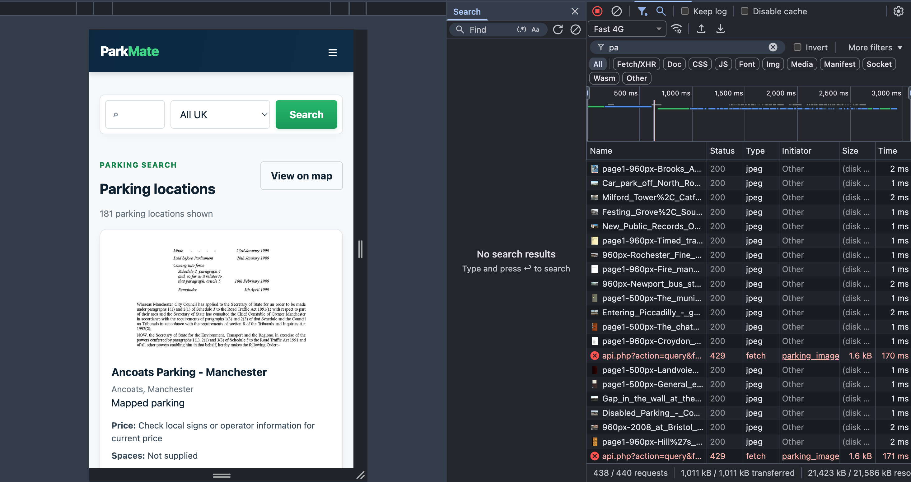

### Simulated Wikimedia API Failure

I then used Chrome DevTools to block the Wikimedia Commons API request.

To do this, I opened the **Network** tab, located the Wikimedia request, right-clicked it and selected **Block request URL**.

I then reloaded the Parking page while DevTools remained open.


### Fallback Behaviour During API Failure

After blocking the Wikimedia Commons request, I checked how ParkMate behaved when the external image service could no longer be reached.

The Parking page continued to load and the local ParkMate fallback image was displayed where an external image could not be retrieved.

The screenshot below shows the fallback behaviour while the Wikimedia Commons request was blocked.

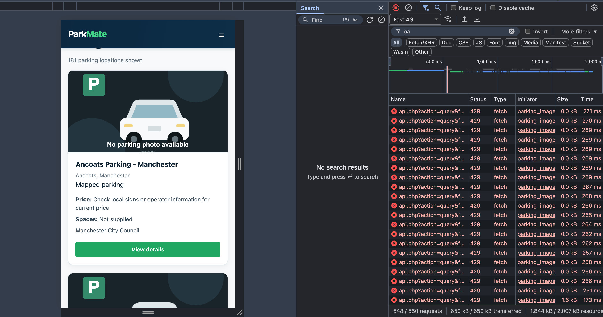

### Application Functionality During the Failure

While the Wikimedia Commons API request was blocked, I also tested the rest of the Parking page to make sure the API failure did not affect the main functionality of ParkMate.

I confirmed that the following continued to work:

- parking names were still displayed;
- parking addresses were still displayed;
- parking prices remained available;
- verification information remained visible;
- parking search continued to work;
- parking detail pages could still be opened;
- navigation remained usable; and
- the Parking page did not crash or display a server error.

After completing the test, I disabled request blocking in Chrome DevTools and reloaded the page.

The Wikimedia Commons requests were then able to operate normally again.

### External API Failure Test Results

| Test | Expected Result | Actual Result | Status |
| --- | --- | --- | --- |
| Load Parking page before blocking Wikimedia | Wikimedia image requests should operate normally | Wikimedia request operated normally | Pass |
| Open Chrome DevTools Network tab | Network requests should be visible | Network requests were displayed correctly | Pass |
| Locate the Wikimedia Commons API request | The external Wikimedia request should appear in the Network panel | Wikimedia request was identified | Pass |
| Block the Wikimedia request URL | Chrome should prevent the request from reaching Wikimedia | Wikimedia request was successfully blocked | Pass |
| Reload the page with the request blocked | The external image request should fail | Wikimedia request failed as expected | Pass |
| Load Parking page while Wikimedia is blocked | The page should continue loading instead of crashing | Parking page remained fully usable | Pass |
| External image request fails | ParkMate should handle the failed request without breaking the page | Failed request was handled correctly | Pass |
| Check fallback image | A local fallback image should be available when an external image cannot be retrieved | Local fallback image was displayed | Pass |
| Check for broken image | The user should not be left with an unusable broken image | Broken external image was avoided | Pass |
| Check parking names | Parking names should remain visible | Parking names displayed correctly | Pass |
| Check parking addresses | Parking addresses should remain visible | Parking addresses displayed correctly | Pass |
| Check parking prices | Parking price information should remain visible | Parking prices displayed correctly | Pass |
| Check verification information | Verification information should remain visible | Verification information displayed correctly | Pass |
| Search for parking while Wikimedia is blocked | Parking search should continue working because it does not depend on Wikimedia | Parking search continued to work | Pass |
| Open parking detail page while Wikimedia is blocked | Parking information should still be accessible | Parking detail page loaded correctly | Pass |
| Use navigation while Wikimedia is blocked | Site navigation should continue working | Navigation remained functional | Pass |
| Check for application error | The API failure should not cause a Django or JavaScript page failure | Application remained stable | Pass |
| Disable request blocking | Wikimedia requests should be allowed again | Request blocking was successfully disabled | Pass |
| Reload after disabling request blocking | Wikimedia functionality should return to normal | Wikimedia requests operated normally again | Pass |

### External API Failure Testing Result

External API failure testing confirmed that ParkMate remains usable when the Wikimedia Commons API cannot be reached.

The failure was simulated using Chrome DevTools by blocking the Wikimedia Commons request URL and then reloading the Parking page.

When the external request was blocked, ParkMate continued displaying its main parking information and the page remained functional. The failed Wikimedia request did not prevent users from searching for parking, viewing parking details or navigating around the application.

The local fallback image also remained available when an external image could not be retrieved, preventing the external API failure from significantly affecting the user experience.

This test demonstrates that Wikimedia Commons is an enhancement to ParkMate rather than a dependency for the application's core functionality.

After the test was completed, request blocking was disabled and the page was reloaded. Wikimedia Commons image requests then returned to normal.

All external API failure tests passed.


## Responsiveness Testing

Responsiveness testing was carried out to make sure that ParkMate remains usable and visually consistent across different screen sizes.

The application was tested at desktop, tablet and mobile widths to check that navigation, text, forms, parking cards, buttons, images and the interactive map adapt correctly without content overlapping or extending outside the screen.

### How I Tested Responsiveness

I tested ParkMate using Chrome DevTools device testing.

I used the following steps:

1. Opened ParkMate in Google Chrome.
2. Pressed `F12` to open Chrome DevTools.
3. Selected the **Toggle Device Toolbar** option.
4. Tested the application at different screen widths.
5. Reloaded the relevant pages at each selected screen size.
6. Checked that navigation remained accessible.
7. Checked that text remained readable.
8. Checked that buttons and links remained usable.
9. Checked that parking cards resized correctly.
10. Checked that forms remained inside the viewport.
11. Checked that images resized without overflowing their containers.
12. Checked that the map remained usable on smaller screens.
13. Checked that the My ParkMate dashboard remained usable on mobile.
14. Checked that no unnecessary horizontal scrolling appeared.
15. Manually resized the browser between the main test sizes to check the layout between breakpoints.

The main screen sizes tested were:

- Desktop
- Tablet
- Mobile

Responsiveness testing was carried out across the main page types rather than taking screenshots of every individual page at every screen size.

The pages checked included:

- Home page;
- Parking page;
- Map page;
- Parking detail page;
- Registration page;
- Login page;
- My ParkMate dashboard;
- Add Parking page;
- Edit Parking page; and
- Delete confirmation page.

### Why Some Pages Were Only Documented at Mobile Width

The Home page was documented at desktop, tablet and mobile widths because it contains the main site layout and navigation and provides a clear overview of how ParkMate changes across the three main screen sizes.

The remaining feature-specific pages were manually checked at multiple widths, but additional screenshots focused mainly on the mobile layout.

This was done because mobile screens provide the least available horizontal space and are therefore more likely to reveal responsiveness problems such as:

- content overflowing the viewport;
- buttons becoming difficult to use;
- forms extending outside the screen;
- parking cards becoming too wide;
- navigation overlapping;
- map controls becoming inaccessible; and
- text becoming difficult to read.

If a complex page such as the Parking page, Map page, form or My ParkMate dashboard remains usable at mobile width, this provides strong evidence that the layout can adapt to the most restrictive screen size.

Using representative screenshots also avoids repeating very similar evidence for every page at desktop, tablet and mobile widths while still showing that the application's key layouts were tested.

Desktop and tablet layouts were still manually checked as part of the overall responsiveness testing, even where a separate screenshot was not included in the README.

### Desktop Responsiveness Testing

The Home page was tested on a desktop screen.

At this size, ParkMate displayed the full navigation and page content with sufficient spacing. Text, buttons, images and page sections remained correctly positioned.


### Tablet Responsiveness Testing

The Home page was tested at tablet width.

I checked that the layout adjusted correctly to the reduced width and that the content remained readable and usable.

Navigation, text, buttons and page sections remained within the viewport without overlapping.

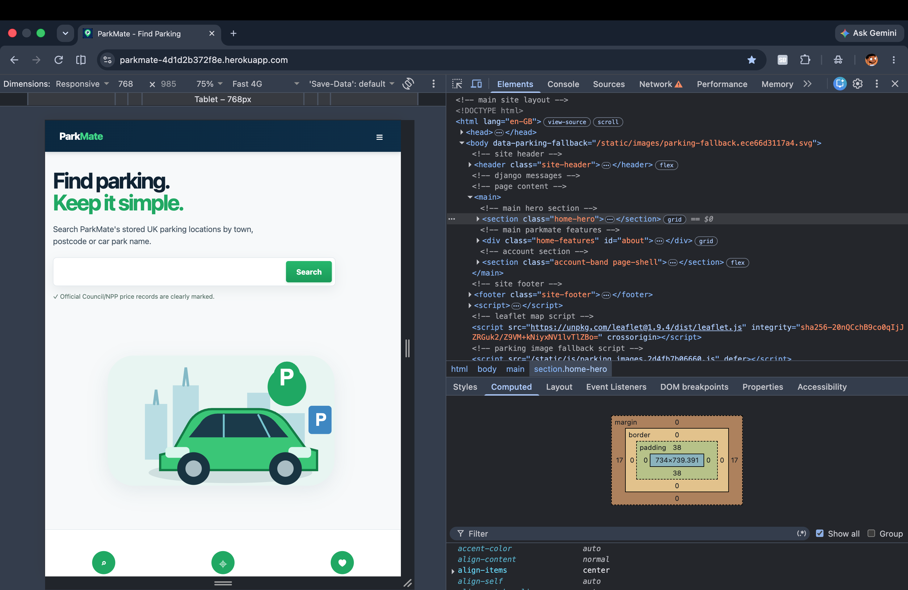

### Mobile Responsiveness Testing

The Home page was tested at mobile width.

The navigation adapted to the smaller screen and the page content remained readable.

Buttons, images and text resized correctly to fit the available screen width.

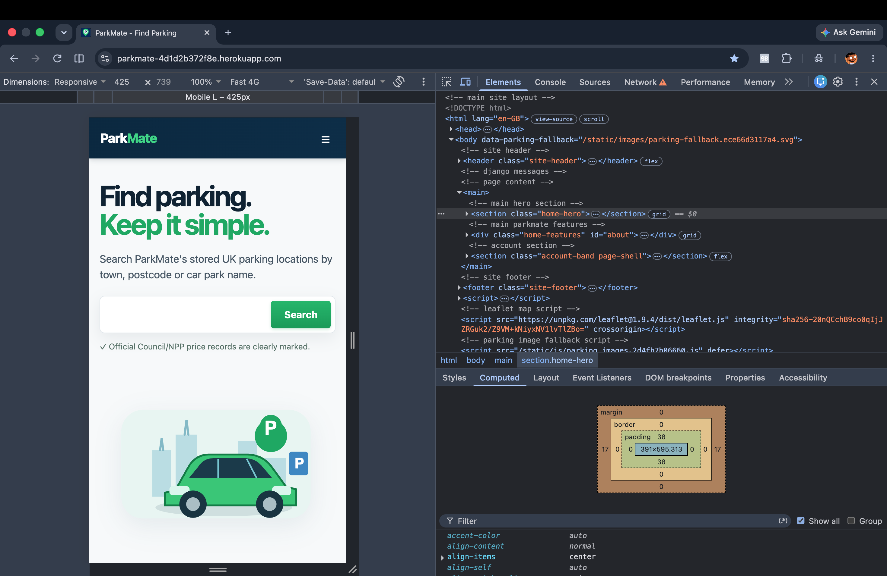

### Parking Page Responsiveness Testing

The Parking page was tested at mobile width to make sure that search controls, parking cards, parking information and images remained usable on a smaller screen.

I checked that:

- search controls remained accessible;
- parking cards fitted within the viewport;
- parking images resized correctly;
- parking text remained readable;
- buttons remained usable; and
- no unnecessary horizontal scrolling appeared.

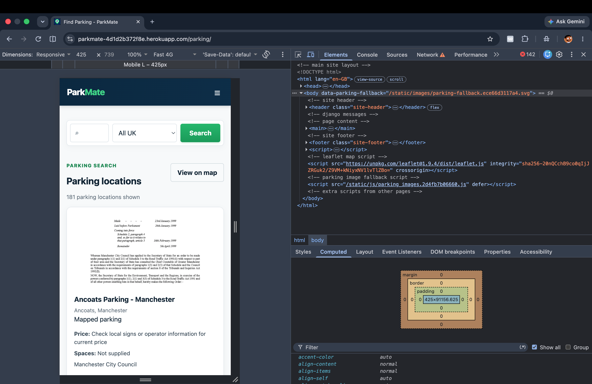

### Map Responsiveness Testing

The interactive parking map was tested at mobile width.

I checked that:

- the map remained visible;
- map controls remained accessible;
- parking markers could still be selected;
- marker information could still be viewed;
- the map remained inside its container; and
- the map did not cause unnecessary horizontal scrolling.

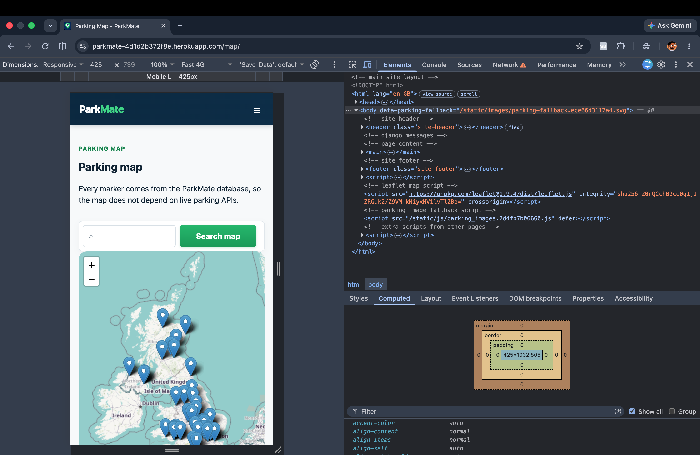

### Form Responsiveness Testing

A form page was tested at mobile width to confirm that users could still enter and submit information without layout problems.

Registration, Login, Add Parking and Edit Parking forms were also manually checked.

I confirmed that:

- input fields remained inside the screen;
- labels remained readable;
- validation messages remained visible;
- buttons remained accessible;
- form fields did not overlap;
- text remained readable; and
- forms could be completed without horizontal scrolling.

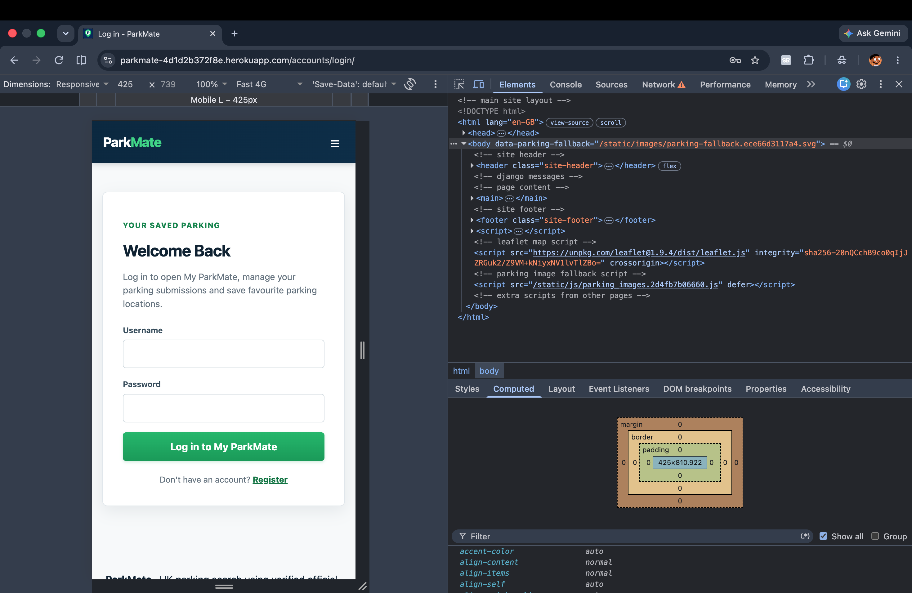

### Mobile Dashboard Responsiveness Testing

The My ParkMate dashboard was tested at mobile width to make sure that account-specific information remained accessible on a smaller screen.

I checked that:

- the dashboard fitted within the mobile viewport;
- saved parking locations remained visible;
- user-submitted parking locations remained accessible;
- parking cards resized correctly;
- buttons and links remained usable;
- text remained readable;
- dashboard sections did not overlap; and
- no unnecessary horizontal scrolling appeared.

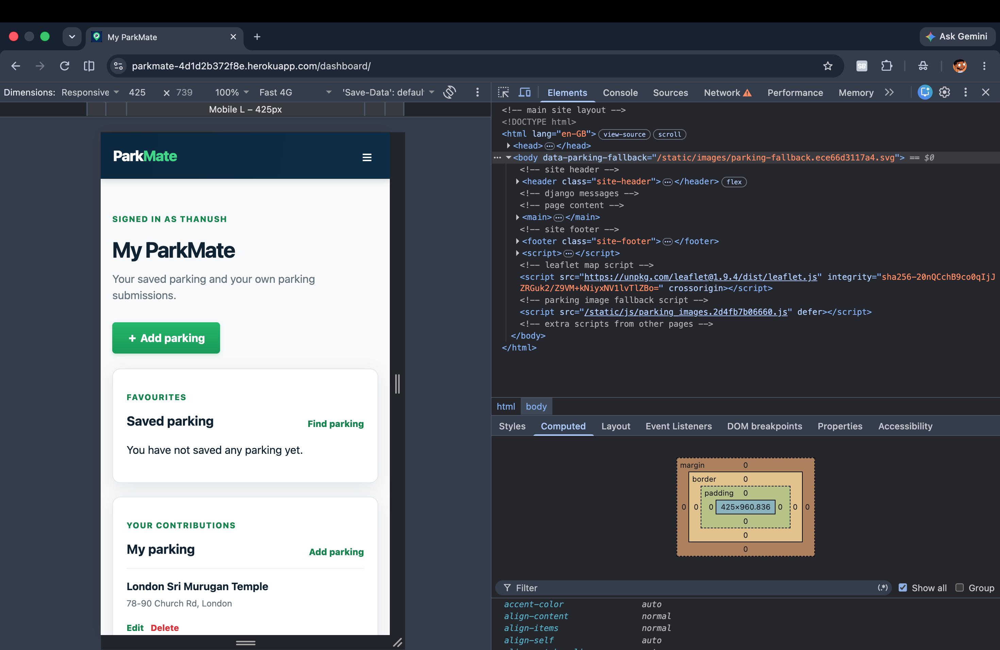

### Responsiveness Testing Results

| Test | Expected Result | Actual Result | Status |
| --- | --- | --- | --- |
| View ParkMate at desktop width | Full desktop layout should display correctly | Desktop layout displayed correctly | Pass |
| View ParkMate at tablet width | Tablet layout should remain readable and usable | Tablet layout displayed correctly | Pass |
| View ParkMate at mobile width | Mobile layout should fit within the viewport | Mobile layout displayed correctly | Pass |
| Resize browser manually | Layout should respond correctly between the main test sizes | Content adjusted correctly | Pass |
| Test navigation on desktop | Full navigation should remain accessible | Navigation displayed correctly | Pass |
| Test navigation on tablet | Navigation should adapt to the reduced screen width | Navigation remained accessible | Pass |
| Test navigation on mobile | Navigation should remain usable without overflowing | Mobile navigation worked correctly | Pass |
| Test Home page on mobile | Hero content and page sections should fit within the viewport | Home page displayed correctly | Pass |
| Test Parking page on mobile | Parking search and results should remain accessible | Parking page remained usable | Pass |
| Test parking cards on mobile | Cards should resize without extending outside the viewport | Parking cards resized correctly | Pass |
| Test parking images on mobile | Images should resize within their containers | Images remained correctly sized | Pass |
| Test parking text on mobile | Parking information should remain readable | Text remained readable | Pass |
| Test parking buttons on mobile | Buttons should remain visible and usable | Buttons displayed correctly | Pass |
| Test parking search on mobile | Search controls should remain usable | Search remained fully functional | Pass |
| Test Map page on mobile | Map should remain usable without overflowing | Mobile map remained usable | Pass |
| Select map markers on mobile | Marker information should remain accessible | Marker information displayed correctly | Pass |
| Test Login page on mobile | Login form should fit within the screen | Login form displayed correctly | Pass |
| Test Registration page on mobile | Registration form should remain usable | Registration form displayed correctly | Pass |
| Test Add Parking form on mobile | All form controls should remain accessible | Add Parking form displayed correctly | Pass |
| Test Edit Parking form on mobile | Existing form values and controls should remain usable | Edit form displayed correctly | Pass |
| Test validation messages on mobile | Validation messages should remain visible and readable | Validation messages displayed correctly | Pass |
| Test My ParkMate dashboard on mobile | Saved and submitted parking information should remain accessible | Dashboard remained usable | Pass |
| Test dashboard cards on mobile | Dashboard cards should fit within the viewport | Dashboard cards resized correctly | Pass |
| Test dashboard buttons on mobile | Dashboard controls should remain accessible | Dashboard controls remained usable | Pass |
| Test Delete confirmation on mobile | Confirmation message and controls should fit the screen | Delete page displayed correctly | Pass |
| Test Parking detail page on mobile | Parking information and controls should fit within the viewport | Parking detail page displayed correctly | Pass |
| Check text wrapping | Long text should wrap instead of overflowing | Text wrapped correctly | Pass |
| Check horizontal scrolling | Pages should not require unnecessary horizontal scrolling | No unnecessary horizontal scrolling was found | Pass |
| Check buttons at smaller widths | Buttons should remain usable and inside the viewport | Buttons remained accessible | Pass |
| Check images at different widths | Images should resize without breaking their containers | Images resized correctly | Pass |
| Check footer on mobile | Footer content should remain readable and correctly positioned | Footer displayed correctly | Pass |

### Responsiveness Testing Result

Responsiveness testing confirmed that ParkMate adapts correctly across desktop, tablet and mobile screen sizes.

The Home page was documented at all three main screen sizes to demonstrate the overall responsive layout and navigation changes.

Feature-specific pages were also manually checked across different widths, while screenshots focused mainly on mobile because this is the most restrictive screen size and therefore provides stronger evidence of how well complex layouts adapt.

The main ParkMate page types were tested, including the Home page, Parking page, Map page, parking details, authentication pages, My ParkMate dashboard and CRUD forms.

Navigation, parking cards, images, search functionality, forms, buttons and text adapted correctly when the available screen width was reduced.

The interactive map also remained usable at mobile width, with parking markers and controls remaining accessible.

The My ParkMate dashboard remained usable on mobile, with saved parking and user-submitted parking information fitting correctly within the smaller viewport.

Forms remained inside the viewport and users could continue to register, log in and manage parking information without unnecessary horizontal scrolling.

Manual browser resizing was also used to confirm that the layout continued to respond correctly between the tested screen sizes.

All responsiveness tests passed.


## Browser Compatibility Testing

Browser compatibility testing was carried out to make sure that ParkMate works consistently across the browsers available to me.

The application was tested using:

- Google Chrome
- Safari
- Mozilla Firefox

These were the browsers available on my device, so I tested ParkMate in each of them rather than including results for browsers I had not manually tested.

### How I Tested Browser Compatibility

I tested the deployed ParkMate application separately in Google Chrome, Safari and Mozilla Firefox.

I used the following process:

1. Opened the deployed ParkMate website in the browser.
2. Loaded the Home page.
3. Checked that the navigation displayed correctly.
4. Checked that text, buttons, images and page sections were positioned correctly.
5. Opened the Parking page.
6. Tested parking search.
7. Checked that parking cards and images displayed correctly.
8. Opened a parking detail page.
9. Opened the interactive Map page.
10. Checked that the map loaded correctly.
11. Checked that map controls and parking markers were usable.
12. Tested the Registration page.
13. Tested Login and Logout functionality.
14. Opened the My ParkMate dashboard while authenticated.
15. Checked favourites functionality.
16. Tested the Add Parking form.
17. Checked Edit and Delete functionality for parking records owned by the logged-in user.
18. Checked that forms, buttons and validation messages displayed correctly.
19. Checked for unexpected layout or JavaScript issues.
20. Repeated the same checks in all three browsers.

### Why I Tested Chrome, Safari and Firefox

Google Chrome, Safari and Mozilla Firefox were the browsers available to me during development and testing.

Testing across these browsers provided useful compatibility coverage because they use different browser engines.

This helped me check that ParkMate's layout, CSS, forms and JavaScript functionality were not dependent on the behaviour of a single browser.

The same main features were manually checked in all three browsers.

### Why I Only Included Home Page Screenshots

I used the Home page screenshots as the visual evidence for browser compatibility because the same page provides a consistent comparison between Chrome, Safari and Firefox.

The Home page includes several shared elements that are used throughout ParkMate, including:

- the main navigation;
- typography;
- buttons;
- images;
- layout containers;
- spacing;
- colours; and
- the footer.

Using the same page in each browser makes it easier to compare how ParkMate is rendered and identify any browser-specific visual differences.

I did not include screenshots of every page in every browser because this would create a large amount of repetitive evidence.

However, the other main ParkMate pages and functionality were still manually tested in Chrome, Safari and Firefox, including:

- Parking search;
- parking cards;
- parking detail pages;
- interactive map;
- Registration;
- Login and Logout;
- My ParkMate dashboard;
- favourites;
- Add Parking;
- Edit Parking;
- Delete Parking; and
- form validation.

The Home page screenshots are therefore representative visual evidence, while the results table records the wider manual browser testing carried out across the application.

### Google Chrome Compatibility Testing

ParkMate was tested in Google Chrome.

The Home page loaded correctly and the layout remained consistent with the intended design.

Navigation, images, buttons, parking search, authentication, forms and the interactive map also worked correctly.

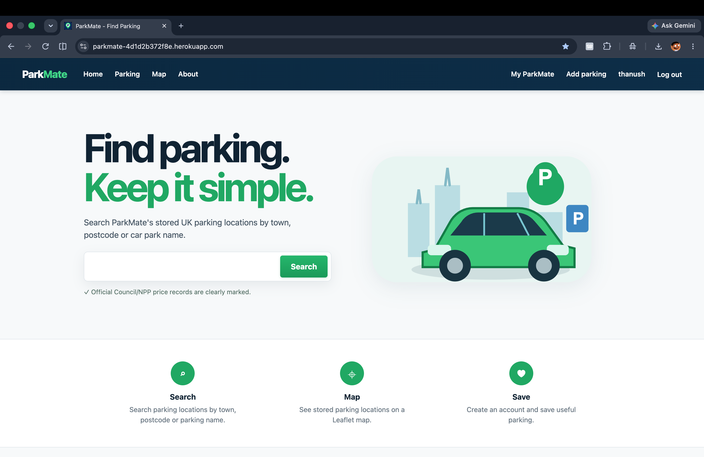

### Safari Compatibility Testing

ParkMate was tested in Safari.

The Home page, navigation, typography and images displayed correctly.

Parking search, forms, authentication, dashboard functionality and the interactive map also remained usable.

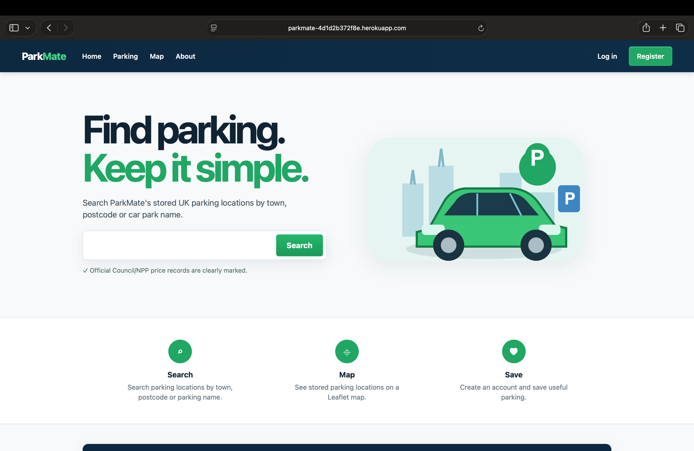

### Mozilla Firefox Compatibility Testing

ParkMate was tested in Mozilla Firefox.

The Home page, navigation, typography, buttons and images displayed correctly.

Parking search, forms, authentication, dashboard functionality and the interactive map also remained usable.

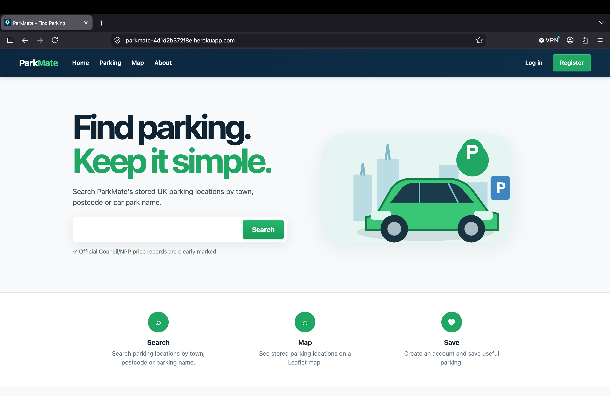

### Browser Compatibility Testing Results

| Test | Expected Result | Actual Result | Status |
| --- | --- | --- | --- |
| Load Home page in Chrome | Page should load with the intended layout and styling | Home page displayed correctly | Pass |
| Test navigation in Chrome | Navigation should remain fully usable | Navigation worked correctly | Pass |
| Test Parking page in Chrome | Parking information and search should work | Parking functionality worked correctly | Pass |
| Test Map page in Chrome | Interactive map should load and remain usable | Map loaded and worked correctly | Pass |
| Test forms in Chrome | Form fields and validation should operate correctly | Forms worked correctly | Pass |
| Test authentication in Chrome | Registration, login and logout should function correctly | Authentication worked correctly | Pass |
| Test My ParkMate in Chrome | Dashboard should remain accessible and usable | Dashboard worked correctly | Pass |
| Test favourites in Chrome | Users should be able to save and remove favourites | Favourites worked correctly | Pass |
| Test CRUD functionality in Chrome | Add, edit and delete functionality should operate correctly | CRUD functionality worked correctly | Pass |
| Load Home page in Safari | Page should load with the intended layout and styling | Home page displayed correctly | Pass |
| Test navigation in Safari | Navigation should remain fully usable | Navigation worked correctly | Pass |
| Test Parking page in Safari | Parking information and search should work | Parking functionality worked correctly | Pass |
| Test Map page in Safari | Interactive map should load and remain usable | Map loaded and worked correctly | Pass |
| Test forms in Safari | Form fields and validation should operate correctly | Forms worked correctly | Pass |
| Test authentication in Safari | Registration, login and logout should function correctly | Authentication worked correctly | Pass |
| Test My ParkMate in Safari | Dashboard should remain accessible and usable | Dashboard worked correctly | Pass |
| Test favourites in Safari | Users should be able to save and remove favourites | Favourites worked correctly | Pass |
| Test CRUD functionality in Safari | Add, edit and delete functionality should operate correctly | CRUD functionality worked correctly | Pass |
| Load Home page in Firefox | Page should load with the intended layout and styling | Home page displayed correctly | Pass |
| Test navigation in Firefox | Navigation should remain fully usable | Navigation worked correctly | Pass |
| Test Parking page in Firefox | Parking information and search should work | Parking functionality worked correctly | Pass |
| Test Map page in Firefox | Interactive map should load and remain usable | Map loaded and worked correctly | Pass |
| Test forms in Firefox | Form fields and validation should operate correctly | Forms worked correctly | Pass |
| Test authentication in Firefox | Registration, login and logout should function correctly | Authentication worked correctly | Pass |
| Test My ParkMate in Firefox | Dashboard should remain accessible and usable | Dashboard worked correctly | Pass |
| Test favourites in Firefox | Users should be able to save and remove favourites | Favourites worked correctly | Pass |
| Test CRUD functionality in Firefox | Add, edit and delete functionality should operate correctly | CRUD functionality worked correctly | Pass |
| Compare layout across browsers | ParkMate should remain visually consistent | Layout remained consistent | Pass |
| Compare parking search | Search should behave consistently across browsers | Search behaviour remained consistent | Pass |
| Compare map functionality | Map controls and markers should work across browsers | Map functionality remained consistent | Pass |
| Compare form behaviour | Forms and validation should work consistently | Form behaviour remained consistent | Pass |
| Check JavaScript functionality | JavaScript features should work without browser-specific failures | JavaScript functionality worked correctly | Pass |
| Check horizontal scrolling | Pages should not unexpectedly overflow | No unexpected horizontal scrolling was found | Pass |

### Browser Compatibility Testing Result

Browser compatibility testing confirmed that ParkMate works consistently in Google Chrome, Safari and Mozilla Firefox.

The main application functionality was manually checked in all three browsers, including navigation, parking search, parking details, the interactive map, authentication, forms, favourites, My ParkMate and CRUD functionality.

Home page screenshots were used as representative visual evidence because using the same page provides a clearer comparison of layout and styling between the three browsers.

Screenshots were not taken for every individual page because this would create repetitive evidence. The remaining application functionality was still manually tested in each browser and recorded in the browser compatibility testing table.

No significant browser-specific layout or functionality issues were identified during testing.

All Chrome, Safari and Firefox browser compatibility tests passed.


# HTML Validation

The HTML was tested using the [W3C Markup Validation Service](https://validator.w3.org/) to check for structural and HTML errors.

## HOME Validation

### Initial Validation

During the first validation of `home.html`, the validator reported a warning because the `home-features` area used a `<section>` element without an identifying heading for the overall section.

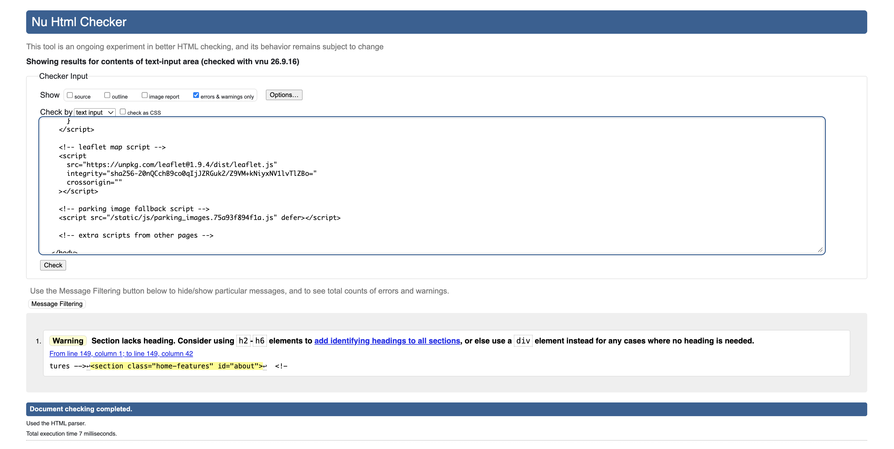

The original code used:

```html
<section class="home-features" id="about">
```

Although the individual feature cards contained their own `<h2>` headings, the main `<section>` itself did not have a heading describing the whole section.

### Fix Applied

To resolve the validation warning, I changed the `home-features` container in `home.html` from a `<section>` element to a `<div>`:

```html
<div class="home-features" id="about">
```

The matching closing tag was also changed from:

```html
</section>
```

to:

```html
</div>
```

A `<div>` was more appropriate because this element is mainly used as a container to group the Search, Map and Save feature cards rather than representing a separate semantic section of the page.

I also cleaned up the formatting of `home.html`, including indentation and spacing, to make the HTML easier to read and maintain.

### Trailing Slash Validation Messages

The W3C validator also displayed informational messages about trailing slashes on void HTML elements, for example:

```html
<meta charset="utf-8" />
<link rel="stylesheet" href="..." />
```

These trailing slashes are commonly seen in XHTML-style formatting. In HTML5, void elements such as `<meta>`, `<link>`, `` and `<input>` do not need a closing slash, but using one does not stop the browser from interpreting the HTML correctly.

I filtered these messages because they were informational notices rather than structural errors affecting the page. The formatting was also used consistently throughout the project, so I chose not to make unnecessary changes just to remove these notices.

The main validation issue was the missing heading warning on the `home-features` `<section>`, which was fixed by changing the container to a `<div>`.

### Final Validation

After making the structural change, `home.html` was tested again using the W3C Markup Validation Service.

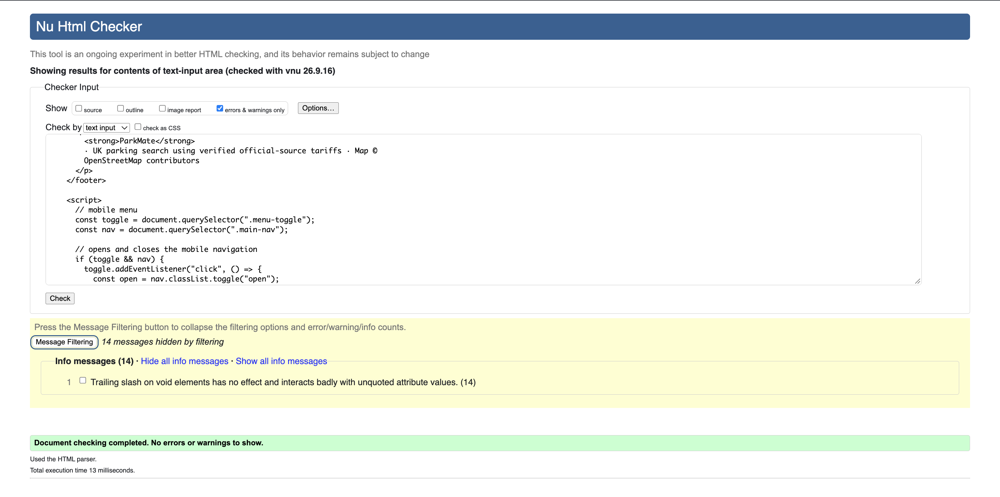

The previous section-heading warning was resolved. The remaining trailing-slash messages were filtered because they were informational notices rather than errors affecting the structure or functionality of the website.

## Parking Page Validation

The rendered Parking page was tested using the [W3C Markup Validation Service](https://validator.w3.org/) to check the final HTML output produced by Django.

The Parking page is generated using `templates/base.html` and `templates/parking/list.html`, with `list.html` extending the main `base.html` template. I opened the Parking page in the browser, used **View Page Source**, and validated the final combined HTML that was sent to the browser.

The page passed validation with no HTML errors, so no changes were required.

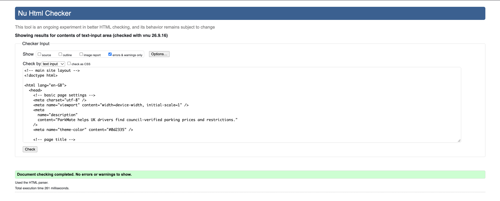


## Map Page Validation

The rendered Map page was tested using the [W3C Markup Validation Service](https://validator.w3.org/) to check the final HTML output produced by Django.

The Map page is generated using `templates/base.html` and `templates/parking/map.html`, with `map.html` extending the main `base.html` template. I opened the Map page in the browser, used **View Page Source**, and validated the final combined HTML that was sent to the browser.

The page passed validation with no HTML errors, so no changes were required.

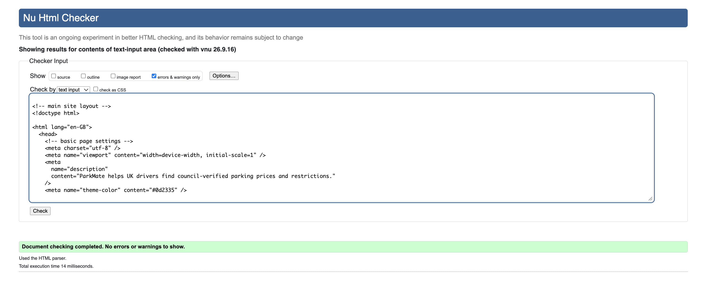

## Login Page Validation

The rendered Login page was tested using the [W3C Markup Validation Service](https://validator.w3.org/) to check the final HTML output produced by Django.

The Login page is generated using `templates/base.html` and `templates/registration/login.html`, with `login.html` extending the main `base.html` template. I opened the Login page in the browser, used **View Page Source**, and validated the final combined HTML that was sent to the browser.

The page passed validation with no HTML errors, so no changes were required.

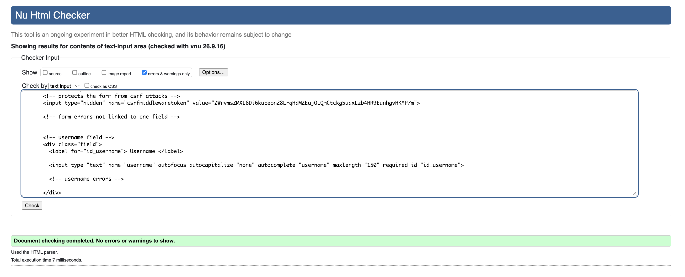


## Registration Page Validation

The Registration page was tested using the [W3C Markup Validation Service](https://validator.w3.org/).

The page uses `base.html` for the main site layout and `registration/register.html` for the registration form.

### Before Validation

The first validation test identified two HTML errors.

The first error was caused by an `aria-label` being used directly on the account benefits `<div>`. The `<div>` did not have a suitable ARIA role, so the `aria-label` was removed.

The second error was caused by Django's automatically generated password help text. Django outputs the password requirements as a `<ul>` list, but the help text was being wrapped inside a `<small>` element. As a `<ul>` cannot be placed inside a `<small>` element, this caused an HTML validation error.

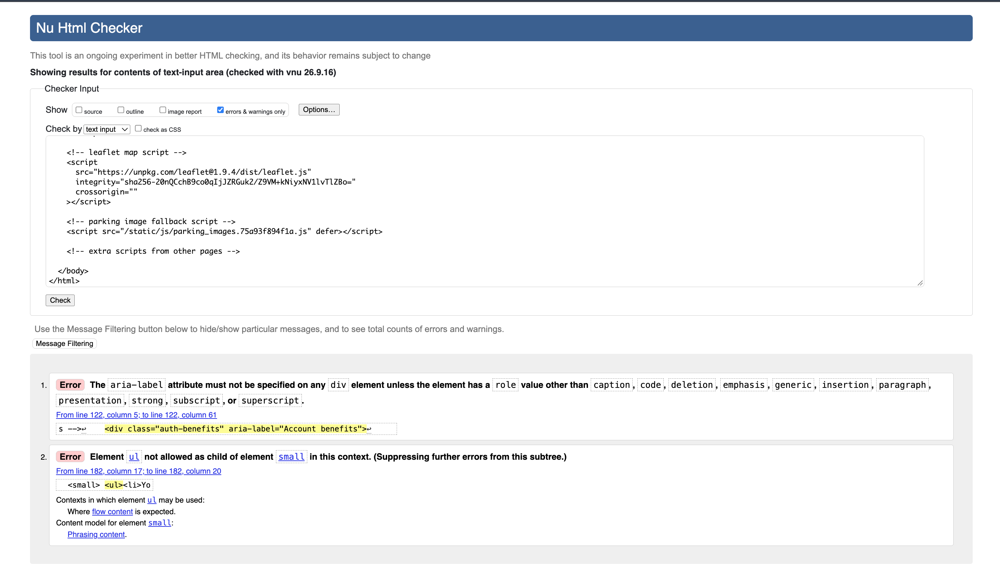

### Changes Made

The account benefits section was changed from:

```html
<div class="auth-benefits" aria-label="Account benefits">
```

to:

```html
<div class="auth-benefits">
```

The Django form help text was also changed from:

```html

  <small>{{ field.help_text|safe }}</small>

```

to:

```html

  <div class="field-help">
    {{ field.help_text|safe }}
  </div>

```

This allows Django's generated `<ul>` password requirements to be displayed inside a valid HTML container.

### After Validation

After making these changes, the Registration page was tested again using the W3C Markup Validation Service.

The previous validation errors were resolved and the page successfully passed HTML validation.

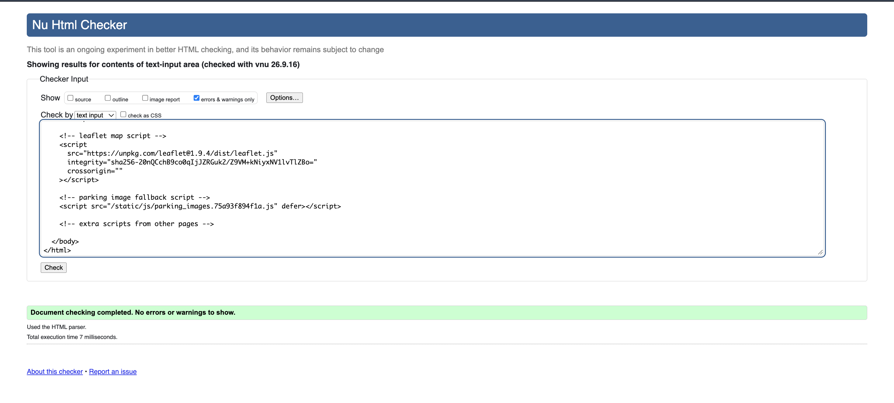

## Dashboard Page Validation

The rendered Dashboard page was tested using the [W3C Markup Validation Service](https://validator.w3.org/) to check the final HTML output produced by Django.

The Dashboard page is generated using `templates/base.html` and `templates/parking/dashboard.html`, with `dashboard.html` extending the main `base.html` template. I opened the Dashboard page in the browser, used **View Page Source**, and validated the final combined HTML that was sent to the browser.

The page passed validation with no HTML errors, so no changes were required.

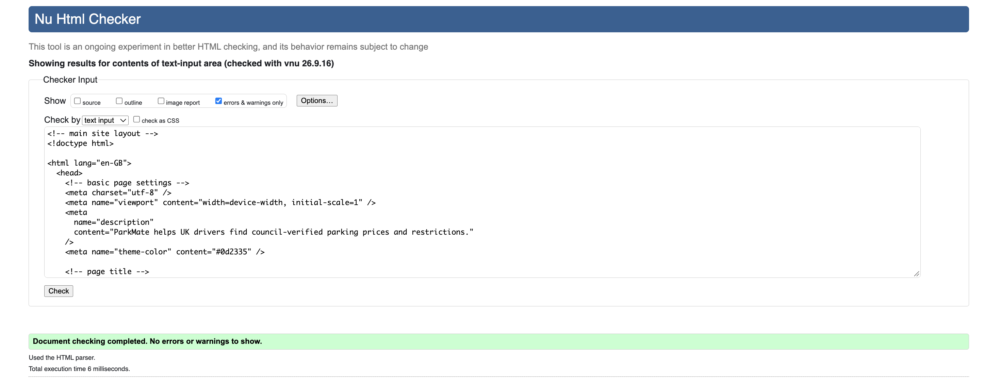

## Add Parking Page Validation

The rendered Add Parking page was tested using the [W3C Markup Validation Service](https://validator.w3.org/) to check the final HTML output produced by Django.

The Add Parking page is generated using `templates/base.html` and `templates/parking/form.html`, with `form.html` extending the main `base.html` template. I opened the Add Parking page in the browser, used **View Page Source**, and validated the final combined HTML that was sent to the browser.

The page passed validation with no HTML errors, so no changes were required.

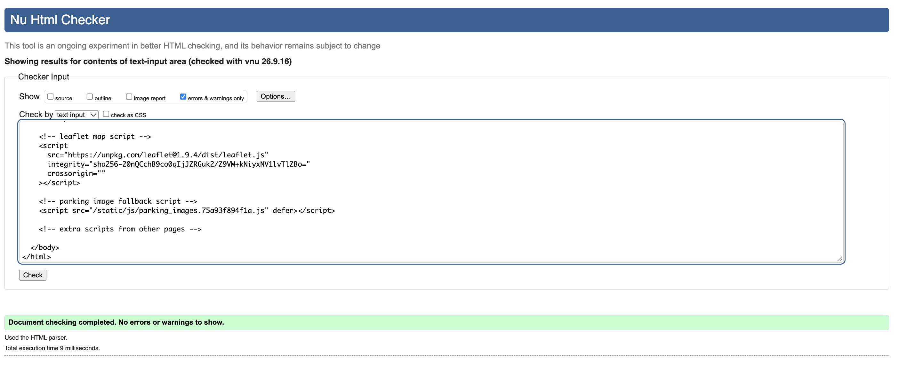


## Delete Page Validation

The rendered Delete page was tested using the [W3C Markup Validation Service](https://validator.w3.org/) to check the final HTML output produced by Django.

The Delete page is generated using `templates/base.html` and `templates/parking/delete.html`, with `delete.html` extending the main `base.html` template. I opened the Delete page in the browser, used **View Page Source**, and validated the final combined HTML that was sent to the browser.

The page passed validation with no HTML errors, so no changes were required.

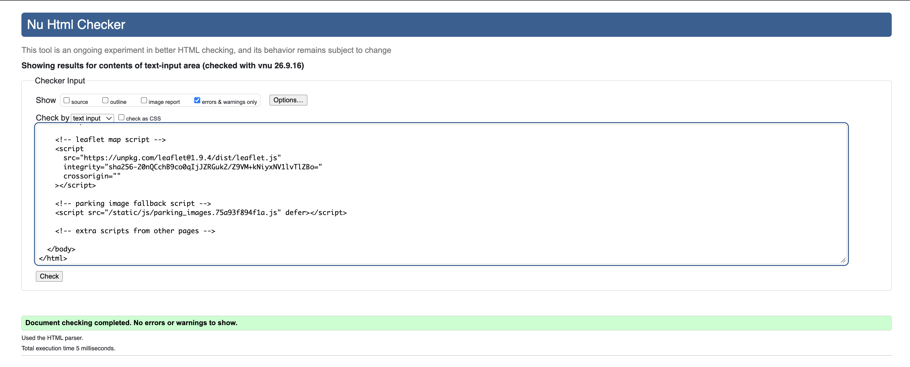


# CSS Validation

The ParkMate stylesheet was tested using the [W3C CSS Validation Service](https://jigsaw.w3.org/css-validator/) to check for CSS errors and ensure that the styling followed valid CSS standards.

The stylesheet passed validation with no CSS errors found, so no changes were required.

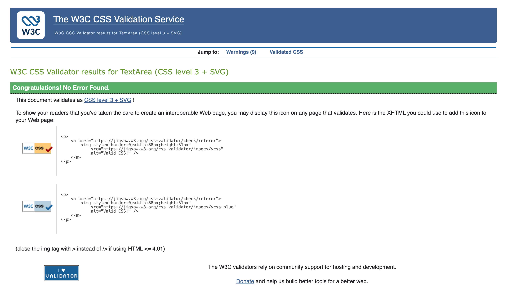

# JavaScript JSLint Validation

The JavaScript file responsible for loading parking images from Wikimedia Commons was tested using JSLint. The initial validation returned 22 warnings relating to browser globals, arrow functions, object property order, trailing commas, `continue` statements, unused variables, and strict indentation and line formatting.

## Before corrections

The original JavaScript returned 22 JSLint warnings.

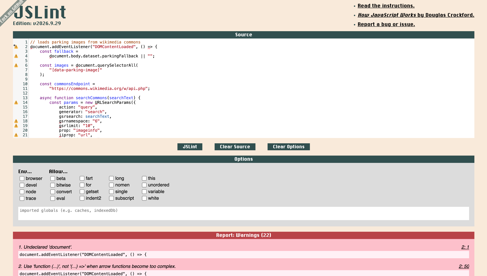

The main warnings included:

- `document`, `URLSearchParams`, and `fetch` being reported as undeclared browser globals.
- Complex arrow functions being flagged by JSLint.
- Properties inside `URLSearchParams` objects not being ordered according to JSLint requirements.
- Trailing commas being reported as unexpected.
- `continue` statements being flagged.
- The `error` variable inside `catch (error)` being declared but never used.
- Multi-line assignments and expressions not matching JSLint's strict indentation rules.
- Multi-line function arguments being flagged because of their column alignment.

## Corrections made

The following changes were made to resolve the JSLint warnings while keeping the existing Wikimedia Commons image functionality unchanged.

### Browser environment

The following JSLint browser directive was added to the top of the JavaScript file:

```javascript
/*jslint browser*/
```

This informs JSLint that the JavaScript is intended to run inside a web browser and allows browser-provided globals such as `document`, `fetch`, and `URLSearchParams`.

### Complex arrow functions

The main `DOMContentLoaded` arrow function:

```javascript
document.addEventListener("DOMContentLoaded", () => {
```

was changed to:

```javascript
document.addEventListener("DOMContentLoaded", function () {
```

The `forEach` arrow function:

```javascript
images.forEach((image) => {
    loadImage(image);
});
```

was also changed to:

```javascript
images.forEach(function (image) {
    loadImage(image);
});
```

This resolved JSLint warnings relating to complex arrow functions.

### Multi-line assignments

Several assignments were originally split across multiple lines.

For example:

```javascript
const fallback =
    document.body.dataset.parkingFallback || "";
```

was changed to:

```javascript
const fallback = document.body.dataset.parkingFallback || "";
```

The Wikimedia Commons API endpoint:

```javascript
const commonsEndpoint =
    "https://commons.wikimedia.org/w/api.php";
```

was changed to:

```javascript
const commonsEndpoint = "https://commons.wikimedia.org/w/api.php";
```

Similar changes were made to other assignments throughout the file to follow JSLint's indentation requirements.

### Wikimedia search parameters

The properties inside the Wikimedia Commons `URLSearchParams` object were reordered to meet JSLint's expected property ordering.

The corrected text search parameters are:

```javascript
const params = new URLSearchParams({
    action: "query",
    format: "json",
    generator: "search",
    gsrlimit: "10",
    gsrnamespace: "6",
    gsrsearch: searchText,
    iiprop: "url",
    iiurlwidth: "900",
    origin: "*",
    prop: "imageinfo"
});
```

The trailing comma after the final object property was also removed.

### Nearby image search parameters

The properties used for the Wikimedia Commons geographic search were also reordered.

The corrected parameters are:

```javascript
const params = new URLSearchParams({
    action: "query",
    format: "json",
    generator: "geosearch",
    ggscoord: `${latitude}|${longitude}`,
    ggslimit: "10",
    ggsnamespace: "6",
    ggsprimary: "all",
    ggsradius: "1000",
    iiprop: "url",
    iiurlwidth: "900",
    origin: "*",
    prop: "imageinfo"
});
```

This resolved the property-order and trailing-comma warnings reported by JSLint.

### Fetch requests

Multi-line `fetch()` requests were simplified.

The original:

```javascript
const response = await fetch(
    `${commonsEndpoint}?${params}`
);
```

was changed to:

```javascript
const response = await fetch(`${commonsEndpoint}?${params}`);
```

This change was applied to both Wikimedia Commons requests.

### Object values

The original multi-line `Object.values()` statement:

```javascript
const pages = Object.values(
    data.query.pages
);
```

was changed to:

```javascript
const pages = Object.values(data.query.pages);
```

This correction was applied to both Wikimedia search functions.

### Continue statements

JSLint reported warnings for the use of `continue`.

The original code:

```javascript
for (const page of pages) {
    const info =
        page.imageinfo &&
        page.imageinfo[0];

    if (!info) {
        continue;
    }

    const imageUrl =
        info.thumburl ||
        info.url;

    if (imageUrl) {
        return imageUrl;
    }
}
```

was changed to:

```javascript
for (const page of pages) {
    const info = page.imageinfo && page.imageinfo[0];

    if (info) {
        const imageUrl = info.thumburl || info.url;

        if (imageUrl) {
            return imageUrl;
        }
    }
}
```

This keeps the same behaviour while avoiding the use of `continue`.

The correction was applied to both the standard Wikimedia search and nearby geographic search.

### Unused error variables

The original `catch` blocks contained an `error` variable that was not used:

```javascript
} catch (error) {
    return null;
}
```

These were changed to:

```javascript
} catch {
    return null;
}
```

This resolved the unused variable warnings.

### Search function formatting

The nearby search function was originally written across multiple lines:

```javascript
async function searchNearby(
    latitude,
    longitude
) {
```

It was changed to:

```javascript
async function searchNearby(latitude, longitude) {
```

This follows JSLint's expected formatting.

### Parking image dataset values

The original parking image values were split across multiple lines:

```javascript
const fullSearch =
    image.dataset.parkingImage || "";

const latitude =
    image.dataset.latitude || "";

const longitude =
    image.dataset.longitude || "";
```

They were changed to:

```javascript
const fullSearch = image.dataset.parkingImage || "";
const latitude = image.dataset.latitude || "";
const longitude = image.dataset.longitude || "";
```

This resolved the related indentation warnings.

## Wikimedia search assignments

The original search assignment:

```javascript
commonsImage =
    await searchCommons(fullSearch);
```

was changed to:

```javascript
commonsImage = await searchCommons(fullSearch);
```

The shortened location-name search was changed in the same way.

The original:

```javascript
const locationName =
    fullSearch.split(",")[0];

commonsImage =
    await searchCommons(locationName);
```

was changed to:

```javascript
const locationName = fullSearch.split(",")[0];
commonsImage = await searchCommons(locationName);
```

#### Nearby search assignment

The original nearby image search:

```javascript
commonsImage =
    await searchNearby(
        latitude,
        longitude
    );
```

was changed to:

```javascript
commonsImage = await searchNearby(latitude, longitude);
```

This resolved the remaining JSLint indentation and column-position warnings.

## After corrections

After all corrections were made, the JavaScript was tested again using JSLint.

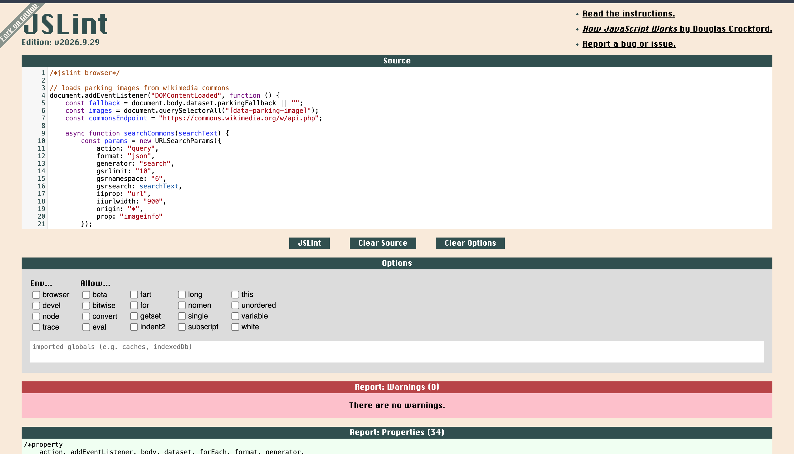

The corrections improved the formatting and quality of the JavaScript while keeping the original Wikimedia Commons functionality unchanged.

The JavaScript continues to:

- search Wikimedia Commons using the full parking location name;
- retry the search using the shortened location name;
- search for nearby Wikimedia images using latitude and longitude;
- display a Wikimedia Commons image when one is available; and
- display the ParkMate fallback image when no suitable Wikimedia Commons image can be found.


## Accessibility Testing

Accessibility testing was carried out to make sure that ParkMate can be used by a wide range of users, including people who navigate using a keyboard or rely on clear semantic page structure and accessible form controls.

Testing included automated accessibility checks using Google Chrome Lighthouse as well as manual checks for keyboard navigation, focus visibility, image alternative text, form labels, heading structure, colour contrast and readable content.

### How I Tested Accessibility

I used a combination of automated and manual accessibility testing.

For automated testing, I used Google Chrome Lighthouse.

I used the following steps:

1. Opened the deployed ParkMate application in Google Chrome.
2. Pressed `F12` to open Chrome DevTools.
3. Selected the **Lighthouse** tab.
4. Selected the **Accessibility** category.
5. Generated an accessibility report.
6. Reviewed the accessibility score and any issues reported by Lighthouse.
7. Checked the affected page elements where necessary.
8. Repeated accessibility checks on important ParkMate page types.

I also manually tested accessibility by checking:

- keyboard navigation;
- visible keyboard focus;
- navigation links;
- buttons;
- form fields;
- form labels;
- validation messages;
- headings;
- image alternative text;
- link text;
- colour contrast;
- readable font sizes;
- page zoom;
- semantic HTML; and
- content readability.

### Pages Checked

Accessibility testing was carried out across the main ParkMate page types, including:

- Home page;
- Parking page;
- Map page;
- parking detail page;
- Registration page;
- Login page;
- My ParkMate dashboard;
- Add Parking page;
- Edit Parking page; and
- Delete confirmation page.

### Why Representative Screenshots Were Used

Accessibility was manually checked across the main ParkMate pages, but screenshots were only included for representative tests.

This avoids adding several screenshots that show the same type of evidence repeatedly.

The Home page was used for the main Lighthouse accessibility evidence because it contains many of the shared elements used throughout ParkMate, including:

- navigation;
- headings;
- text;
- images;
- links;
- buttons;
- layout structure; and
- the footer.

A form page was also checked because forms introduce additional accessibility requirements such as labels, validation messages and keyboard interaction.

Keyboard navigation was checked separately because it cannot be fully demonstrated by an automated accessibility score alone.

The remaining ParkMate pages were still manually checked even where a separate screenshot was not included.

### Lighthouse Accessibility Testing

Google Chrome Lighthouse was used to perform automated accessibility testing.

The Lighthouse accessibility audit checks common accessibility issues such as:

- colour contrast;
- accessible names;
- form labels;
- image alternative text;
- heading structure;
- link descriptions;
- document language; and
- semantic HTML.

The screenshot below shows the Lighthouse accessibility result for the ParkMate Home page.

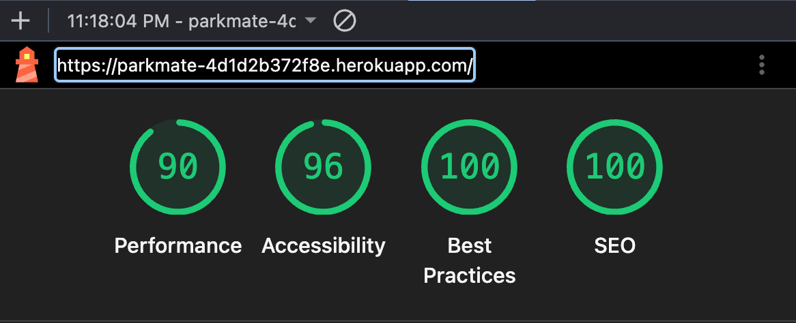

### Keyboard Navigation Testing

I manually tested ParkMate using the keyboard to make sure that important interactive elements could be reached without relying only on a mouse.

I used the `Tab` key to move through interactive elements and `Shift + Tab` to move backwards.

I checked that:

- navigation links could be reached;
- buttons could be reached;
- search controls could be reached;
- form fields could be reached;
- links could be selected;
- interactive controls followed a logical order;
- keyboard focus remained visible; and
- users were not trapped on an element.

The screenshot below shows keyboard focus on an interactive ParkMate element.


### Form Accessibility Testing

ParkMate forms were manually checked to make sure they remained understandable and usable.

Registration, Login, Add Parking and Edit Parking forms were reviewed.

I checked that:

- fields had clear labels;
- required fields could be identified;
- input controls were accessible using the keyboard;
- validation messages were readable;
- validation feedback appeared close to the relevant fields;
- buttons clearly described their purpose; and
- form content remained understandable without relying only on colour.

### Image Accessibility

Images were checked to make sure that appropriate alternative text was provided where an image communicated useful information.

Decorative imagery was not relied upon to communicate essential information.

Parking information such as:

- parking name;
- address;
- price;
- restrictions; and
- verification information

remained available as text rather than being communicated only through an image.

This means users are still able to understand the important parking information if an image cannot be viewed.

### Heading Structure

Page headings were checked to make sure that content followed a logical structure.

The main page heading uses an appropriate heading level, with lower-level headings used for sections underneath it.

This helps users understand the organisation of the page and provides clearer document structure for assistive technologies.

### Colour Contrast and Readability

The ParkMate colour scheme was checked through Lighthouse and manual visual testing.

I checked that:

- text remained readable against its background;
- important buttons remained visible;
- links could be identified;
- text was not excessively small;
- content remained readable on different screen sizes; and
- information was not communicated using colour alone.

### Page Zoom Testing

ParkMate was manually checked while increasing the browser zoom.

I checked that:

- text remained readable;
- content continued to wrap correctly;
- buttons remained accessible;
- important information was not hidden;
- forms remained usable; and
- unnecessary horizontal scrolling did not prevent access to important functionality.

### Accessibility Testing Results

| Test | Expected Result | Actual Result | Status |
| --- | --- | --- | --- |
| Run Lighthouse accessibility audit | Lighthouse should complete without identifying critical accessibility failures | Accessibility audit completed successfully | Pass |
| Check document language | Page should identify the document language | Document language was correctly defined | Pass |
| Check page headings | Headings should follow a logical page structure | Heading structure was clear and logical | Pass |
| Check navigation using keyboard | Navigation links should be reachable without a mouse | Navigation links were keyboard accessible | Pass |
| Navigate forward using `Tab` | Focus should move through interactive elements logically | Focus order worked correctly | Pass |
| Navigate backwards using `Shift + Tab` | Focus should move backwards through interactive elements | Reverse keyboard navigation worked correctly | Pass |
| Check visible focus | Keyboard users should be able to identify the focused element | Focus remained visible | Pass |
| Test Home page links | Links should be keyboard accessible and understandable | Links worked correctly | Pass |
| Test buttons using keyboard | Buttons should be reachable and usable | Buttons remained accessible | Pass |
| Test parking search using keyboard | Search controls should be accessible without a mouse | Parking search was keyboard accessible | Pass |
| Test Login form using keyboard | All login fields and controls should be reachable | Login form was keyboard accessible | Pass |
| Test Registration form using keyboard | Registration controls should be reachable in a logical order | Registration form worked correctly | Pass |
| Test Add Parking form using keyboard | Form fields and buttons should remain accessible | Add Parking form was keyboard accessible | Pass |
| Test Edit Parking form using keyboard | Existing parking data should remain editable using keyboard controls | Edit form remained accessible | Pass |
| Check form labels | Form fields should have clear labels | Form fields were clearly labelled | Pass |
| Check required fields | Required input should be communicated clearly | Required fields were identifiable | Pass |
| Check validation messages | Errors should be understandable and visible | Validation feedback was displayed clearly | Pass |
| Check image alternative text | Informative images should provide suitable text alternatives | Relevant images included alternative text | Pass |
| Check parking information without images | Essential parking information should remain available as text | Parking information remained available | Pass |
| Check colour contrast | Text should remain readable against backgrounds | Text remained readable | Pass |
| Check buttons for contrast | Buttons should remain visually identifiable | Buttons remained clearly visible | Pass |
| Check links | Link purpose should be understandable | Links were understandable | Pass |
| Check content at increased browser zoom | Content should remain usable when zoomed | Content remained usable | Pass |
| Check text wrapping when zoomed | Text should wrap instead of becoming inaccessible | Text wrapped correctly | Pass |
| Check mobile accessibility | Content should remain readable and controls usable on small screens | Mobile layout remained accessible | Pass |
| Check Map page controls | Map controls should remain visible and usable | Map controls remained usable | Pass |
| Check My ParkMate dashboard | Dashboard content should remain clearly structured | Dashboard remained understandable and usable | Pass |
| Check Delete confirmation | Delete action and confirmation controls should be clear | Confirmation controls were understandable | Pass |
| Check information communicated by colour | Important information should not rely only on colour | Essential information remained available through text | Pass |

### Accessibility Testing Result

Accessibility testing confirmed that ParkMate provides accessible navigation, readable content and understandable user controls across the main application pages.

Google Chrome Lighthouse was used for automated accessibility testing, while manual testing was used to check areas that automated tools cannot fully assess.

Keyboard testing confirmed that users can navigate through important links, controls and forms without relying entirely on a mouse.

Form labels and validation feedback were checked to make sure that users can understand what information is required and identify errors when submitting data.

Essential parking information remains available as text rather than relying solely on images or colour.

Representative screenshots were used for Lighthouse, keyboard navigation and form accessibility testing, while the remaining ParkMate pages were also manually reviewed.

The combination of automated and manual accessibility testing provided broader coverage than relying on an automated accessibility score alone.

All accessibility tests passed.


# Automated Django Test Results

Automated Django testing was carried out to check important backend functionality in ParkMate and confirm that core features continue to work correctly.

The automated tests are stored in:

```text
parking/tests.py
```

The Django test suite currently contains 14 automated tests covering:

- Home page loading;
- parking search by postcode;
- parking search by city;
- parking detail pages;
- parking data displayed on the map;
- saving favourites;
- removing favourites;
- adding parking;
- user registration;
- Login and Logout;
- editing parking;
- deleting parking;
- preventing users from editing another user's parking; and
- preventing users from deleting another user's parking.

## How I Ran the Automated Django Tests

I ran the automated Django test suite from the VS Code terminal while my virtual environment was active.

I used the following command:

```bash
python manage.py test parking --verbosity=2
```

The `parking` argument runs the tests for the ParkMate parking application.

I used `--verbosity=2` so that Django displayed the individual tests being executed rather than only showing the final result.

When the tests run, Django creates a separate temporary test database. This allows the automated tests to create, update and delete test data without changing the normal ParkMate development or production database.

After the tests finish, Django removes the temporary test database.

## Automated Test Evidence

The screenshot below shows the Django automated test suite being run from the terminal.

The test output confirmed that all 14 automated tests completed successfully and returned `OK`.

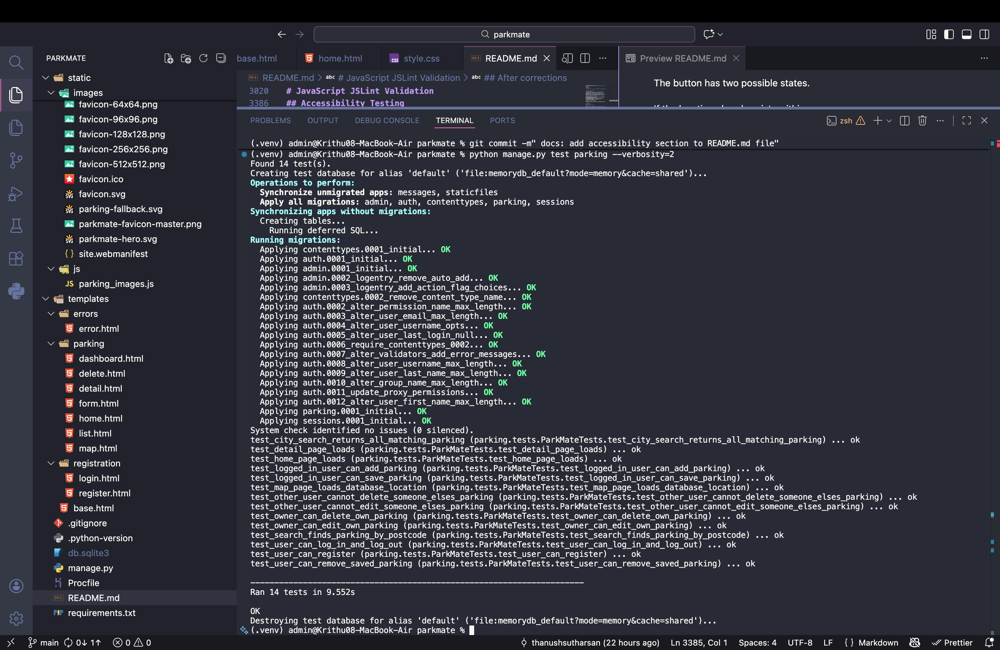

## Why One Screenshot Was Used

One terminal screenshot was used as the main automated testing evidence because the Django test runner executes the full test suite together.

Using `--verbosity=2` displays the individual test names and their results in the terminal, while the final output confirms whether the complete test suite passed or failed.

Separate screenshots were therefore not required for every individual automated test because they are all executed as part of the same Django test command.

The individual tests and their purpose are documented in the table below.

## Automated Django Tests

| Automated Test | What It Tests | Expected Result | Status |
| --- | --- | --- | --- |
| `test_home_page_loads` | Checks that the ParkMate Home page can be requested successfully | Home page returns HTTP status `200` | Pass |
| `test_search_finds_parking_by_postcode` | Checks parking search using a postcode | Matching parking location is returned | Pass |
| `test_city_search_returns_all_matching_parking` | Checks that a city search returns multiple matching parking locations | All matching city parking records are returned | Pass |
| `test_detail_page_loads` | Checks that an individual parking detail page loads | Parking detail page returns status `200` and displays parking information | Pass |
| `test_map_page_loads_database_location` | Checks that stored parking data is available to the Map page | Map page loads and contains the test parking location | Pass |
| `test_logged_in_user_can_save_parking` | Checks that an authenticated user can save a parking location | Favourite record is created successfully | Pass |
| `test_logged_in_user_can_add_parking` | Checks Create functionality for an authenticated user | New parking location is created and a redirect is returned | Pass |
| `test_user_can_register` | Checks that a new ParkMate user account can be registered | User account is created successfully | Pass |
| `test_user_can_log_in_and_log_out` | Checks Login and Logout functionality | Login and Logout both complete successfully | Pass |
| `test_user_can_remove_saved_parking` | Checks that a user can remove an existing favourite | Favourite record is removed successfully | Pass |
| `test_owner_can_edit_own_parking` | Checks Update functionality for parking owned by the logged-in user | Parking information is updated successfully | Pass |
| `test_owner_can_delete_own_parking` | Checks Delete functionality for parking owned by the logged-in user | Parking record is deleted successfully | Pass |
| `test_other_user_cannot_edit_someone_elses_parking` | Checks authorisation protection when another user attempts to edit a parking record | Original parking information remains unchanged | Pass |
| `test_other_user_cannot_delete_someone_elses_parking` | Checks authorisation protection when another user attempts to delete a parking record | Parking record remains in the database | Pass |

## Areas Covered by Automated Testing

### Page and Content Testing

The automated tests check that important ParkMate pages load correctly.

This includes the Home page, parking detail pages and the Map page.

The tests confirm that these views return successful responses and that expected parking information is included in the rendered response.

### Parking Search Testing

Automated tests check that ParkMate can find stored parking using a postcode.

A separate city search test creates multiple Birmingham parking records and confirms that all relevant results are returned when Birmingham is searched.

This helps verify that the search functionality correctly queries parking records rather than returning only one result.

### Authentication Testing

Automated tests check that a new user can register successfully.

Login and Logout are also tested to confirm that authentication requests return the expected redirects.

### Favourites Testing

The Django tests check both parts of the favourites functionality.

An authenticated user can save a parking location and the expected `Favourite` database record is created.

The same user can then remove the saved parking and the favourite record is removed.

### CRUD Testing

Automated testing covers Create, Update and Delete operations.

A logged-in user can:

- create a new parking location;
- edit a parking location they own; and
- delete a parking location they own.

The parking detail and search tests also help verify the Read part of the CRUD functionality.

### Authorisation Testing

Automated tests specifically check ownership protection.

A second user is created and attempts to edit and delete a parking location owned by another account.

The tests confirm that:

- another user cannot change the parking information; and
- another user cannot delete the parking record.

This provides automated evidence that ParkMate's ownership restrictions are being enforced by the backend.

## Automated Django Test Results

| Test Area | Tests Covered | Result |
| --- | ---: | --- |
| Page loading | Home, detail and map | Pass |
| Parking search | Postcode and city search | Pass |
| Registration | User account creation | Pass |
| Authentication | Login and Logout | Pass |
| Favourites | Save and remove favourite | Pass |
| Create | Add a new parking location | Pass |
| Read | Display stored parking information | Pass |
| Update | Owner edits own parking | Pass |
| Delete | Owner deletes own parking | Pass |
| Authorisation | Prevent another user editing parking | Pass |
| Authorisation | Prevent another user deleting parking | Pass |
| **Overall** | **14 automated Django tests** | **Pass** |

## Automated Django Testing Result

The automated Django test suite confirmed that ParkMate's main backend functionality operates correctly.

A total of 14 automated tests were run using Django's built-in testing framework.

The tests covered important areas of the application including page loading, parking search, map data, user registration, Login and Logout, favourites, CRUD functionality and ownership-based authorisation.

The ownership tests are particularly important because they confirm that authenticated users can manage their own community parking submissions while being prevented from editing or deleting parking records belonging to another user.

All 14 automated Django tests completed successfully.

The final Django test runner result returned:

```text
Ran 14 tests

OK
```

This confirms that the automated test suite passed without failures or errors.


# Python PEP8 Validation

Python code quality was tested using `pycodestyle` to check that the custom Python code in ParkMate follows the PEP8 Python style guide.

The validation covered:

- the `parking` Django application;
- the `parkmate` project files;
- custom Django management commands;
- automated Django tests; and
- `manage.py`.

Django migration files were excluded because they are automatically generated by Django rather than manually written application code.

## How I Tested the Python Code

I carried out the testing from the root directory of the ParkMate project using the VS Code integrated terminal.

I first installed `pycodestyle`:

```bash
pip install pycodestyle
```

I then ran:

```bash
pycodestyle --exclude=migrations parking parkmate manage.py
```

`pycodestyle` reports:

- the affected Python file;
- the line number;
- the column number;
- the PEP8 error code; and
- a description of the issue.

## Initial PEP8 Test

The first project-wide validation identified a number of PEP8 formatting problems in:

```text
parking/management/commands/seed_parking.py
```

The main problems reported were:

```text
E501 line too long
```

and:

```text
E128 continuation line under-indented for visual indent
```

The screenshot below shows the original PEP8 errors before they were corrected.

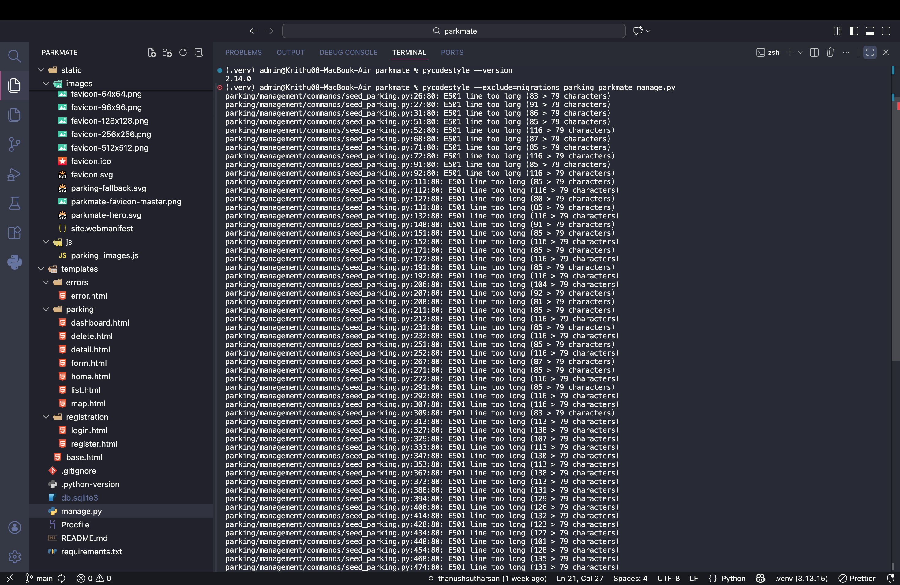

## Fixing seed_parking.py

The errors were concentrated in `seed_parking.py`, which contains the large dataset used to populate ParkMate with parking locations.

The file contains information such as:

- parking names;
- addresses;
- postcodes;
- coordinates;
- parking tariffs;
- restrictions;
- local authorities;
- payment information; and
- official source URLs.

Some of the data values created lines longer than the PEP8 recommended line length.

I corrected the formatting without changing the actual parking information or the functionality of ParkMate.

Long values were reformatted across multiple lines where required, while keeping the resulting Python values unchanged.

The continuation indentation within the large mapped parking dataset was also corrected so that it followed PEP8 indentation conventions.

During the correction process, I also used `autopep8` to help format the affected file:

```bash
autopep8 --in-place --max-line-length=79 parking/management/commands/seed_parking.py
```

After making the required corrections, I tested the file again using:

```bash
pycodestyle parking/management/commands/seed_parking.py
```

No PEP8 errors were returned.

The screenshot below shows `seed_parking.py` successfully passing PEP8 validation.

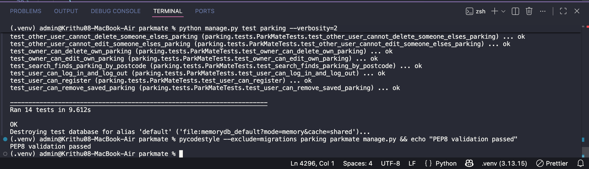

## Project-Wide Python Validation

After correcting `seed_parking.py`, I ran `pycodestyle` again from the root of the ParkMate project to check all of the custom Python code together.

I used:

```bash
pycodestyle --exclude=migrations parking parkmate manage.py
```

The command returned no errors.

For clearer evidence of the successful result, I then ran:

```bash
pycodestyle --exclude=migrations parking parkmate manage.py && echo "All Python files passed PEP8 validation"
```

The terminal returned:

```text
All Python files passed PEP8 validation
```

This confirmed that the custom Python files checked across the ParkMate project passed the PEP8 validation.

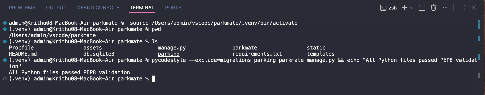

## Why Migrations Were Excluded

Django migration files were excluded from the PEP8 check using:

```text
--exclude=migrations
```

Migration files are automatically generated by Django when database model changes are converted into migration files.

Because these files are generated by the framework rather than manually written as part of the application logic, the PEP8 validation focused on the custom Python code written for ParkMate.

## PEP8 Testing and Fixing Process

The full process used was:

1. Opened the ParkMate project in VS Code.
2. Opened the integrated terminal from the project root.
3. Activated the Python virtual environment.
4. Installed `pycodestyle`.
5. Ran `pycodestyle` across the custom ParkMate Python code.
6. Identified the reported `E501` and `E128` errors.
7. Confirmed that the errors were located in `seed_parking.py`.
8. Corrected the continuation indentation issues.
9. Reformatted long lines while preserving the original parking data and functionality.
10. Used `autopep8` to assist with PEP8 formatting.
11. Ran `pycodestyle` against `seed_parking.py` again.
12. Confirmed that `seed_parking.py` passed without PEP8 errors.
13. Ran `pycodestyle` from the project root against all custom Python files.
14. Confirmed that the complete checked Python code passed PEP8 validation.
15. Recorded screenshots of the original errors and both successful validation results.

## Python PEP8 Validation Results

| Test | Expected Result | Actual Result | Status |
| --- | --- | --- | --- |
| Initial project-wide PEP8 validation | Python code is checked for PEP8 issues | `E501` and `E128` issues identified in `seed_parking.py` | Fixed |
| `seed_parking.py` line lengths | Lines should conform to the configured PEP8 maximum line length | Long lines were reformatted | Pass |
| `seed_parking.py` indentation | Continuation indentation should follow PEP8 | Indentation corrected | Pass |
| `seed_parking.py` final validation | No PEP8 errors should be returned | No errors returned | Pass |
| `parking` application | No PEP8 errors should be returned | No errors returned | Pass |
| `parkmate` project files | No PEP8 errors should be returned | No errors returned | Pass |
| Models | Python code should conform to PEP8 | No errors returned | Pass |
| Views | Python code should conform to PEP8 | No errors returned | Pass |
| Forms | Python code should conform to PEP8 | No errors returned | Pass |
| URL configuration | Python code should conform to PEP8 | No errors returned | Pass |
| Automated Django tests | Python code should conform to PEP8 | No errors returned | Pass |
| Management commands | Python code should conform to PEP8 | No errors returned | Pass |
| `manage.py` | Python code should conform to PEP8 | No errors returned | Pass |
| Final project-wide validation | All checked custom Python files should pass | `All Python files passed PEP8 validation` | Pass |

## Final PEP8 Result

The initial PEP8 validation successfully identified formatting problems within `seed_parking.py`.

These issues were corrected without changing the parking data or the intended functionality of ParkMate.

The corrected `seed_parking.py` was then tested independently and passed PEP8 validation.

Finally, the complete custom Python codebase was validated from the root of the project using:

```bash
pycodestyle --exclude=migrations parking parkmate manage.py
```

No PEP8 errors were returned.

The final confirmation command returned:

```text
All Python files passed PEP8 validation
```

ParkMate's checked custom Python code therefore successfully passed PEP8 style validation.


# Lighthouse Testing

Google Chrome Lighthouse was used to test the performance, accessibility, best practices and SEO quality of the main ParkMate pages.

Unlike some of the other testing sections where representative screenshots were sufficient, Lighthouse testing was carried out on each main page individually because different pages contain different content and functionality.

For example:

- the Home page contains hero content and general navigation;
- the Parking page contains multiple parking cards and images;
- the Map page contains JavaScript and Leaflet map functionality;
- authentication pages contain forms;
- My ParkMate contains user-specific dashboard content; and
- CRUD pages contain more complex form controls.

Testing each page separately therefore provides more accurate evidence than assuming that one Lighthouse result represents the entire application.

## Lighthouse Categories Tested

For each page, I checked the following Lighthouse categories:

- **Performance** - checks page loading and rendering performance;
- **Accessibility** - checks common accessibility issues;
- **Best Practices** - checks modern browser and security-related practices; and
- **SEO** - checks whether the page follows basic search engine optimisation practices.

## How I Carried Out Lighthouse Testing

I used Google Chrome DevTools to test the deployed version of ParkMate.

I followed these steps:

1. Opened the deployed ParkMate page in Google Chrome.
2. Pressed `F12` to open Chrome DevTools.
3. Selected the **Lighthouse** tab.
4. Selected:
   - Performance;
   - Accessibility;
   - Best Practices; and
   - SEO.
5. Used the desktop Lighthouse test where appropriate.
6. Generated the Lighthouse report.
7. Recorded the scores.
8. Reviewed any warnings or recommendations.
9. Took a screenshot of the final Lighthouse result.
10. Repeated the same process for each main ParkMate page.

Where a page required authentication, I logged into ParkMate before running the Lighthouse test.

## Pages Tested

Lighthouse testing was carried out on the following ParkMate pages:

- Home page;
- Parking page;
- Map page;
- Parking detail page;
- Registration page;
- Login page;
- My ParkMate dashboard;
- Add Parking page;
- Edit Parking page; and
- Delete confirmation page.

---

## Home Page Lighthouse Testing

The Home page was tested using Google Chrome Lighthouse.

The page was checked for performance, accessibility, best practices and SEO.

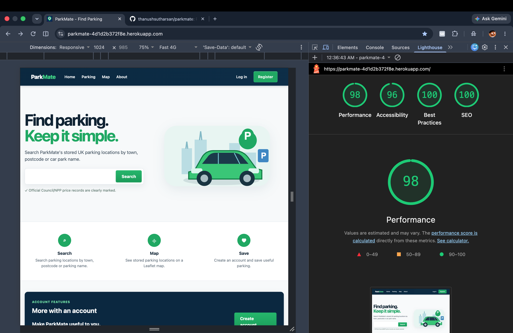


---

## Parking Page Lighthouse Testing

The Parking page was tested separately because it contains multiple parking cards, parking information and images.

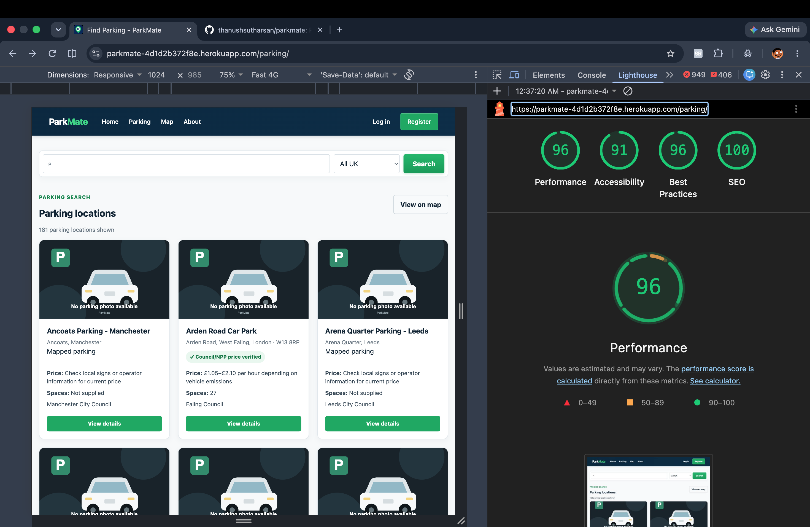


---

## Map Page Lighthouse Testing

The Map page was tested separately because it contains interactive JavaScript and Leaflet map functionality.

This made it important to check whether the additional JavaScript, map tiles and markers affected the Lighthouse results.

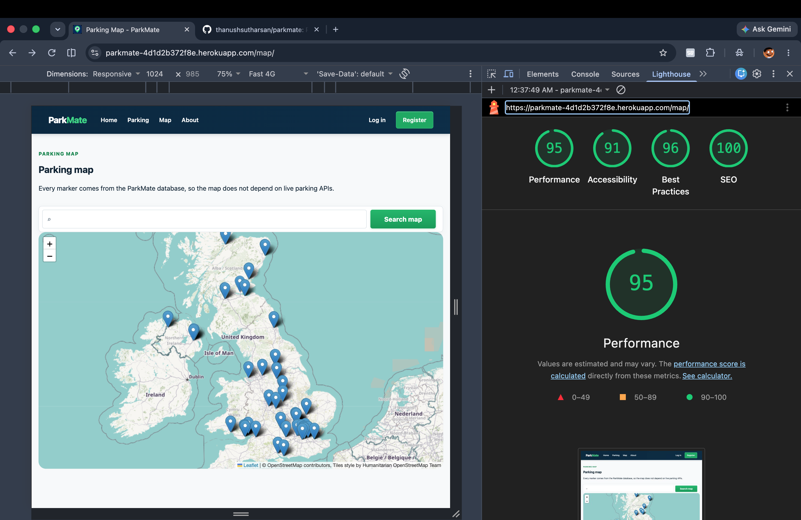

---

## Parking Detail Page Lighthouse Testing

A parking detail page was tested to check the layout and content used when displaying an individual parking location.


---

## Registration Page Lighthouse Testing

The Registration page was tested because forms have additional accessibility and usability requirements.

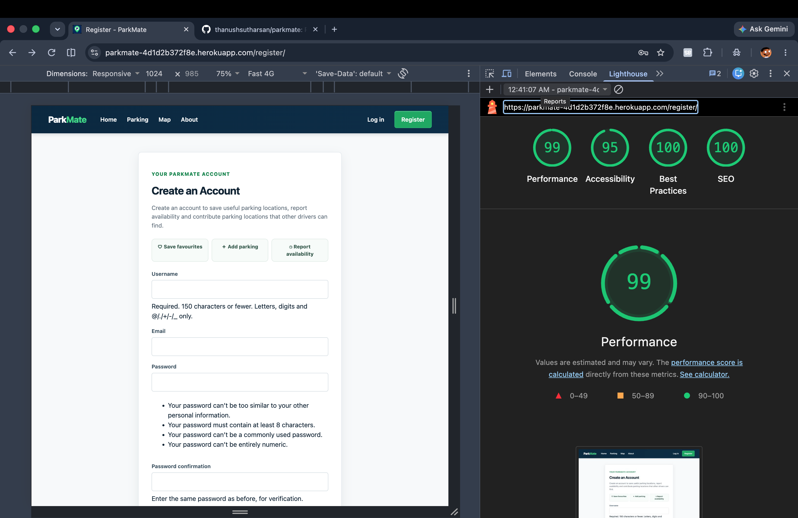


---

## Login Page Lighthouse Testing

The Login page was tested separately to check the authentication form and supporting page structure.

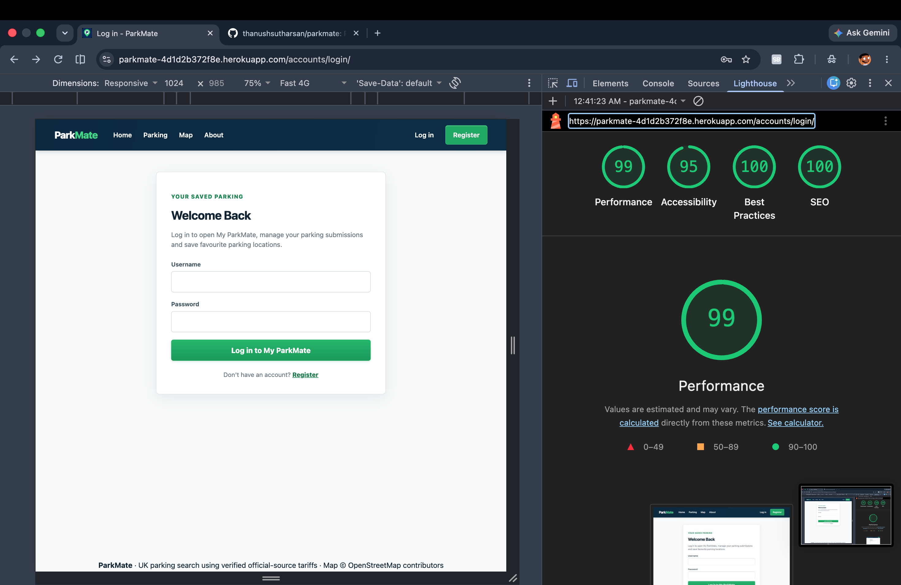


---

## My ParkMate Dashboard Lighthouse Testing

The My ParkMate dashboard was tested while logged into a user account.

This page was tested separately because it contains account-specific content, saved parking locations and user-submitted parking information.

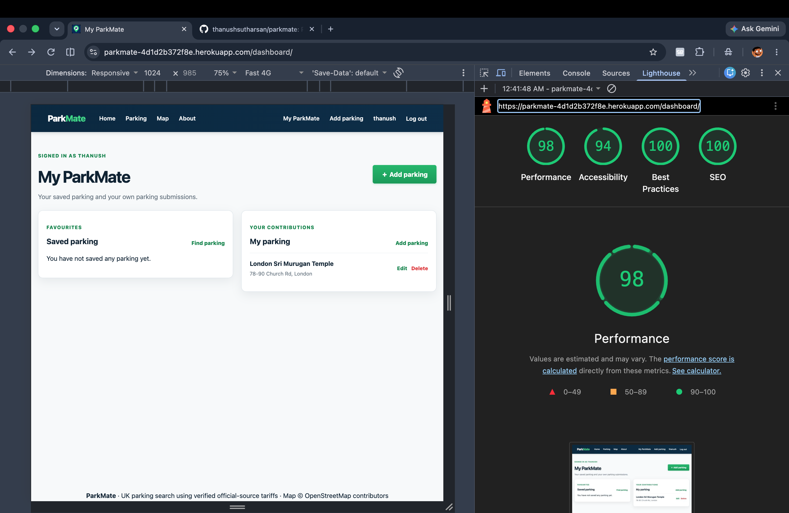


---

## Add Parking Page Lighthouse Testing

The Add Parking page was tested while authenticated.

This page contains the main parking creation form and therefore required its own Lighthouse check.

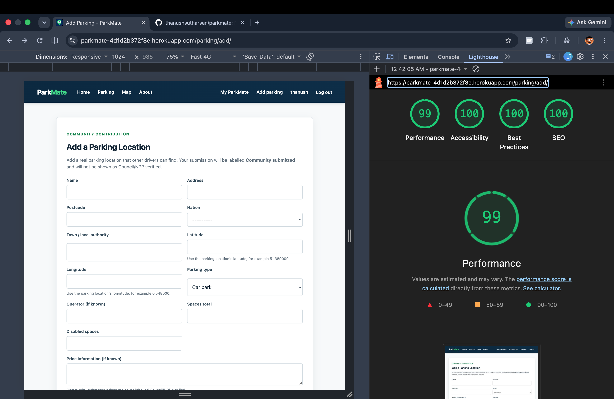


---

## Edit Parking Page Lighthouse Testing

The Edit Parking page was tested using a parking record owned by the logged-in user.

The page contains a pre-populated form and was checked independently from the Add Parking page.


---

## Delete Confirmation Page Lighthouse Testing

The Delete confirmation page was also tested.

Although this is a simpler page, it was included because it forms part of the complete CRUD workflow.

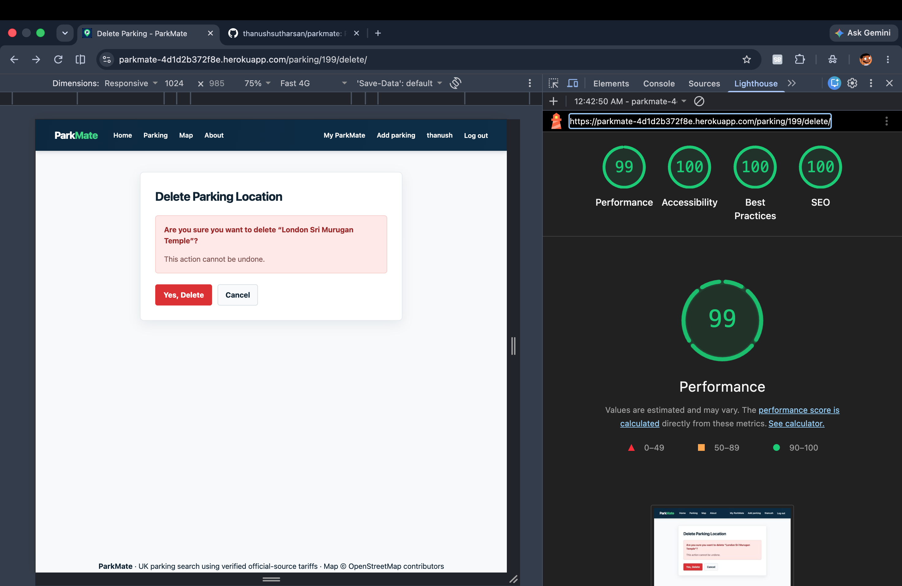


---


## Why Every Main Page Was Tested

Unlike general browser compatibility or responsiveness testing, Lighthouse results can vary significantly between individual pages.

Different ParkMate pages contain different types and amounts of content.

For example:

- the Parking page contains multiple cards and images;
- the Map page loads external map tiles and JavaScript;
- authentication pages contain forms;
- My ParkMate contains personalised database content; and
- CRUD pages contain form controls and validation.

For this reason, each main ParkMate page was tested separately rather than using the Home page as evidence for the whole application.

This provides clearer evidence that performance, accessibility, best practices and SEO were considered throughout the project.

## Interpreting the Lighthouse Results

The Lighthouse scores were reviewed alongside the detailed recommendations provided by Chrome DevTools.

A score below `100` does not automatically mean that the page has failed.

Lighthouse scores can be affected by factors such as:

- network conditions;
- browser extensions;
- local device performance;
- external resources;
- third-party services;
- map tiles;
- external images; and
- JavaScript execution.

The purpose of the tests was therefore to identify significant issues and check that ParkMate achieved acceptable results across all four categories.

Where Lighthouse identified an issue that could reasonably be addressed within ParkMate, the recommendation was reviewed and corrected where appropriate.

## Lighthouse Testing Result

Lighthouse testing was completed on all of the main ParkMate pages.

The tests covered:

- Performance;
- Accessibility;
- Best Practices; and
- SEO.

Testing each page separately provided a more accurate overview of the application's quality than relying on a single Home page Lighthouse report.

The Map, authentication, dashboard and CRUD pages were specifically included because they contain functionality that is not present on the Home page.

The final Lighthouse results demonstrated that ParkMate remained functional and achieved acceptable results across the main application pages.

Any differences between page scores were reviewed in the context of the content and functionality used by that page.


# Final UX Evaluation

The final ParkMate user experience was evaluated after development and testing to determine whether the application meets the needs of its intended users.

The evaluation focused on:

- Information Hierarchy;
- User Control;
- User Feedback;
- Consistency;
- Confirmation; and
- Accessibility.

The aim was to ensure that users can understand the interface, find parking efficiently, complete important actions and recover from mistakes without unnecessary complexity.

The final UX was reviewed alongside the manual functional testing, responsiveness testing, browser compatibility testing, accessibility testing and Lighthouse testing carried out during development.

## Information Hierarchy

ParkMate uses a clear information hierarchy so that the most important information and actions are presented first.

The Home page introduces the purpose of ParkMate and directs users towards the main task of finding parking.

The navigation provides access to the main areas of the application, including:

- Home;
- Parking;
- Map;
- My ParkMate; and
- account-related functionality.

On the Parking page, users are presented with search functionality before the parking results. This supports the main user goal of finding a suitable parking location quickly.

Parking cards present important information in a structured format so that users can scan and compare locations.

Important parking information includes:

- parking name;
- location;
- price;
- restrictions;
- verification information; and
- links to further details.

The individual parking detail page then provides more detailed information when the user chooses a specific location.

Account-related functionality is separated within My ParkMate, where users can view their saved parking and their own community parking submissions.

This prevents account-management functionality from interfering with the main parking search experience.

### Information Hierarchy Evaluation

| UX Area | Evaluation |
| --- | --- |
| Main purpose | Finding parking is presented as the primary purpose of the application |
| Navigation | Main areas of ParkMate are clearly separated |
| Parking search | Search functionality appears before detailed parking results |
| Parking cards | Important information is grouped into structured cards |
| Parking details | Additional information is available without overloading the main results page |
| Dashboard | Personal account information is separated within My ParkMate |
| CRUD functionality | Add, Edit and Delete controls are provided in the relevant user-owned parking areas |

The final information hierarchy helps users understand where they are, what information is available and what action they can take next.

## User Control

ParkMate gives users control over how they interact with the application.

Users do not need to register simply to search for parking.

Guest users can:

- view parking locations;
- search for parking;
- use the interactive map;
- view parking information; and
- open individual parking detail pages.

Registration is only required when the user wants to use account-specific functionality.

Authenticated users can:

- save parking locations;
- remove saved parking;
- access My ParkMate;
- add community parking locations;
- edit parking locations they own;
- delete parking locations they own; and
- log out when they have finished.

Users remain in control of their own community submissions because ownership checks ensure that another normal user cannot edit or delete their parking.

Users can also change search terms, clear searches and return to the full parking list without being locked into a previous search.

The application therefore avoids forcing users into unnecessary account creation while still providing additional functionality to users who choose to register.

### User Control Evaluation

| UX Area | Evaluation |
| --- | --- |
| Guest access | Users can search and view parking without creating an account |
| Registration | Account creation is only required for personal functionality |
| Search | Users can change or clear searches |
| Favourites | Users can save and remove parking locations |
| CRUD | Users control their own community parking submissions |
| Ownership | Users cannot modify another user's submissions |
| Logout | Users can end their authenticated session when required |

This provides users with appropriate control while protecting account-specific data and user-created content.

## User Feedback

ParkMate provides feedback when users perform important actions.

Feedback is particularly important when users:

- register;
- log in;
- log out;
- submit forms;
- save parking;
- remove parking from favourites;
- create parking;
- edit parking;
- delete parking;
- enter invalid information; or
- perform a search with no matching results.

Form validation provides feedback when information is missing or invalid.

Examples include:

- required fields;
- invalid password information;
- mismatching passwords;
- duplicate account information;
- invalid parking coordinates; and
- invalid parking capacity information.

Parking search also provides feedback when no matching parking locations can be found rather than leaving the user with an unexplained empty page.

Favourite controls change state so that users can identify whether a parking location has already been saved.

After Create, Update and Delete operations, users are redirected to an appropriate page so that it is clear that the requested action has been completed.

Error handling also prevents unexpected failures from exposing technical information to the user.

### User Feedback Evaluation

| User Action | Feedback Provided |
| --- | --- |
| Registration | Validation messages explain problems with submitted details |
| Login | Invalid credentials are rejected and feedback is provided |
| Parking search | Matching results or a no-results message are displayed |
| Save favourite | Favourite state changes to show that the location is saved |
| Remove favourite | Saved state is removed |
| Add parking | Successful submission redirects to the created parking information |
| Edit parking | Updated information is displayed after saving |
| Delete parking | User is redirected after confirming deletion |
| Invalid form data | Validation messages identify the problem |
| Invalid page | Custom error handling provides a controlled response |

The final application therefore provides users with feedback instead of requiring them to guess whether an action has succeeded or failed.

## Consistency

Consistency was maintained throughout ParkMate to make the interface easier to learn and use.

The application uses a shared base layout so that common interface elements remain consistent between pages.

Consistent elements include:

- navigation;
- typography;
- colour scheme;
- buttons;
- page spacing;
- cards;
- forms;
- headings;
- footer;
- verification styling; and
- account controls.

Buttons performing similar actions use consistent styling and positioning where appropriate.

Forms also follow a consistent structure so that users who understand one form can more easily understand another.

Parking cards use a repeated design pattern so that users can quickly recognise the type of information being presented.

The responsive design maintains the same visual identity across desktop, tablet and mobile devices rather than presenting users with completely different interfaces.

Browser compatibility testing also confirmed that the main design remained consistent across Google Chrome, Safari and Mozilla Firefox.

### Consistency Evaluation

| UX Area | Evaluation |
| --- | --- |
| Navigation | Shared navigation structure is used throughout the application |
| Colours | ParkMate branding remains consistent |
| Typography | Text styling and heading patterns are reused |
| Buttons | Similar actions use recognisable controls |
| Forms | Form layouts follow a consistent structure |
| Parking cards | Parking information uses the same presentation pattern |
| Dashboard | Uses the same visual language as the rest of ParkMate |
| Responsive layout | Branding and functionality remain consistent across screen sizes |
| Browser rendering | Main design remains consistent across tested browsers |

This consistency reduces the amount of new interface behaviour users need to learn when moving between ParkMate pages.

## Confirmation

Confirmation is particularly important for actions that make significant changes to user data.

ParkMate provides a dedicated confirmation step before a user deletes one of their parking submissions.

Instead of deleting a parking record immediately when the Delete option is selected, the user is shown a Delete confirmation page.

This gives the user an opportunity to review the action before permanently removing the record.

The confirmation step helps protect users from accidental deletion.

Create and Edit actions also provide confirmation through the resulting page and updated information.

For example:

- creating parking redirects the user to the created parking information;
- editing parking displays the updated information; and
- deleting parking redirects the user away from the removed record.

Authentication state also provides confirmation through changes to the available navigation and account controls after Login or Logout.

### Confirmation Evaluation

| Action | Confirmation Behaviour |
| --- | --- |
| Add Parking | User is redirected to the created parking information |
| Edit Parking | Updated information is displayed after submission |
| Delete Parking | Dedicated confirmation page appears before deletion |
| Confirm Delete | Parking is removed and the user is redirected |
| Save Favourite | Favourite control changes state |
| Remove Favourite | Favourite control returns to its unsaved state |
| Login | Authenticated account functionality becomes available |
| Logout | Account-only functionality is removed |

The Delete confirmation is particularly important because deletion is a destructive action that cannot be treated in the same way as ordinary navigation.

## Accessibility

Accessibility was considered throughout the design and testing of ParkMate.

The application was checked using both automated and manual accessibility testing.

Google Chrome Lighthouse was used to identify common accessibility issues, while manual testing was used to check areas that cannot be fully assessed through an automated tool.

Accessibility considerations included:

- semantic HTML;
- logical heading structure;
- keyboard navigation;
- visible keyboard focus;
- form labels;
- readable validation messages;
- image alternative text;
- readable text;
- colour contrast;
- responsive layouts;
- descriptive controls; and
- ensuring essential information is not communicated only through images or colour.

Important parking information remains available as text.

Users therefore do not need to rely on parking images to understand information such as the parking name, address, price or verification status.

Forms use labels and validation feedback to help users understand the information required.

Keyboard testing was also carried out to check that important controls could be reached without relying entirely on a mouse.

Responsiveness testing supported accessibility by confirming that content remains usable on smaller screens and that users are not forced to navigate unnecessary horizontal scrolling.

## Final UX Evaluation Result

The final UX evaluation found that ParkMate provides a clear and consistent user experience centred around the main task of finding parking.

The information hierarchy prioritises parking search and parking information while keeping account-specific functionality separate within My ParkMate.

Users retain control because searching and viewing parking does not require registration, while additional account functionality is available to users who choose to register.

Feedback is provided through form validation, search results, favourite states, redirects and error handling so that users can understand the outcome of their actions.

Consistent navigation, styling, cards, forms and buttons help users learn the interface and move between pages without encountering unexpected design changes.

Destructive actions such as deleting parking require confirmation before the change is completed, reducing the risk of accidental data loss.

Accessibility was supported through semantic structure, keyboard navigation, form labels, text alternatives, readable content and automated and manual accessibility testing.

Overall, the final ParkMate UX meets the intended goal of providing a straightforward parking search and management experience while maintaining user control, clear feedback, consistency and accessibility.


# User Story Testing (EVIDENCE)

User story acceptance testing was carried out to confirm that the final ParkMate application meets the needs identified for the three main target user groups:

- Commuters
- Drivers attending appointments or events
- Delivery drivers

The original user stories were divided into first-time, returning and frequent users.

Several user stories require the same ParkMate functionality. To avoid adding repetitive explanations, related user stories have been grouped together where the same feature provides suitable acceptance evidence.

During testing, it was identified that ParkMate displays price information for parking locations, but it does not currently provide an automatic side-by-side price comparison feature. Users can compare prices manually by opening or reviewing each parking location one at a time. Therefore, the user story requiring users to compare parking prices before choosing a location is considered a pass because the required comparison can be completed through the existing parking information.

Each screenshot section below identifies exactly which user stories it provides evidence for.

---

## Parking Search Acceptance Testing

ParkMate allows users to search for parking using location information they are likely to already know, including town or city names, postcodes, postcode areas and parking names.

### User Stories Covered

This evidence relates to the following user stories:

- **First-Time Commuter** - search by town or city to find parking near the destination.
- **First-Time Commuter** - search using a postcode without knowing the parking location name.
- **First-Time Appointment/Event Driver** - search using the postcode of an unfamiliar destination.
- **First-Time Delivery Driver** - quickly search near a delivery postcode.
- **First-Time Delivery Driver** - find parking in an unfamiliar town.
- **Returning Delivery Driver** - search directly for a previously used parking location.

### Acceptance Test

I tested searches using:

- town or city names;
- postcodes;
- postcode areas; and
- parking location names.

A separate screenshot was captured for each type of search. The relevant parking locations were returned successfully for all four search methods.

**Status:** Pass

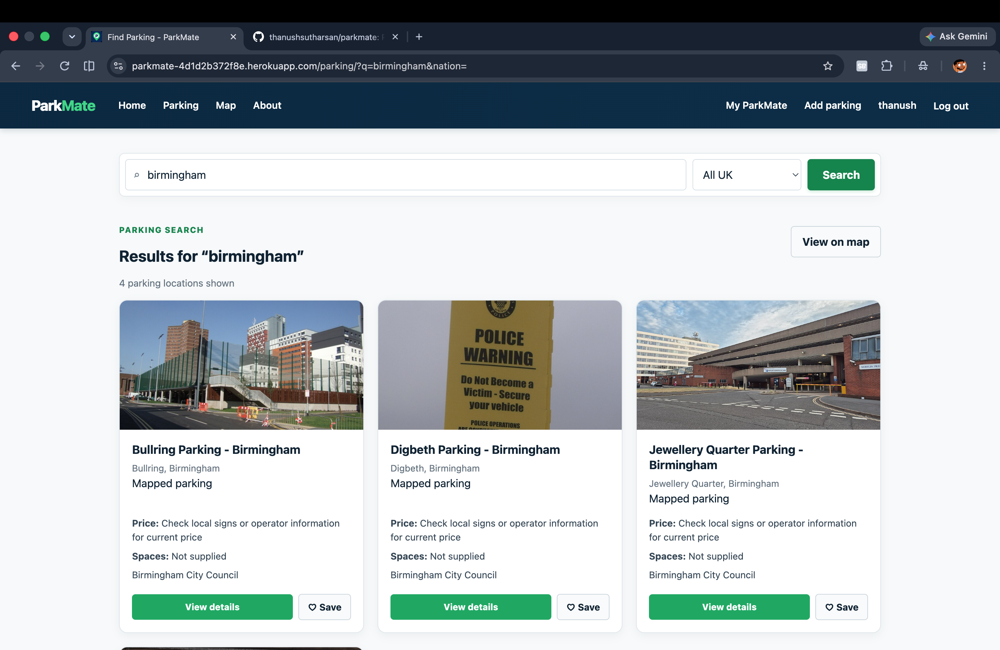

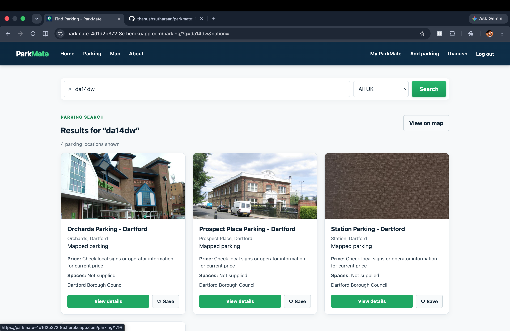

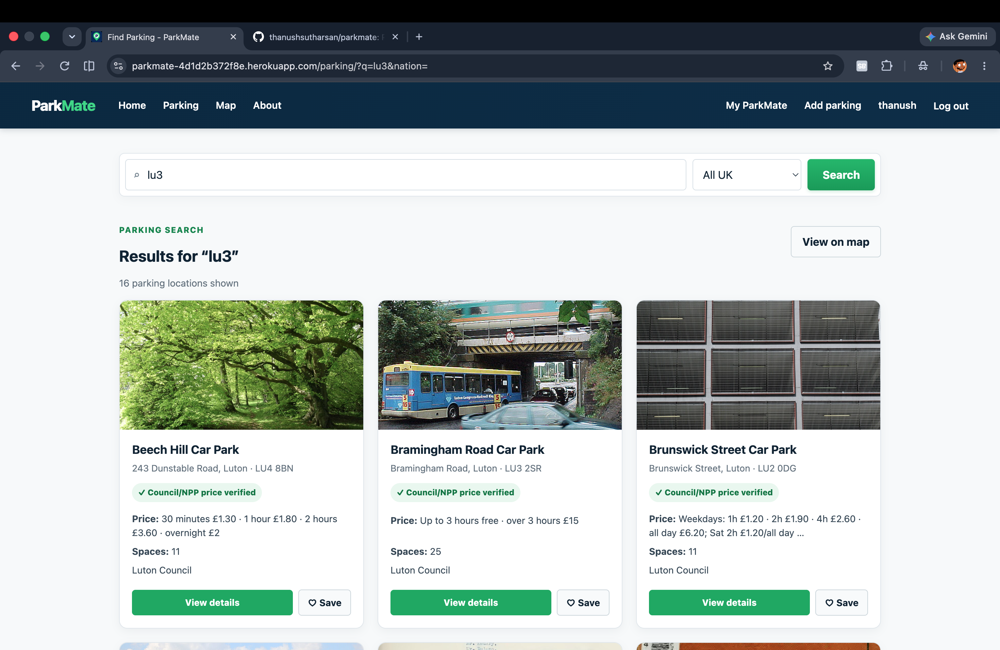

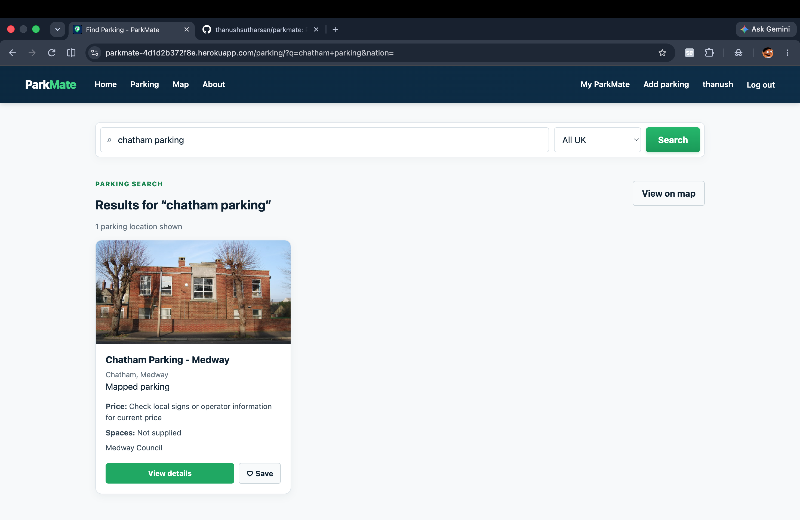

---

## Parking Results Acceptance Testing

ParkMate displays multiple parking locations where matching records are available.

The parking cards allow users to review general parking information, including price information where it has been provided, and select a suitable location. Users can compare parking prices by reviewing the parking locations one at a time.

### User Stories Covered

This evidence relates to:

- **First-Time Commuter** - compare parking prices before choosing a location.
- **First-Time Delivery Driver** - view several parking options before choosing one.
- **Frequent Appointment/Event Driver** - view several parking choices before deciding which one to use.

### Acceptance Test

I searched an area containing several parking locations and checked that multiple results were displayed.

I then reviewed the parking options one by one and checked the price information shown for each location. This allowed me to compare the available prices before choosing a parking location.

Although ParkMate does not provide an automatic side-by-side comparison table, users can compare prices manually by clicking on or reviewing each parking location individually.

**Status:** Pass

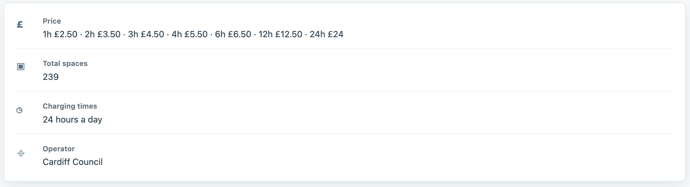

---

## Interactive Map Acceptance Testing

ParkMate provides an interactive Leaflet map showing parking locations with stored coordinates.

Users can view the geographical position of parking locations and interact with map markers.

### User Stories Covered

This evidence relates to:

- **First-Time Commuter** - see where parking locations are geographically positioned.
- **First-Time Appointment/Event Driver** - use a map to understand where parking is located near an unfamiliar destination.
- **Returning Delivery Driver** - view stored parking locations on the interactive map.

### Acceptance Test

I opened the Map page and confirmed that:

- parking markers were displayed;
- the map could be moved and zoomed;
- markers could be selected; and
- parking information could be viewed.

**Status:** Pass

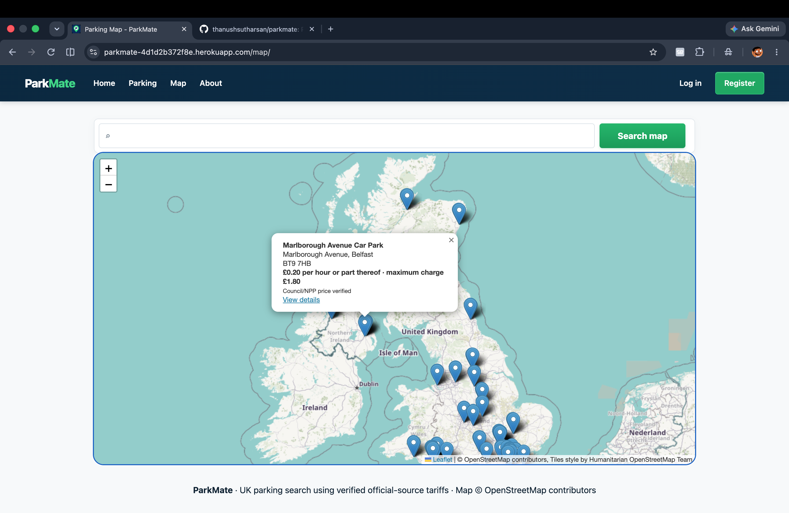

---

## Parking Detail Information Acceptance Testing

Individual parking detail pages provide more information than the main parking results.

The available information can include:

- parking name;
- address;
- price;
- restrictions;
- charging information;
- payment information; and
- verification information.

### User Stories Covered

This evidence relates to:

- **First-Time Appointment/Event Driver** - check parking restrictions before travelling.
- **Returning Appointment/Event Driver** - review parking information again before travelling.
- **Returning Appointment/Event Driver** - check when parking charges apply.
- **Returning Appointment/Event Driver** - understand available payment information.
- **First-Time Delivery Driver** - check the parking address and restrictions before stopping.

### Acceptance Test

I opened a parking detail page and confirmed that the available parking information was clearly presented.

Price information was displayed where it was available for the selected parking location. I reviewed the detail pages for individual parking locations one at a time so that the prices could be compared before selecting a suitable location.

**Status:** Pass

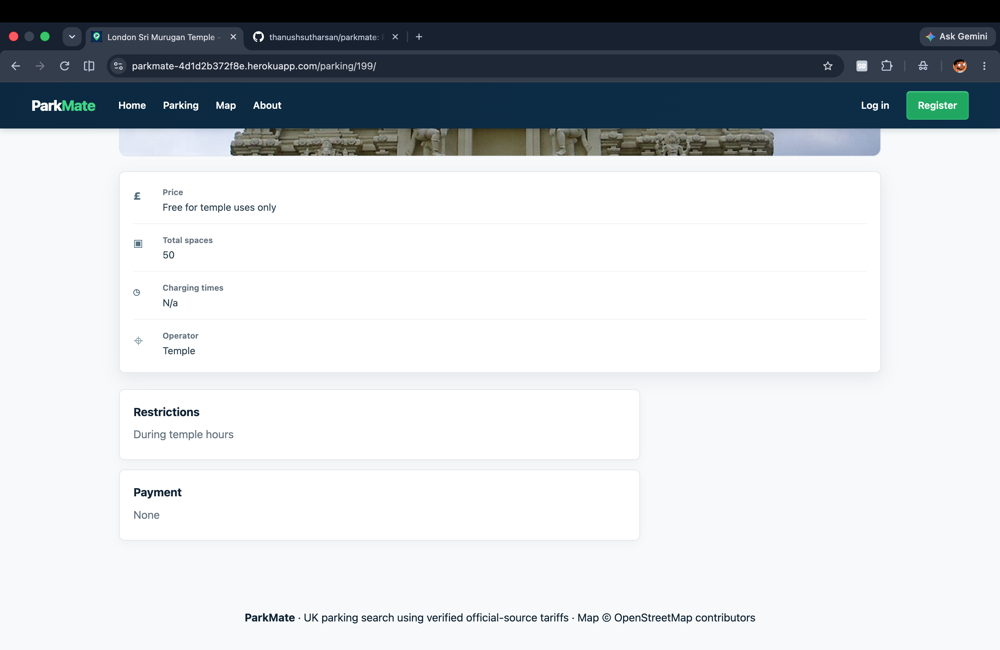

---

## Parking Verification Acceptance Testing

ParkMate distinguishes officially sourced parking information from other mapped or community parking records.

Council/NPP price-verified parking clearly displays its verification status.

### User Stories Covered

This evidence relates to:

- **First-Time Appointment/Event Driver** - identify whether parking information has an official source.
- **Frequent Appointment/Event Driver** - access the official source where one is available.
- **Frequent Delivery Driver** - distinguish verified parking from mapped parking.

### Acceptance Test

I compared parking records with different verification states and confirmed that Council/NPP verified parking was clearly identified.

Where an official source was stored, the user could access the source information.

Verification identifies the source or status of a parking record and helps users assess the reliability of the parking information before comparing and selecting a location.

**Status:** Pass

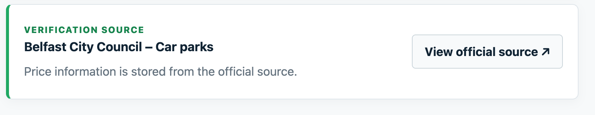

---

## Registration and Login Acceptance Testing

ParkMate allows returning users to create an account and access personal functionality.

### User Stories Covered

This evidence relates to:

- **Returning Commuter** - register for an account to access personal ParkMate features.
- **Returning Commuter** - log in and access My ParkMate.

Registration and authentication also support all other user stories involving favourites, My ParkMate and community parking management.

### Acceptance Test

I registered a new account using valid details and then logged into ParkMate.

After authentication, account-specific navigation and My ParkMate became available.

**Status:** Pass

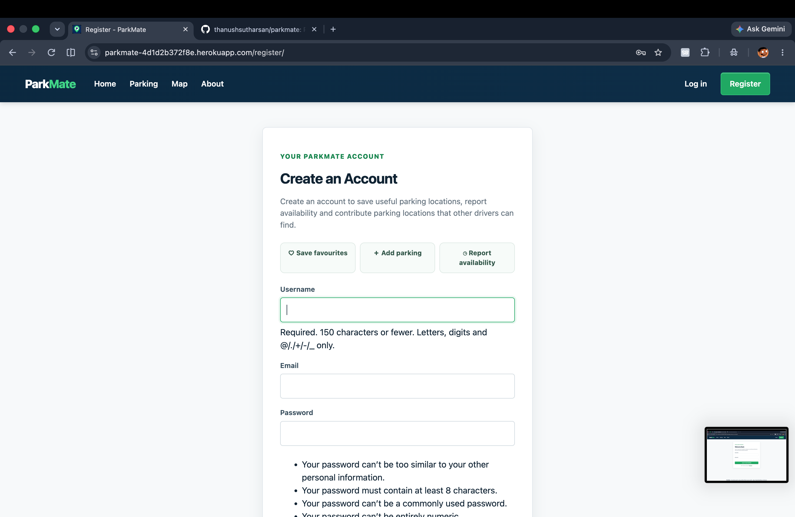

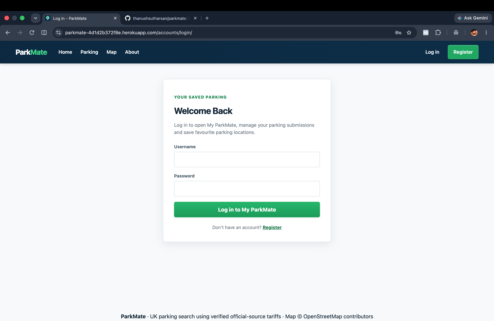
---

## Favourites and My ParkMate Acceptance Testing

Registered users can save useful parking locations and access them later through My ParkMate.

### User Stories Covered

This evidence relates to:

- **Returning Commuter** - save useful parking for later.
- **Returning Commuter** - view saved favourites.
- **Frequent Commuter** - quickly return to previously saved parking.
- **Returning Appointment/Event Driver** - save suitable parking for later.
- **Frequent Appointment/Event Driver** - access saved parking from My ParkMate.
- **Returning Delivery Driver** - save useful parking for future journeys.
- **Returning Delivery Driver** - quickly access saved parking.

### Acceptance Test

I saved a parking location while logged in and then opened My ParkMate.

The saved location appeared within the favourites section and could be opened again.

**Status:** Pass

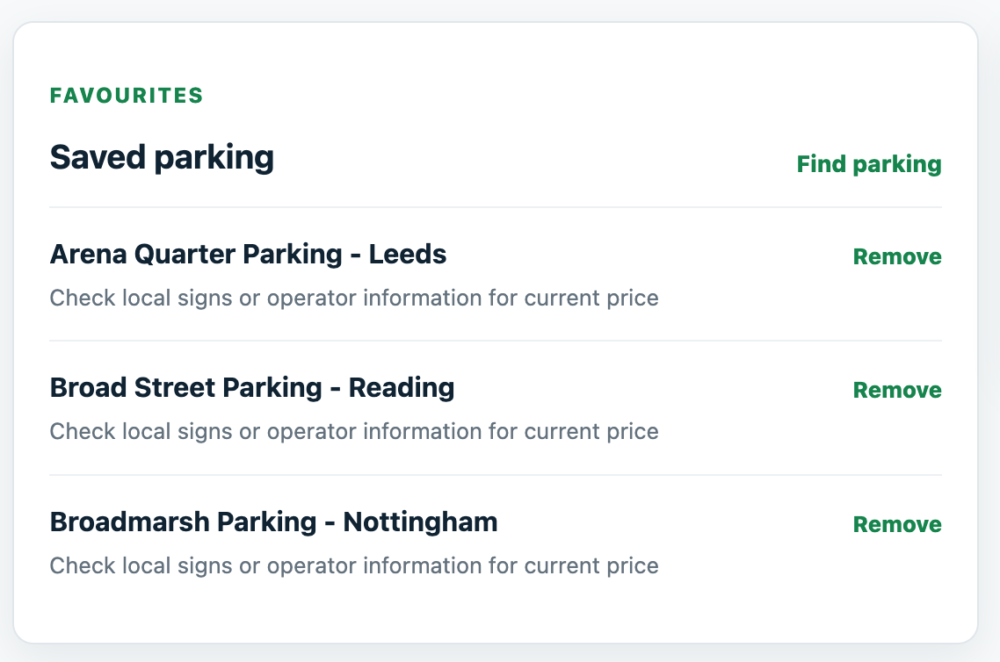

---

## Add Parking Acceptance Testing

Authenticated users can contribute community parking locations using the Add Parking form.

Community-created parking is not automatically marked as Council/NPP verified.

### User Stories Covered

This evidence relates to:

- **Frequent Commuter** - add a missing parking location.
- **Frequent Appointment/Event Driver** - contribute missing parking.
- **Frequent Delivery Driver** - add useful parking that could help other drivers.

### Acceptance Test

I logged into ParkMate, completed the Add Parking form using valid information and submitted the record.

The parking location was created successfully and remained a community submission rather than being automatically marked as officially verified.

**Status:** Pass

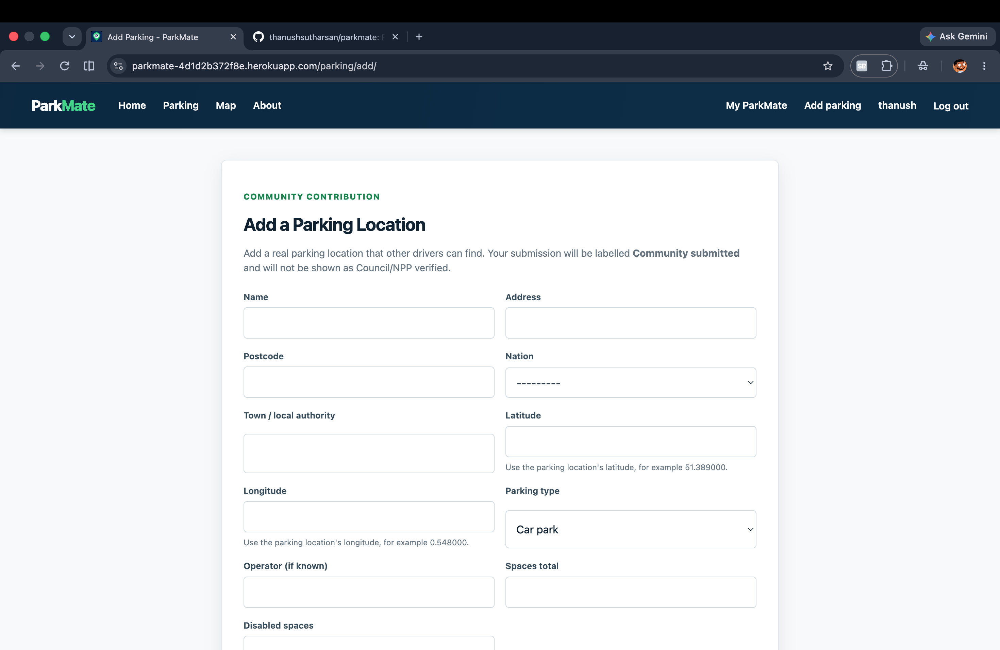

---

## Edit Parking Acceptance Testing

Users can update community parking records that they own.

### User Stories Covered

This evidence relates to:

- **Frequent Commuter** - correct information in a parking record they submitted.
- **Frequent Delivery Driver** - update parking information they previously submitted.

### Acceptance Test

I opened a parking record owned by the logged-in account, selected Edit and changed the parking information.

The updated information was saved successfully.

**Status:** Pass

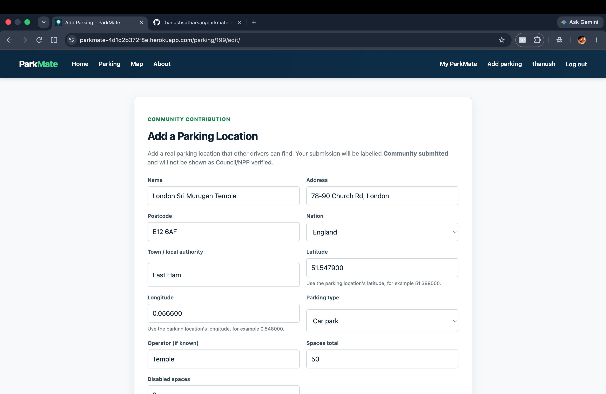

---

## Delete Parking Acceptance Testing

Users can remove parking records that they own.

ParkMate requires confirmation before the record is deleted.

### User Stories Covered

This evidence relates to:

- **Frequent Commuter** - remove an outdated parking submission.
- **Frequent Delivery Driver** - remove one of their own outdated submissions.

#### Acceptance Test

I selected Delete on a user-owned parking record.

ParkMate displayed a confirmation page before completing the deletion.

After confirmation, the record was successfully removed.

**Status:** Pass


---

## User Story Acceptance Testing Summary

| Feature | Main User Stories Supported | Result |
| --- | --- | --- |
| Parking search | Town, city, postcode, postcode-area and parking-name searches | Pass |
| Parking results | View multiple parking options | Pass |
| Parking price information | View and compare prices by reviewing parking locations individually | Pass |
| Interactive map | View geographical parking locations | Pass |
| Parking details | View address, restrictions, charges and payment information | Pass |
| Verification | Identify verified, mapped and community parking | Pass |
| Registration and Login | Access account functionality | Pass |
| Favourites and My ParkMate | Save and retrieve useful parking | Pass |
| Add Parking | Contribute community parking | Pass |
| Edit Parking | Correct user-owned parking information | Pass |
| Delete Parking | Remove user-owned parking information | Pass |

## User Story Acceptance Testing Result

The user story acceptance testing confirmed that the main functionality implemented in ParkMate supports the needs identified for commuters, drivers attending appointments or events and delivery drivers.

Related user stories were grouped where they relied on the same ParkMate feature. Separate screenshots were included for each parking search method because town or city names, postcodes, postcode areas and parking location names were tested individually.

The evidence demonstrates the main user journeys from finding and comparing parking through to account registration, saving locations and managing community parking submissions.

ParkMate includes price information for parking locations where it has been provided. Users can compare prices by reviewing the parking locations one at a time and selecting the most suitable option. Although the application does not provide an automatic side-by-side comparison view, the user story requirement is met because the prices can be compared manually within the existing parking results and detail pages.

---

## Final Success Criteria Evaluation

The completed ParkMate application was evaluated against the user-facing and technical success criteria established during the planning stage.

## User-Facing Success Criteria

| Success Criterion | Evidence | Status |
| --- | --- | --- |
| Search using a town or city | Parking Search acceptance testing | Met |
| Search using a postcode | Parking Search acceptance testing | Met |
| Search using a postcode area | Parking Search acceptance testing | Met |
| Search using a parking name | Parking Search acceptance testing | Met |
| View matching parking results | Parking Results acceptance testing | Met |
| View available parking price information | Parking Results and Parking Detail testing | Met |
| Compare parking prices before choosing a location | Parking Results and Parking Detail testing | Met |
| Open individual parking details | Parking Detail testing | Met |
| View parking on an interactive map | Interactive Map testing | Met |
| Identify Council/NPP verified parking | Parking Verification testing | Met |
| Distinguish mapped/community parking | Parking Verification testing | Met |
| Register for an account | Registration and Login testing | Met |
| Log in | Registration and Login testing | Met |
| Log out | Login and Logout testing | Met |
| Save favourites | Favourites and My ParkMate testing | Met |
| Remove favourites | Favourites testing | Met |
| Access My ParkMate | Favourites and My ParkMate testing | Met |
| Add community parking | Add Parking testing | Met |
| Edit own parking | Edit Parking testing | Met |
| Delete own parking | Delete Parking testing | Met |
| Prevent users editing another user’s parking | Authentication and Authorisation testing | Met |
| Prevent users deleting another user’s parking | Authentication and Authorisation testing | Met |
| Use ParkMate on desktop | Responsiveness testing | Met |
| Use ParkMate on tablet | Responsiveness testing | Met |
| Use ParkMate on mobile | Responsiveness testing | Met |

## User-Facing Success Criteria Result

The defined user-facing success criteria were met by the final ParkMate application.

Users can complete the main parking journey without creating an account, including searching, viewing results, opening parking details and using the map.

Users can view price information where it has been provided for an individual parking location. They can then review the available parking locations one at a time and compare the prices before choosing a suitable location.

ParkMate does not provide an automatic side-by-side price comparison feature, but this is not required for the user story to pass because the comparison can be completed manually by clicking through the available parking options.

---

## Technical Success Criteria

| Technical Success Criterion | Evidence | Status |
| --- | --- | --- |
| Python backend | ParkMate Python source code and PEP8 validation | Met |
| Django framework | Django project and application structure | Met |
| Relational database | Parking, favourites and user relationships | Met |
| Django ORM | Database Create, Read, Update and Delete operations | Met |
| Authentication | Registration, Login and Logout | Met |
| Authorisation | Ownership-protected Edit and Delete functionality | Met |
| CRUD functionality | Add, view, edit and delete parking | Met |
| Django forms | Registration and parking forms | Met |
| Form validation | Registration and parking validation testing | Met |
| Security controls | CSRF, authentication and ownership restrictions | Met |
| Interactive map | Leaflet and OpenStreetMap integration | Met |
| Responsive design | Desktop, tablet and mobile testing | Met |
| Browser compatibility | Chrome, Safari and Firefox testing | Met |
| Accessibility | Lighthouse and manual accessibility testing | Met |
| Automated backend testing | Django automated test suite | Met |
| Python code quality | PEP8 validation | Met |
| HTML quality | HTML validation | Met |
| CSS quality | CSS validation | Met |
| JavaScript quality | JavaScript validation | Met |
| External API resilience | Wikimedia API failure testing | Met |
| Deployment | Heroku deployment and verification | Met |

## Technical Success Criteria Result

The final ParkMate application demonstrates the technical requirements established during development.

The project uses Python and Django for backend functionality, relational database models for storing application data and Django’s ORM for database interaction.

Authentication and ownership-based authorisation protect user-specific functionality.

CRUD functionality is demonstrated through:

- **Create** - users can add community parking;
- **Read** - users can search for and view parking;
- **Update** - users can edit parking they own; and
- **Delete** - users can delete parking they own.

The application also stores and displays parking price information where it is available. Users can review the prices for individual parking locations one at a time and compare them before selecting a suitable location. This supports the parking price comparison user story, even though the application does not include a dedicated automatic comparison table or side-by-side comparison interface.

Testing and validation provide additional evidence that the final application is functional, responsive, accessible and appropriately protected.

# Data Model Rationale

ParkMate uses a relational data model built with Django models.

The database structure was designed around the main actions users need to perform within the application:

- search for parking locations;
- view parking information;
- register and authenticate;
- save parking locations as favourites;
- add community parking locations;
- edit their own parking submissions;
- delete their own parking submissions; and
- associate parking information with the user who created it.

The central model is `ParkingLocation`.

This model stores the information required to display and manage a parking location, while related models handle user favourites and parking availability reports.

Django's built-in `User` model is used for authentication rather than creating a separate custom user model.

## Main Models

The main data models used by ParkMate are:

- Django `User`
- `ParkingLocation`
- `Favourite`
- `AvailabilityReport`

## ParkingLocation Model

`ParkingLocation` is the main model in ParkMate because most application functionality is based around parking records.

It stores information including:

- parking name;
- address;
- postcode;
- nation;
- local authority;
- latitude;
- longitude;
- parking type;
- operator;
- total spaces;
- disabled spaces;
- tariff information;
- charging times;
- restrictions;
- payment information;
- payment location code;
- official source information;
- verification status;
- image information;
- submitting user;
- active status;
- creation date; and
- update date.

The model was designed to support both officially sourced parking and community-submitted parking within the same database table.

The `council_verified` field is used to distinguish officially verified Council/NPP records from community parking submissions.

Community users cannot directly control this field through the community parking form.

## Why Parking Information Uses One Main Model

I chose to keep the main parking information within one `ParkingLocation` model rather than separating official and community parking into different models.

This provides several advantages:

- all parking can use the same search system;
- all parking can appear on the same map;
- parking details can use the same template;
- favourites can reference either type of parking;
- less duplicated model and view logic is required; and
- verification status can be used to clearly distinguish the source of the information.

This keeps the database structure simpler while still allowing ParkMate to differentiate between verified and community data.

## ParkingLocation Validation

Validation is also included within the model.

ParkMate checks that:

- latitude remains within the supported UK range;
- longitude remains within the supported UK range;
- disabled spaces cannot exceed total parking spaces;
- verified parking must have an official source URL;
- verified parking must include a last checked date; and
- verified parking must contain tariff information.

This helps prevent invalid parking information from being stored in the database.

## User Model

ParkMate uses Django's built-in authentication `User` model.

This avoids recreating authentication functionality that Django already provides securely.

The User model is used for:

- Registration;
- Login;
- Logout;
- identifying the owner of community parking;
- associating favourites with an account; and
- associating availability reports with an account.

This also allows ParkMate to use Django functionality such as:

- password validation;
- session authentication;
- `login_required`;
- user permissions; and
- staff accounts.

### Favourite Model

The `Favourite` model connects a user to a parking location they want to save.

A favourite contains:

- a reference to the user;
- a reference to the parking location; and
- the date the favourite was created.

The model acts as a junction between `User` and `ParkingLocation`.

This is preferable to storing favourites directly inside either model because:

- one user can save many parking locations;
- one parking location can be saved by many users; and
- favourite records can be added and removed independently.

A database constraint also prevents the same user from creating duplicate favourites for the same parking location.

## AvailabilityReport Model

The `AvailabilityReport` model was designed to associate a user-submitted parking availability report with a specific parking location.

It stores:

- the parking location;
- the reporting user;
- availability status;
- available spaces;
- an optional note; and
- creation time.

Possible availability states include:

- spaces available;
- busy / nearly full; and
- full.

Validation prevents logically invalid data, such as reporting available spaces for a location marked as full or reporting more available spaces than the known total capacity.

The model provides a structured foundation for parking availability reports.

## Data Model Overview

| Model | Main Purpose | Important Relationships |
| --- | --- | --- |
| `User` | Authentication and ownership | Parking submissions, favourites and availability reports |
| `ParkingLocation` | Stores parking information | Submitted by User, referenced by Favourite and AvailabilityReport |
| `Favourite` | Stores saved parking | Links one User to one ParkingLocation |
| `AvailabilityReport` | Stores availability information | Links one User to one ParkingLocation |

## Data Model Diagram

The following diagram shows the main ParkMate database relationships.

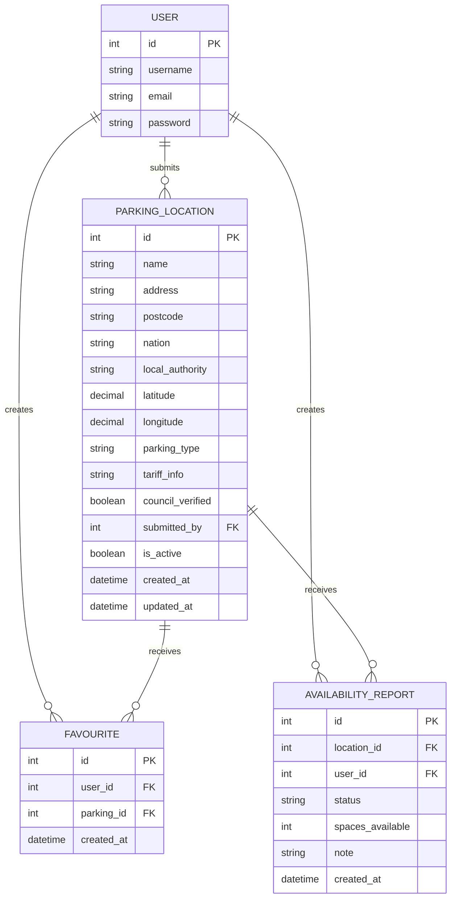
```mermaid
erDiagram
    USER ||--o{ PARKING_LOCATION : submits
    USER ||--o{ FAVOURITE : creates
    PARKING_LOCATION ||--o{ FAVOURITE : receives
    USER ||--o{ AVAILABILITY_REPORT : creates
    PARKING_LOCATION ||--o{ AVAILABILITY_REPORT : receives

    USER {
        int id PK
        string username
        string email
        string password
    }

    PARKING_LOCATION {
        int id PK
        string name
        string address
        string postcode
        string nation
        string local_authority
        decimal latitude
        decimal longitude
        string parking_type
        string tariff_info
        boolean council_verified
        int submitted_by FK
        boolean is_active
        datetime created_at
        datetime updated_at
    }

    FAVOURITE {
        int id PK
        int user_id FK
        int parking_id FK
        datetime created_at
    }

    AVAILABILITY_REPORT {
        int id PK
        int location_id FK
        int user_id FK
        string status
        int spaces_available
        string note
        datetime created_at
    }
```


---

## Model Relationships

The ParkMate database uses Django `ForeignKey` relationships to connect users with parking information.

The relationships were designed so that ownership, favourites and related parking information can be managed without duplicating data.

## User to ParkingLocation

A `ParkingLocation` can optionally reference the user who submitted it using:

```python
submitted_by = models.ForeignKey(
    settings.AUTH_USER_MODEL,
    on_delete=models.SET_NULL,
    null=True,
    blank=True,
    related_name="parking_submissions",
)
```

This creates a **one-to-many relationship**:

```text
One User -> Many ParkingLocation records
```

A user can submit multiple parking locations, while each community parking record can have one submitting user.

`SET_NULL` is used when a user account is removed.

This means deleting a user does not automatically delete useful parking information from ParkMate.

Instead, the `submitted_by` value can become empty while the parking record remains available.

## User to Favourite

Each `Favourite` belongs to one user.

```text
One User -> Many Favourite records
```

If the user is deleted, their favourites are deleted using `CASCADE` because favourites have no purpose without the user who created them.

## ParkingLocation to Favourite

Each favourite also belongs to one parking location.

```text
One ParkingLocation -> Many Favourite records
```

A parking location can therefore be saved by multiple users.

Together, these relationships create a many-to-many relationship between users and parking locations through the `Favourite` model.

```text
User
  |
  | 1
  |
  | many
Favourite
  | many
  |
  | 1
  |
ParkingLocation
```

The database includes a unique constraint on:

```text
user + parking
```

This prevents the same user from saving the same parking location more than once.

## User to AvailabilityReport

Each availability report is linked to the user who submitted it.

```text
One User -> Many AvailabilityReport records
```

If the user is deleted, their associated availability reports are also deleted through `CASCADE`.

## ParkingLocation to AvailabilityReport

Each availability report is also linked to one parking location.

```text
One ParkingLocation -> Many AvailabilityReport records
```

This allows a parking location to have multiple reports over time.

The `ParkingLocation.latest_report` property can identify the newest related report.

### Relationship Summary

| Parent Model | Related Model | Relationship | Delete Behaviour | Reason |
| --- | --- | --- | --- | --- |
| `User` | `ParkingLocation` | One-to-Many | `SET_NULL` | Parking can remain even if the submitting account is removed |
| `User` | `Favourite` | One-to-Many | `CASCADE` | A favourite has no purpose without its user |
| `ParkingLocation` | `Favourite` | One-to-Many | `CASCADE` | Favourites should disappear if the parking record is deleted |
| `User` | `AvailabilityReport` | One-to-Many | `CASCADE` | Reports remain associated with their reporting account |
| `ParkingLocation` | `AvailabilityReport` | One-to-Many | `CASCADE` | Reports relate directly to a specific parking location |

## Relationship Rationale

This relational structure avoids unnecessarily repeating parking information.

For example, when a user saves a parking location, ParkMate does not copy the complete parking record into the user's account.

Instead, the `Favourite` table stores references to:

```text
User ID
+
ParkingLocation ID
```

The dashboard can then retrieve the related `ParkingLocation` data using Django's ORM.

This provides a cleaner relational structure and ensures that if parking information changes, users see the updated information rather than an outdated copied version.

---

## Front End and Back End Data Flow

ParkMate uses Django's Model-View-Template structure to move information between the user interface, Python backend and database.

The general flow is:

```text
User
  ↓
HTML Template / Browser
  ↓
URL Request
  ↓
Django URL Routing
  ↓
Django View
  ↓
Django Form / Business Logic
  ↓
Django ORM
  ↓
Database
  ↓
Django View
  ↓
Template Context
  ↓
HTML Template
  ↓
User
```

## Front End to Back End

When a user performs an action in the front end, the browser sends a request to Django.

Examples include:

- entering a parking search;
- opening a parking detail page;
- registering;
- logging in;
- saving a favourite;
- adding parking;
- editing parking; and
- deleting parking.

Django's URL configuration maps the requested URL to the appropriate view.

The view then determines what application logic needs to run.

## Back End to Database

Django views communicate with the database through Django's Object Relational Mapper.

For example, the parking list begins with active parking records.

The search view can then filter records using information such as:

- name;
- address;
- postcode;
- local authority; and
- nation.

Django ORM queries retrieve the matching `ParkingLocation` objects from the database.

## Database to Front End

After the required data has been retrieved, the view passes it into a Django template through the template context.

For example:

```text
Database
   ↓
ParkingLocation QuerySet
   ↓
parking_list view
   ↓
locations context variable
   ↓
parking/list.html
   ↓
Parking cards shown to user
```

This separates the database logic from the HTML presentation.

## Parking Search Data Flow

When the user performs a parking search:

```text
User enters search
        ↓
GET request with q parameter
        ↓
parking_list view
        ↓
Search text is cleaned
        ↓
Django Q objects build the search query
        ↓
ParkingLocation database query
        ↓
Matching active records returned
        ↓
Results passed to list.html
        ↓
Parking cards displayed
```

Searches can match:

- parking name;
- address;
- postcode; and
- local authority.

Postcode-area logic can also map supported postcode prefixes to an area name before extending the database query.

## Map Data Flow

The Map page uses parking records stored in the same `ParkingLocation` model.

The backend retrieves active parking records and prepares the information required by the front end.

This includes:

- ID;
- parking name;
- address;
- postcode;
- price;
- latitude;
- longitude; and
- verification status.

The data is then passed to the Map template, where JavaScript and Leaflet use the latitude and longitude values to create map markers.

```text
ParkingLocation database
        ↓
map_view
        ↓
Python creates map_locations data
        ↓
parking/map.html
        ↓
JavaScript / Leaflet
        ↓
Map markers displayed
```

## Registration Data Flow

Registration follows a form-based data flow:

```text
User completes Registration form
        ↓
POST request
        ↓
RegisterForm
        ↓
Form validation
        ↓
Django User created
        ↓
User automatically logged in
        ↓
Redirect to My ParkMate
```

The form also checks whether the email address has already been used.

## Favourite Data Flow

When a logged-in user saves parking:

```text
User selects Save
        ↓
POST request
        ↓
toggle_favourite view
        ↓
User authentication checked
        ↓
ParkingLocation retrieved
        ↓
Favourite get_or_create()
        ↓
Favourite saved
        ↓
Success message
        ↓
User returned to page
```

If the favourite already exists, ParkMate removes it instead.

This allows the same control to act as both Save and Remove.

## Dashboard Data Flow

The My ParkMate dashboard retrieves information specifically associated with the logged-in user.

```text
Authenticated User
        ↓
dashboard view
        ↓
Favourite records filtered by user
        +
Parking submissions filtered by user
        ↓
Related ParkingLocation data retrieved
        ↓
dashboard.html
        ↓
Saved Parking + My Parking displayed
```

## Front End and Back End Data Flow Summary

| User Action | Front End | Back End | Database Action | Final Output |
| --- | --- | --- | --- | --- |
| Search parking | Search form | `parking_list` | Filter `ParkingLocation` | Matching parking cards |
| View map | Map page | `map_view` | Retrieve active parking | Leaflet markers |
| View parking | Detail link | `parking_detail` | Retrieve one parking record | Parking detail page |
| Register | Registration form | `register` | Create `User` | Logged-in dashboard |
| Save favourite | Save control | `toggle_favourite` | Create `Favourite` | Saved state/message |
| Remove favourite | Saved control | `toggle_favourite` | Delete `Favourite` | Unsaved state/message |
| View dashboard | My ParkMate | `dashboard` | Query favourites and submissions | Personal dashboard |
| Add parking | Add form | `parking_create` | Create `ParkingLocation` | Parking detail |
| Edit parking | Edit form | `parking_edit` | Update `ParkingLocation` | Updated detail |
| Delete parking | Confirmation form | `parking_delete` | Delete `ParkingLocation` | Dashboard |

## Front End and Back End Data Flow Diagram

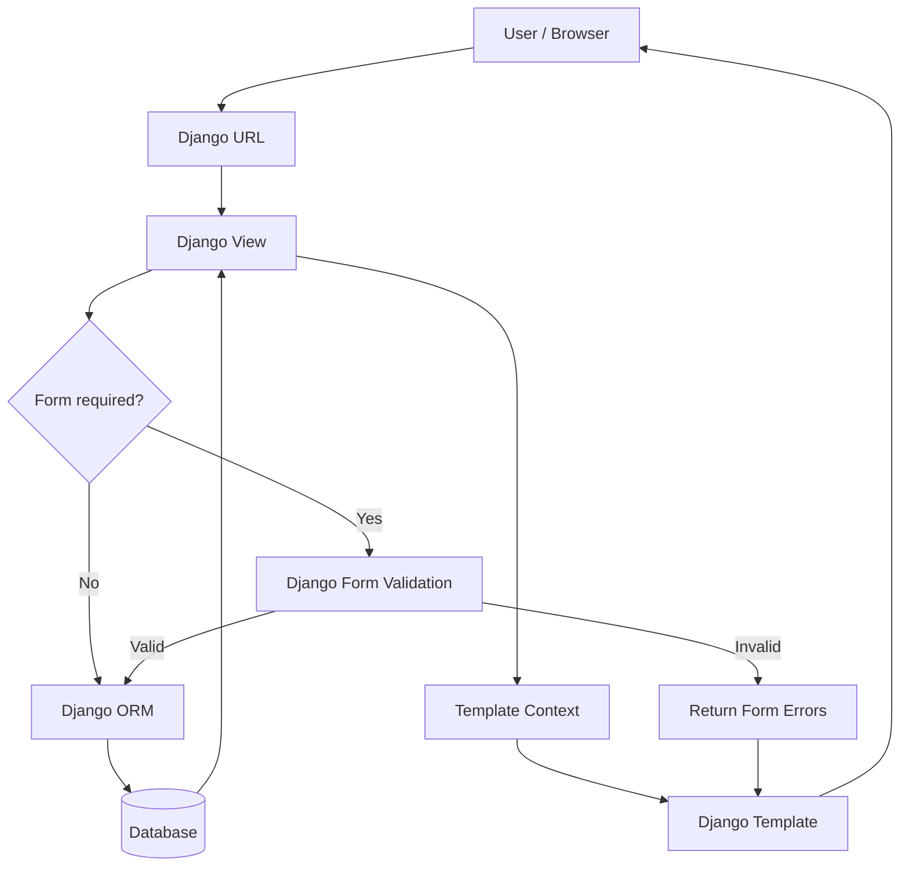
```mermaid
flowchart TD
    A[User / Browser] --> B[Django URL]
    B --> C[Django View]
    C --> D{Form required?}

    D -->|Yes| E[Django Form Validation]
    D -->|No| F[Django ORM]

    E -->|Valid| F
    E -->|Invalid| G[Return Form Errors]

    F --> H[(Database)]
    H --> C

    C --> I[Template Context]
    I --> J[Django Template]
    J --> A

    G --> J
```


---

## CRUD Data Flow

ParkMate implements Create, Read, Update and Delete functionality for parking records.

CRUD functionality is mainly based around the `ParkingLocation` model.

The system also applies authentication and ownership checks so that normal registered users can manage their own community parking without being able to modify another user's records.

## CRUD Overview

| CRUD Operation | ParkMate Action | Authentication | Ownership Required |
| --- | --- | --- | --- |
| Create | Add Parking | Yes | Current user becomes owner |
| Read | Search/View Parking | No | No |
| Update | Edit Parking | Yes | Yes, unless staff |
| Delete | Delete Parking | Yes | Yes, unless staff |

---

## Create Data Flow

Parking creation is protected using `login_required`.

Only authenticated users can access the Add Parking functionality.

The user completes the `CommunityParkingLocationForm`.

```text
Authenticated user
        ↓
Add Parking
        ↓
CommunityParkingLocationForm
        ↓
POST request
        ↓
Form validation
        ↓
form.save(commit=False)
        ↓
submitted_by = request.user
        ↓
council_verified = False
        ↓
ParkingLocation saved
        ↓
Success message
        ↓
Redirect to parking detail
```

Using `commit=False` allows ParkMate to add backend-controlled information before the record is saved.

The logged-in user is automatically assigned as `submitted_by`.

The backend also forces:

```python
council_verified = False
```

This prevents a normal community user from marking their own parking record as Council/NPP verified.

### Create Result

The new parking record becomes available through the same `ParkingLocation` model used by:

- parking search;
- parking details;
- the map; and
- My ParkMate.

---

## Read Data Flow

Read functionality is publicly available for parking information.

Users do not need an account to:

- view the parking list;
- search parking;
- filter parking;
- view the map; or
- open parking details.

The basic Read flow is:

```text
User requests parking
        ↓
Django view
        ↓
ParkingLocation.objects query
        ↓
Only active parking selected
        ↓
Optional search/filter applied
        ↓
QuerySet returned
        ↓
Data passed to template
        ↓
Parking displayed
```

The parking detail view uses the parking record's primary key to retrieve one specific active parking location.

If the requested active parking record does not exist, Django returns the appropriate not-found response rather than exposing invalid database information.

---

## Update Data Flow

Edit functionality requires authentication.

Before allowing an update, ParkMate checks whether:

```text
request.user is staff
OR
request.user owns the parking record
```

If neither condition is true, the user cannot edit the record.

For a normal registered user:

```text
Authenticated user
        ↓
Select Edit
        ↓
Parking record retrieved
        ↓
Ownership check
        ↓
CommunityParkingLocationForm loaded
        ↓
User changes information
        ↓
POST request
        ↓
Form validation
        ↓
council_verified forced to False
        ↓
ParkingLocation updated
        ↓
Success message
        ↓
Redirect to parking detail
```

A staff user can use the more detailed `ParkingLocationForm`, which contains official-source fields that are intentionally not exposed to ordinary community users.

This separation prevents community users from changing official verification information.

---

## Delete Data Flow

Delete functionality also requires authentication and ownership.

When the user initially selects Delete, ParkMate does not immediately remove the database record.

Instead, a confirmation page is displayed.

```text
Authenticated user
        ↓
Select Delete
        ↓
Parking record retrieved
        ↓
Ownership check
        ↓
Delete confirmation page
        ↓
User confirms using POST
        ↓
ParkingLocation deleted
        ↓
Success message
        ↓
Redirect to My ParkMate
```

This confirmation step reduces the risk of accidental deletion.

If a user tries to delete parking belonging to another user, ParkMate blocks the operation and redirects them away from the protected action.

---

## CRUD Ownership Protection

Ownership checks are an important part of the CRUD data flow.

Create automatically assigns the current user as the owner.

Update and Delete compare the current authenticated user with:

```text
ParkingLocation.submitted_by
```

This means a normal user can manage:

```text
their own parking
```

but cannot manage:

```text
another user's parking
```

Staff users are handled separately and can manage parking where required.

## CRUD Data Flow Diagram

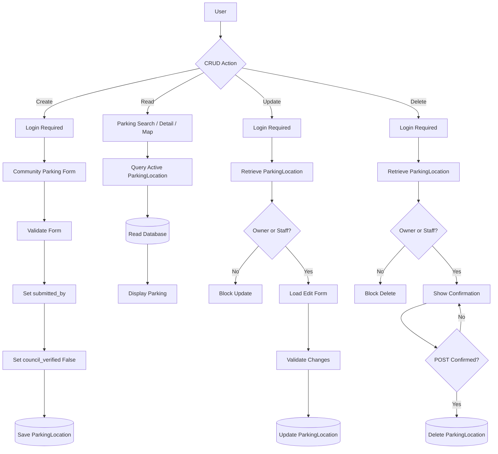
```mermaid
flowchart TD
    A[User] --> B{CRUD Action}

    B -->|Create| C[Login Required]
    C --> D[Community Parking Form]
    D --> E[Validate Form]
    E --> F[Set submitted_by]
    F --> G[Set council_verified False]
    G --> H[(Save ParkingLocation)]

    B -->|Read| I[Parking Search / Detail / Map]
    I --> J[Query Active ParkingLocation]
    J --> K[(Read Database)]
    K --> L[Display Parking]

    B -->|Update| M[Login Required]
    M --> N[Retrieve ParkingLocation]
    N --> O{Owner or Staff?}
    O -->|No| P[Block Update]
    O -->|Yes| Q[Load Edit Form]
    Q --> R[Validate Changes]
    R --> S[(Update ParkingLocation)]

    B -->|Delete| T[Login Required]
    T --> U[Retrieve ParkingLocation]
    U --> V{Owner or Staff?}
    V -->|No| W[Block Delete]
    V -->|Yes| X[Show Confirmation]
    X --> Y{POST Confirmed?}
    Y -->|Yes| Z[(Delete ParkingLocation)]
    Y -->|No| X
```

## CRUD Data Flow Summary

| Operation | Input | Validation / Security | Database Result | User Feedback |
| --- | --- | --- | --- | --- |
| Create | Community parking form | Login, form validation, UK coordinates | New `ParkingLocation` | Success message and redirect |
| Read | Search, URL or map request | Active record filtering | Data retrieved | Parking displayed |
| Update | Edit form | Login, ownership, form validation | Existing record updated | Success message and redirect |
| Delete | Confirmation POST | Login and ownership | Record deleted | Success message and dashboard redirect |

## CRUD Data Flow Evaluation

The final CRUD implementation provides a clear separation between public parking information and protected data-management actions.

Read functionality remains publicly accessible because searching and viewing parking is the main purpose of ParkMate.

Create, Update and Delete functionality requires authentication because these actions change stored application data.

Update and Delete also require ownership checks, preventing normal users from changing parking submitted by another account.

Community forms deliberately exclude official verification controls, and the backend forces community records to remain unverified.

This means security does not rely only on hiding fields in the front end.

The backend also enforces the intended rules before database changes are made.

This provides a safer and more reliable CRUD structure for the ParkMate application.

---

## Data Model and Data Flow Evaluation

The final ParkMate database structure supports the main application requirements without unnecessarily duplicating information.

`ParkingLocation` acts as the central parking entity, while Django's `User` model provides authentication and ownership.

`Favourite` creates a structured relationship between users and saved parking rather than copying parking data into individual accounts.

`AvailabilityReport` provides a related structure for storing user-generated parking availability information.

The front end communicates with Django views through HTTP requests, while Django forms provide validation before data is passed through the ORM to the relational database.

Data retrieved from the database is returned to templates through the view context, keeping database logic separate from presentation.

CRUD functionality applies additional authentication and ownership checks before changes are made.

This structure allows ParkMate to provide:

- searchable parking information;
- interactive map data;
- user authentication;
- favourites;
- personal dashboards;
- community parking submissions;
- ownership protection; and
- complete parking CRUD functionality.

The final data model and data flow therefore support both the functional requirements and security requirements of the completed ParkMate application.


# Security Features Implemented

Security was considered throughout the development of ParkMate to protect user accounts, application data and production configuration.

ParkMate uses Django's built-in security features alongside additional application-level controls.

The main security areas implemented include:

- environment variables for sensitive configuration;
- production-only security settings;
- HTTPS enforcement;
- secure cookies;
- CSRF protection;
- Django password validation;
- authentication requirements;
- ownership and permission checks;
- protected CRUD functionality;
- restricted verification controls;
- secure form handling; and
- protection against accidental destructive actions.

The security implementation was reviewed alongside authentication testing, authorisation testing, CRUD testing and automated Django testing.

---

## Environment Variables and Secret Keys

Sensitive configuration should not be stored directly in the public GitHub repository.

ParkMate therefore uses environment variables for important production settings.

The Django settings file retrieves the secret key using:

```python
SECRET_KEY = (
    os.environ.get("DJANGO_SECRET_KEY")
    or os.environ.get("SECRET_KEY")
    or "django-insecure-local-development-only"
)
```

The production secret key can therefore be supplied through either:

```text
DJANGO_SECRET_KEY
```

or:

```text
SECRET_KEY
```

The fallback value is clearly identified as being for local development only.

The actual production secret key is not written directly into the repository.

## Database Environment Variable

ParkMate uses `dj_database_url` to configure its database connection.

The production database connection can be supplied using:

```text
DATABASE_URL
```

When running locally without a production database URL, ParkMate falls back to the local SQLite database.

This means production database connection information does not need to be written directly into `settings.py`.

## Additional Environment-Based Configuration

ParkMate also supports environment variables for:

```text
DJANGO_DEBUG
DJANGO_ALLOWED_HOSTS
DJANGO_CSRF_TRUSTED_ORIGINS
DATABASE_URL
DJANGO_SECRET_KEY
```

This allows different configuration to be used between local development and production without modifying the source code.

## Heroku Environment Detection

ParkMate checks whether it is running on Heroku using:

```python
IS_HEROKU = bool(os.environ.get("DYNO"))
```

The `DYNO` environment variable is automatically available when the application runs on Heroku.

This allows ParkMate to apply production behaviour automatically.

For example, `DEBUG` defaults to off when the application is running on Heroku.

```python
DEBUG = os.environ.get(
    "DJANGO_DEBUG",
    "0" if IS_HEROKU else "1"
) == "1"
```

This helps prevent Django debug information from being exposed on the deployed application.

## .gitignore Protection

The `.gitignore` file prevents important local files from being committed to GitHub.

ParkMate excludes:

```text
.venv/
__pycache__/
*.pyc
.env
.DS_Store
db.sqlite3
staticfiles/
```

The important security entry is:

```text
.env
```

This prevents a local environment file containing secret configuration from being accidentally committed to the repository.

The local SQLite database is also ignored.

```text
db.sqlite3
```

This prevents development database contents from being uploaded to GitHub.


## Environment Variable Security Summary

| Security Measure | Implementation | Purpose |
| --- | --- | --- |
| Secret key | Environment variable | Prevents production secret from being hard-coded |
| Database URL | Environment variable | Protects database connection information |
| Debug configuration | Environment variable / Heroku detection | Prevents production debug information being exposed |
| Allowed hosts | Environment variable | Controls which hosts Django accepts |
| CSRF trusted origins | Environment variable | Controls trusted HTTPS origins |
| `.env` | Added to `.gitignore` | Prevents local secrets being committed |
| `db.sqlite3` | Added to `.gitignore` | Prevents local database contents being committed |

---

### Production Security

ParkMate applies additional security settings when:

```python
DEBUG = False
```

This separates local development behaviour from production behaviour.

### Debug Mode

Debug mode is useful during development because Django displays detailed error information.

However, this information should not be exposed publicly.

When ParkMate runs on Heroku, the default behaviour is:

```text
DEBUG = False
```

This prevents Django's detailed debug pages from being displayed to production users.

Instead, ParkMate uses its normal error handling.

## HTTPS Enforcement

When ParkMate is running with debug mode disabled, HTTPS is enforced using:

```python
SECURE_SSL_REDIRECT = True
```

This redirects insecure HTTP requests to HTTPS.

The application also includes:

```python
SECURE_PROXY_SSL_HEADER = (
    "HTTP_X_FORWARDED_PROTO",
    "https",
)
```

This allows Django to correctly recognise HTTPS when ParkMate is running behind Heroku's proxy.

### Secure Session Cookies

Production session cookies are configured using:

```python
SESSION_COOKIE_SECURE = True
```

This tells the browser to send the Django session cookie only over HTTPS.

The session cookie is important because Django uses it to identify authenticated sessions.

## Secure CSRF Cookies

ParkMate also uses:

```python
CSRF_COOKIE_SECURE = True
```

This ensures that the CSRF cookie is only transmitted over HTTPS in production.

## CSRF Protection

Django's CSRF middleware is enabled:

```python
"django.middleware.csrf.CsrfViewMiddleware"
```

Forms that change application data include:

```django

```

This includes important actions such as:

- Registration;
- Login;
- saving favourites;
- Add Parking;
- Edit Parking; and
- Delete Parking.

CSRF protection helps prevent another website from submitting an unwanted request using a user's authenticated ParkMate session.

## HSTS

ParkMate enables HTTP Strict Transport Security when running in production.

The settings include:

```python
SECURE_HSTS_SECONDS = 3600
SECURE_HSTS_INCLUDE_SUBDOMAINS = True
SECURE_HSTS_PRELOAD = True
```

HSTS instructs supporting browsers to use HTTPS when communicating with the application after receiving the security header.

The preload directive is also included in the configured HSTS header.

## Content Type Protection

ParkMate uses:

```python
SECURE_CONTENT_TYPE_NOSNIFF = True
```

This helps prevent browsers from attempting to interpret a response as a different content type from the one declared by the server.

## Security Middleware

Django's security middleware is enabled:

```python
"django.middleware.security.SecurityMiddleware"
```

This allows Django's production security settings to be applied to requests and responses.

## Clickjacking Protection

The project also includes:

```python
"django.middleware.clickjacking.XFrameOptionsMiddleware"
```

This provides Django's clickjacking protection through the `X-Frame-Options` response header.

It helps prevent ParkMate pages from being embedded inside an unauthorised page in a way that could mislead users into clicking hidden controls.

## Allowed Hosts

Django uses `ALLOWED_HOSTS` to control which host headers the application will accept.

ParkMate builds this list from:

```text
DJANGO_ALLOWED_HOSTS
```

The default development/deployment configuration includes:

```text
localhost
127.0.0.1
192.168.0.61
.herokuapp.com
```

This provides an additional layer of protection against invalid Host headers.

## CSRF Trusted Origins

Trusted CSRF origins can be supplied through:

```text
DJANGO_CSRF_TRUSTED_ORIGINS
```

When running on Heroku, the default trusted origin pattern uses HTTPS for Heroku applications.

This allows legitimate production forms to work while maintaining Django's CSRF origin validation.

## Password Security

ParkMate uses Django's built-in password validators.

The configured validators include:

```text
UserAttributeSimilarityValidator
MinimumLengthValidator
CommonPasswordValidator
NumericPasswordValidator
```

These checks help prevent users from creating weak passwords.

The Registration form is based on Django's:

```python
UserCreationForm
```

This also handles password confirmation and Django authentication requirements.

ParkMate additionally checks for duplicate email addresses before creating an account.

## Production Security Evidence

The deployed application was checked to confirm that it runs using HTTPS.

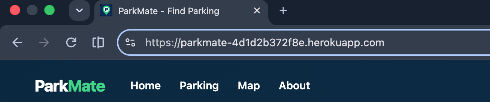

## Production Security Summary

| Security Feature | Implementation | Status |
| --- | --- | --- |
| Debug disabled in production | Heroku environment detection | Implemented |
| HTTPS redirect | `SECURE_SSL_REDIRECT` | Implemented |
| Proxy HTTPS recognition | `SECURE_PROXY_SSL_HEADER` | Implemented |
| Secure session cookie | `SESSION_COOKIE_SECURE` | Implemented |
| Secure CSRF cookie | `CSRF_COOKIE_SECURE` | Implemented |
| HSTS | `SECURE_HSTS_SECONDS` | Implemented |
| HSTS subdomains | `SECURE_HSTS_INCLUDE_SUBDOMAINS` | Implemented |
| HSTS preload directive | `SECURE_HSTS_PRELOAD` | Implemented |
| MIME sniffing protection | `SECURE_CONTENT_TYPE_NOSNIFF` | Implemented |
| Security middleware | `SecurityMiddleware` | Implemented |
| CSRF middleware | `CsrfViewMiddleware` | Implemented |
| Clickjacking middleware | `XFrameOptionsMiddleware` | Implemented |
| Password validation | Django password validators | Implemented |
| Allowed hosts | `ALLOWED_HOSTS` | Implemented |
| Trusted CSRF origins | `CSRF_TRUSTED_ORIGINS` | Implemented |

---

## Ownership and Permissions

ParkMate uses authentication and ownership checks to control who can perform actions that change database information.

Public users can search and view parking, while actions that modify personal or parking data require authentication.

## Login Required Protection

Django's:

```python
@login_required
```

decorator is used to protect account-specific functionality.

Authentication is required for:

- My ParkMate;
- saving and removing favourites;
- adding parking;
- editing parking; and
- deleting parking.

For example:

```python
@login_required
def dashboard(request):
```

An unauthenticated user attempting to access protected functionality is redirected to the Login page.

## Dashboard Permissions

The My ParkMate dashboard only retrieves information associated with the logged-in user.

Favourite records are filtered using:

```python
Favourite.objects.filter(
    user=request.user,
    parking__is_active=True,
)
```

User parking submissions are retrieved through:

```python
request.user.parking_submissions
```

This prevents one user's dashboard from automatically displaying another user's personal favourites or submissions.

## Favourite Permissions

Favourite functionality also requires authentication.

When a favourite is created, ParkMate automatically uses:

```python
user=request.user
```

This means users cannot use the normal interface to assign favourites to another account.

## Parking Ownership

When a community user creates a new parking location, ParkMate automatically sets:

```python
location.submitted_by = request.user
```

The user therefore becomes associated with the parking record at the backend level.

The owner is not selected manually through the form.

This reduces the risk of a user assigning their submission to another account.

## Edit Permissions

Edit functionality checks the user before allowing access to the form.

The backend checks:

```python
request.user.is_staff
or location.submitted_by_id == request.user.id
```

A normal registered user can therefore edit:

```text
their own parking records
```

but cannot edit:

```text
another user's parking records
```

If an unauthorised user attempts to edit another user's record, ParkMate displays an error message and redirects them away from the protected edit action.

## Delete Permissions

Delete functionality performs the same ownership check:

```python
request.user.is_staff
or location.submitted_by_id == request.user.id
```

This prevents a normal user from deleting another user's parking location.

The protection exists inside the Django view rather than relying only on whether the Delete button is visible.

This is important because a user could otherwise attempt to enter an Edit or Delete URL manually.

## Front-End Permission Controls

The parking detail page only displays the Edit and Delete controls when:

```text
can_manage = True
```

For normal users this means they own the parking record.

Staff accounts can also receive management controls.

This improves the user experience by hiding actions the user is not authorised to perform.

## Back-End Permission Controls

The back-end view still checks ownership independently.

This means security does not rely only on hiding buttons in HTML.

The protection operates at both levels:

```text
Front End
   ↓
Hide unauthorised Edit/Delete controls
   ↓
Back End
   ↓
Check authenticated user and ownership again
   ↓
Allow or block database change
```

This provides stronger protection than relying on the interface alone.

## Community Verification Permissions

Community users should not be able to mark their own parking record as officially Council/NPP verified.

ParkMate protects this in two ways.

### Form-Level Protection

`CommunityParkingLocationForm` does not include official verification fields such as:

- official source name;
- official source URL;
- last checked information; and
- official image/source administration fields.

### Back-End Protection

When a community parking record is created, the backend explicitly sets:

```python
location.council_verified = False
```

When a normal user edits their parking, ParkMate again forces:

```python
location.council_verified = False
```

This means manually altering front-end form data would not allow a normal user to make their own record officially verified.

## Staff Permissions

Staff users are handled separately.

When a staff user edits a parking record, ParkMate provides the more detailed:

```python
ParkingLocationForm
```

Normal users receive:

```python
CommunityParkingLocationForm
```

This separates community functionality from official parking administration.

## Delete Confirmation

Delete is a destructive CRUD action.

ParkMate therefore does not immediately remove a parking record when the Delete link is selected.

Instead, the user is taken to a confirmation page.

The actual deletion only occurs after a:

```text
POST
```

request is submitted from the confirmation form.

The form is also protected by a CSRF token.

This reduces both accidental deletion and unauthorised cross-site requests.

## POST Requests for Data Changes

Actions that change application state use POST requests.

Examples include:

- saving/removing favourites;
- Registration;
- Login;
- Add Parking;
- Edit Parking; and
- confirming Delete Parking.

Using POST for changes avoids performing destructive database operations through ordinary GET navigation.

## Safe Favourite Redirect

After changing favourite status, ParkMate checks the requested return URL.

The redirect is only accepted when it begins with:

```text
/
```

but not:

```text
//
```

This prevents the normal favourite workflow from blindly redirecting users to an arbitrary external URL.

## Ownership Protection Evidence

The screenshot below shows ParkMate blocking an attempt to manage a parking record belonging to another user.


## Ownership and Permissions Summary

| Action | Guest | Logged-In Owner | Other Logged-In User | Staff |
| --- | --- | --- | --- | --- |
| Search parking | Allowed | Allowed | Allowed | Allowed |
| View parking | Allowed | Allowed | Allowed | Allowed |
| View map | Allowed | Allowed | Allowed | Allowed |
| View My ParkMate | Blocked | Allowed | Allowed for own account | Allowed |
| Save favourite | Blocked | Allowed | Allowed for own account | Allowed |
| Add community parking | Blocked | Allowed | Allowed | Allowed |
| Edit own parking | Blocked | Allowed | Not applicable | Allowed |
| Edit another user's parking | Blocked | Blocked | Blocked | Allowed |
| Delete own parking | Blocked | Allowed | Not applicable | Allowed |
| Delete another user's parking | Blocked | Blocked | Blocked | Allowed |
| Mark community submission as verified | Blocked | Blocked | Blocked | Controlled through staff functionality |

---

## CSRF Security Evidence

ParkMate forms that submit data include Django's:

```django

```

For example, the Add/Edit Parking form, authentication forms, favourite form and Delete confirmation form are protected.

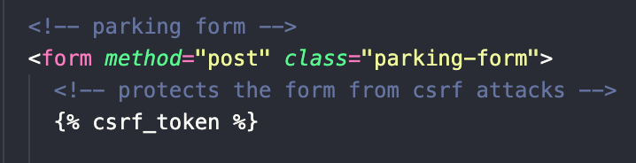

---

## Security Features Summary

| Security Area | Security Feature | Implementation |
| --- | --- | --- |
| Secrets | Production secret key | Environment variable |
| Secrets | Environment file | Excluded using `.gitignore` |
| Database | Production database credentials | Environment-based `DATABASE_URL` |
| Development data | Local SQLite database | Excluded from Git |
| Production | Debug mode | Disabled by default on Heroku |
| Production | HTTPS | Forced when `DEBUG=False` |
| Sessions | Session cookie | Secure in production |
| CSRF | CSRF cookie | Secure in production |
| CSRF | Form protection | Django CSRF middleware and tokens |
| Transport security | HSTS | Enabled in production |
| Browser security | MIME sniffing | Disabled |
| Browser security | Clickjacking protection | Django middleware |
| Authentication | Passwords | Django authentication and validators |
| Authentication | Protected pages | `login_required` |
| User data | Dashboard | Filtered to authenticated user |
| Favourites | Ownership | Automatically associated with authenticated user |
| Create | Ownership | `submitted_by` set by backend |
| Update | Permissions | Owner or staff only |
| Delete | Permissions | Owner or staff only |
| Delete | Confirmation | POST confirmation required |
| Verification | Community records | Cannot self-verify |
| Redirects | Favourite return URL | Restricted to local-style paths |

---

## Security Features Evaluation

The final ParkMate application uses security controls at multiple levels rather than relying on a single security mechanism.

Sensitive production information is separated from the public source code through environment variables.

The `.env` file and local database are excluded from Git to reduce the risk of accidentally publishing secrets or development data.

Production settings disable debug mode and apply HTTPS, secure cookies, HSTS and other Django security controls.

Django's authentication system and password validators are used rather than implementing a custom password system.

CSRF middleware and form tokens protect actions that change application data.

Protected account functionality uses `login_required`, while Edit and Delete operations include additional ownership checks.

These ownership checks are performed in the Django backend, meaning that manually entering a protected URL does not bypass the permission rules.

Community parking verification is also protected at both the form and backend levels. Normal users are not given official verification fields and their records are explicitly forced to remain unverified.

Destructive Delete actions require a confirmation POST before the database record is removed.

Overall, ParkMate applies security to configuration, authentication, forms, sessions, production deployment and database-changing actions rather than relying only on front-end controls.

# Defensive Programming

Defensive programming was used throughout ParkMate to reduce the risk of invalid data, unexpected user behaviour, unauthorised changes and failures from external services.

Rather than assuming that all user input or external data will always be valid, ParkMate performs checks at multiple levels before allowing important operations to continue.

The main defensive programming techniques used include:

- Django form validation;
- model-level validation;
- authentication checks;
- ownership checks;
- safe database object retrieval;
- POST requests for data-changing actions;
- Delete confirmation;
- controlled verification permissions;
- duplicate prevention;
- external API failure handling;
- fallback images;
- safe redirects;
- active-record filtering; and
- custom error handling.


## Form Validation

ParkMate uses Django forms to validate user input before data is saved.

For example, the Registration form checks whether an email address is already associated with another account.

```python
def clean_email(self):
    email = self.cleaned_data["email"].strip().lower()

    if User.objects.filter(email__iexact=email).exists():
        raise forms.ValidationError(
            "An account with this email address already exists."
        )

    return email
```

This prevents duplicate email addresses from being accepted through normal Registration.

The parking form also formats postcodes consistently:

```python
def clean_postcode(self):
    return (
        self.cleaned_data
        .get("postcode", "")
        .strip()
        .upper()
    )
```

This reduces inconsistent postcode formatting in the database.

## Model-Level Validation

Important parking rules are also enforced within the `ParkingLocation` model rather than relying only on the HTML form.

ParkMate checks that:

- latitude is within the supported United Kingdom range;
- longitude is within the supported United Kingdom range;
- disabled parking spaces do not exceed total parking spaces;
- verified parking has an official source URL;
- verified parking has a last-checked date; and
- verified parking contains tariff information.

For example:

```python
if (
    self.spaces_total is not None
    and self.disabled_spaces is not None
    and self.disabled_spaces > self.spaces_total
):
    raise ValidationError(
        {
            "disabled_spaces": (
                "Disabled spaces cannot be greater "
                "than total spaces."
            )
        }
    )
```

Using validation at the model level provides an additional layer of protection because the rule applies to the stored data rather than only to one specific front-end form.

## Official Source Validation

ParkMate restricts official parking source URLs to recognised source domains.

The accepted source suffixes are:

```python
OFFICIAL_HOST_SUFFIXES = ("gov.uk", "npp.org.uk")
```

The custom validator checks the URL hostname before accepting it as an official source.

This prevents an unrelated website from being stored as the official evidence for a Council/NPP verified parking record.

## Safe Database Retrieval

ParkMate uses Django's:

```python
get_object_or_404()
```

when retrieving individual parking records.

For example:

```python
location = get_object_or_404(
    active_locations(),
    pk=pk,
)
```

If a requested parking record does not exist, Django safely returns a not-found response instead of allowing the application to fail because an expected object was missing.

## Active Parking Filtering

ParkMate centralises active parking retrieval using:

```python
def active_locations():
    return ParkingLocation.objects.filter(is_active=True)
```

Search, Map, detail and other public parking functionality can therefore work from active records rather than displaying records that have been marked inactive.

## Authentication Checks

Account-specific functionality uses:

```python
@login_required
```

This protects features including:

- My ParkMate;
- favourites;
- Add Parking;
- Edit Parking; and
- Delete Parking.

Users who are not authenticated cannot directly access these protected actions.

## Ownership Checks

Authentication alone is not enough because one authenticated user should not be able to change another user's parking.

ParkMate therefore checks:

```python
request.user.is_staff
or location.submitted_by_id == request.user.id
```

before allowing Edit or Delete operations.

This means manually entering another user's Edit or Delete URL does not bypass the ownership rules.

## Community Verification Protection

Normal community users are not allowed to mark their own submissions as officially Council/NPP verified.

When parking is created:

```python
location.submitted_by = request.user
location.council_verified = False
```

When a normal user edits parking:

```python
if not request.user.is_staff:
    location.council_verified = False
```

This is a defensive backend rule.

Even if a user attempted to alter the submitted form data, the backend still prevents the community record from becoming officially verified.

## Delete Confirmation

Delete is a destructive action.

ParkMate therefore displays a confirmation page before permanently deleting a parking record.

The actual deletion only happens when the user submits a POST request:

```python
if request.method == "POST":
    location.delete()
```

This reduces the chance of accidental deletion through ordinary navigation.

## Favourite Duplicate Protection

ParkMate uses:

```python
Favourite.objects.get_or_create()
```

when saving parking.

This prevents unnecessary duplicate favourite records from being created through the normal favourite workflow.

The database model also includes a uniqueness constraint for the user and parking combination.

## Safe Redirect Handling

After changing favourite status, ParkMate checks the requested return path.

```python
if next_url.startswith("/") and not next_url.startswith("//"):
    return redirect(next_url)
```

The application therefore avoids blindly redirecting to an arbitrary external URL supplied through the request.

## External API Failure Handling

Parking images can use the Wikimedia Commons API.

Because this is an external service, ParkMate does not assume that every request will succeed.

The JavaScript checks the response:

```javascript
if (!response.ok) {
    return null;
}
```

Network or JavaScript request failures are also caught:

```javascript
try {
    // external request
} catch {
    return null;
}
```

If no suitable Wikimedia image can be retrieved, ParkMate uses its local fallback image instead.

```javascript
if (fallback) {
    image.src = fallback;
}
```

This prevents an unavailable external image API from breaking the main parking functionality.

## Defensive Programming Evidence

The screenshot below demonstrates ParkMate responding to invalid user input through form validation.

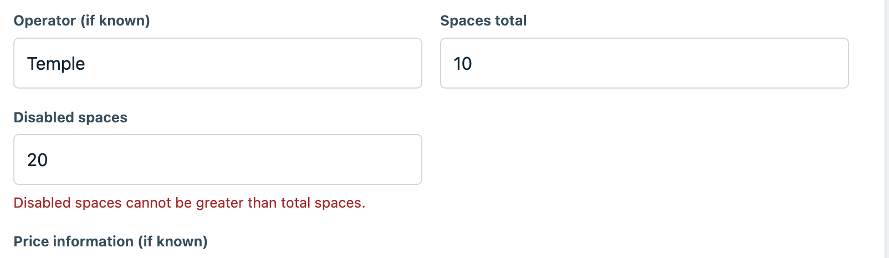

The screenshot below demonstrates ownership protection when a user attempts an unauthorised action.

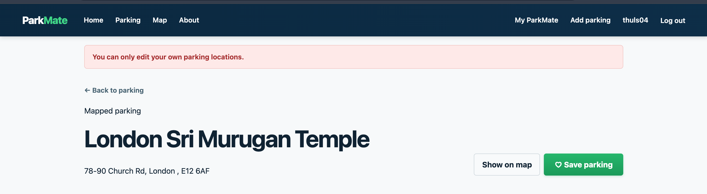

## Defensive Programming Summary

| Defensive Measure | Risk Addressed | Implementation |
| --- | --- | --- |
| Form validation | Invalid user input | Django forms |
| Duplicate email check | Duplicate accounts | `clean_email()` |
| Postcode formatting | Inconsistent data | `clean_postcode()` |
| Coordinate validation | Invalid UK locations | Model validation |
| Capacity validation | Impossible parking data | Model validation |
| Official-source validation | False verification source | URL hostname validator |
| Authentication | Guest access to protected functions | `login_required` |
| Ownership checks | Users changing other users' data | Backend permission checks |
| Community verification protection | False official status | Backend forces `False` |
| Safe object retrieval | Missing database objects | `get_object_or_404()` |
| Active filtering | Inactive records displayed | `active_locations()` |
| Favourite duplicate protection | Duplicate saved records | `get_or_create()` |
| Delete confirmation | Accidental deletion | Confirmation + POST |
| Safe redirects | Unwanted external redirects | Local-path check |
| API exception handling | External API failure | `try` / `catch` |
| Image fallback | Broken external image | Local fallback asset |

## Defensive Programming Evaluation

Defensive programming in ParkMate operates at both the front-end and backend levels.

The most important rules are not dependent only on what controls are visible in the browser.

Authentication, ownership, validation and verification status are also checked by the Django backend before database changes are made.

This provides stronger protection against invalid input, accidental actions, manually altered URLs and external service failures.

---

# Version Control

Git and GitHub were used throughout the ParkMate development process.

The GitHub repository maintains the source code and development history for the project.

The repository contains more than 100 commits, showing that the application was developed and updated iteratively rather than being uploaded only at the end of development.

## Version Control Workflow

The normal development workflow was:

```text
Make a change
      ↓
Test the change locally
      ↓
Review the changed files
      ↓
Stage the files
      ↓
Create a descriptive commit
      ↓
Push the commit to GitHub
      ↓
Deploy the updated version to Heroku where required
```

Typical Git commands used during development included:

```bash
git status
git add .
git commit -m "descriptive commit message"
git push origin main
```

For deployment to Heroku:

```bash
git push heroku main
```

## Commit Messages

Commits were used to separate changes such as:

- new functionality;
- bug fixes;
- validation fixes;
- responsive improvements;
- testing evidence;
- README documentation;
- deployment fixes;
- image handling;
- accessibility improvements; and
- code cleanup.

This makes the Git history easier to review and provides evidence of the development process.

## Why Version Control Was Important

Git allowed changes to be tracked throughout development.

This provided several benefits:

- previous versions could be identified;
- changes could be reviewed before committing;
- bug fixes could be separated from feature development;
- documentation changes could be tracked;
- the GitHub repository acted as the central project source; and
- deployment could use committed project code rather than untracked local changes.

---

# Deployment Verification

ParkMate is configured for deployment to Heroku.

Deployment verification was carried out to make sure that the deployed version operates independently from the local development environment.

## Heroku Web Process

The project contains a `Procfile` with:

```text
web: gunicorn parkmate.wsgi:application
```

This tells Heroku to run the Django application using Gunicorn.

## Deployment Dependencies

The production dependencies are stored in:

```text
requirements.txt
```

The main deployment-related dependencies include:

```text
Django
dj-database-url
gunicorn
psycopg2-binary
whitenoise
```

These provide:

- Django application functionality;
- environment-based database configuration;
- a production WSGI server;
- PostgreSQL connectivity; and
- production static-file handling.

## Environment Configuration

Production configuration is provided using environment variables rather than committing sensitive values to GitHub.

Important variables include:

```text
DATABASE_URL
DJANGO_SECRET_KEY
DJANGO_DEBUG
DJANGO_ALLOWED_HOSTS
DJANGO_CSRF_TRUSTED_ORIGINS
```

## Deployment Verification Process

After deployment, I checked the deployed application rather than assuming that a successful Git push meant the application was working.

The following areas were verified:

1. The deployed Home page loads.
2. Static CSS loads correctly.
3. Images and favicons load.
4. Parking search works.
5. Parking detail pages load.
6. The Leaflet map loads.
7. Registration works.
8. Login and Logout work.
9. My ParkMate can be accessed when authenticated.
10. Favourites can be saved and removed.
11. Add Parking works.
12. Edit Parking works for the owner.
13. Delete Parking works after confirmation.
14. Unauthorised Edit/Delete actions remain blocked.
15. Custom error handling works.
16. HTTPS is used.
17. Database-backed parking records remain available after deployment.

## Health Check

ParkMate includes a lightweight health-check view:

```python
def health_check(request):
    return JsonResponse({"status": "ok"})
```

The application route is:

```text
/health/
```

When the deployed application is operating correctly, this endpoint should return:

```json
{"status": "ok"}
```

This provides a simple way to check that Django is responding.

## Deployed Application Evidence

The screenshot below shows the deployed ParkMate application running on Heroku.

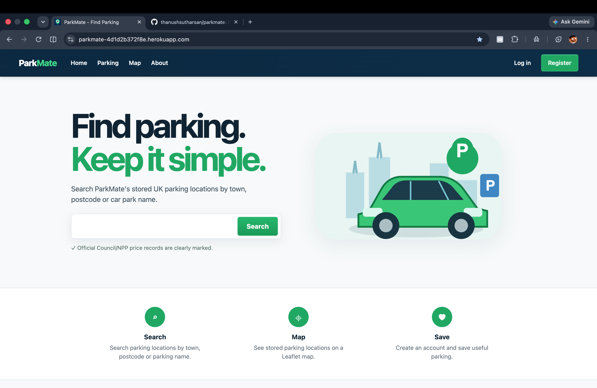

The screenshot below shows the health-check endpoint returning a successful response.

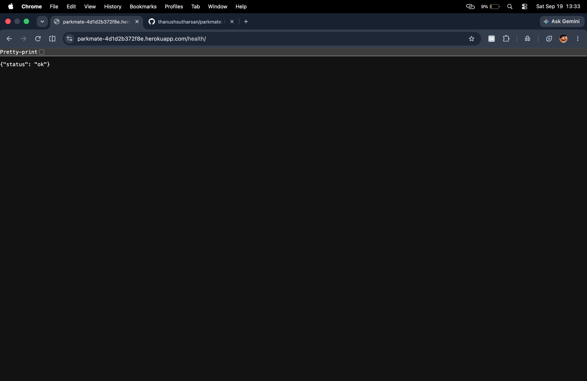

## Deployment Verification Summary

| Deployment Check | Expected Result | Status |
| --- | --- | --- |
| Heroku application starts | Application loads successfully | Pass |
| Gunicorn | Django served using production WSGI server | Pass |
| Static CSS | Styling loads correctly | Pass |
| Static images | Images and favicons load | Pass |
| Database | Parking records load correctly | Pass |
| Parking search | Search operates on deployed application | Pass |
| Map | Leaflet map loads | Pass |
| Registration | User account can be created | Pass |
| Login / Logout | Authentication works | Pass |
| Favourites | Saved parking works | Pass |
| CRUD | Add, Edit and Delete operate correctly | Pass |
| Ownership | Unauthorised changes remain blocked | Pass |
| HTTPS | Secure connection used | Pass |
| Health check | Returns `{"status": "ok"}` | Pass |

## Deployment Verification Result

Deployment testing confirmed that the production version of ParkMate provides the same core functionality as the locally tested application.

Testing the deployed version was important because deployment introduces additional factors such as environment variables, production security, database configuration, static-file handling and the production web server.

The final application was therefore tested after deployment rather than relying only on local testing.

---
# Bugs and Fixes

During the development of ParkMate, I identified several issues within the
Django templates. These included an actual Django template syntax error,
template blocks and conditional statements that were difficult to read, and
HTML and JavaScript that required restructuring to make the code easier to
debug and maintain.

The fixes were completed across two commits:

`7f567ff - fix: correct template syntax errors`

`c939fc3 - fix: correct parking filter syntax`

The first commit updated three files:

- `templates/base.html`
- `templates/parking/list.html`
- `templates/parking/map.html`

This commit contained 237 additions and 66 deletions.

During further testing and review, I found that the nation parking filter still
contained an incorrect comparison operator. This was corrected in the second
commit:

`c939fc3 - fix: correct parking filter syntax`

This follow-up commit changed one file with one addition and one deletion.

The debugging process involved both correcting genuine syntax problems and
refactoring surrounding code to improve readability, maintainability and
consistency.

---

### Navigation Conditional

**File:** `templates/base.html`

The navigation contains a link that displays different text depending on
whether the logged-in user is a staff member.

Previously, the complete Django conditional was written inline:

```html
<a href="">
     Add official parking  Add parking 
</a>
```

This was changed to:

```html
<a href="">
    
        Add official parking
    
        Add parking
    
</a>
```

#### Why this was changed

The condition has two possible outcomes:

- Staff users see `Add official parking`.
- Other authenticated users see `Add parking`.

Writing the ``, `` and `` statements separately
makes the conditional easier to understand.

It also makes future changes to the navigation easier because the opening,
alternative and closing parts of the condition can be identified immediately.

The functionality of the link was retained.

---

## Parking List Template Fixes

### Template Inheritance

**File:** `templates/parking/list.html`

The Django template inheritance and static-file loading statements were
originally placed together:

```django
 
```

They were separated into:

```django


```

#### Why this was changed

`` tells Django which parent template should be used.

`` loads Django's static template functionality.

Putting these statements on separate lines makes the template structure
clearer and makes template-related problems easier to identify during
debugging.

---

### Page Title and Content Blocks

The title and content blocks were originally written together:

```django
 Find Parking - ParkMate  
```

They were changed to:

```django

Find Parking - ParkMate



```

#### Why this was changed

Django template blocks define sections that are inserted into the parent
template.

Separating each block makes it much easier to identify:

- Where the title block begins.
- Where the title block ends.
- Where the content block begins.
- Where the content block eventually ends.

This makes the template hierarchy clearer and reduces the risk of incorrectly
nesting template content.

---

### Parking Search Input

The parking search input originally appeared on a single line:

```html
<input name="q" value="{{ q }}" />
```

It was reformatted to:

```html
<input
    name="q"
    value="{{ q }}"
/>
```

#### Why this was changed

This was a readability improvement rather than a functional change.

Separating the attributes makes the input easier to read and makes it easier
to add additional attributes later.

The `{{ q }}` value remains in place so that the user's previous search term
can remain visible when the results page reloads.

---

### Parking Filter Syntax Error

**File:** `templates/parking/list.html`

While correcting the template structure, the nation filter was also reviewed.

The filter is responsible for checking which nation the user selected and
adding the HTML `selected` attribute to the correct option.

After the first template-fixing commit, the condition appeared as:

```django
selected
```

This still contained a syntax error because a single equals sign was being
used for the comparison.

The issue was found during further review and corrected in:

`c939fc3 - fix: correct parking filter syntax`

The condition was changed to:

```django
selected
```

The complete corrected option is:

```django
<option
    value="{{ value }}"
    selected
>
    {{ label }}
</option>
```

#### Why this was a bug

The purpose of the condition is to compare two values:

```django
nation
```

and:

```django
value
```

The original condition used:

```django
nation = value
```

The comparison needed to use:

```django
nation == value
```

The corrected `==` operator checks whether the selected nation is equal to the
current nation option being processed by the template.

#### How the corrected filter works

The template loops through the available nations.

For each option Django checks:

```django

```

If the values match, Django outputs:

```html
selected
```

This allows the browser to keep that nation selected after the user submits
the search form.

For example, the resulting HTML could contain:

```html
<option value="ENG" selected>
    England
</option>
```

If the nation does not match the current option, the `selected` attribute is
not added.

#### Result of the fix

Changing:

```django

```

to:

```django

```

corrected the nation filter comparison.

The fix ensures that:

- The Django template uses the correct comparison syntax.
- The nation value can be compared correctly.
- The correct option can receive the `selected` attribute.
- The user's selected nation can remain selected after a search.
- The incorrect single `=` condition is no longer present.

---

### Search Button

The search button was changed from:

```html
<button type="submit" class="green-button">Search</button>
```

to:

```html
<button type="submit" class="green-button">
    Search
</button>
```

#### Why this was changed

This was a code readability improvement.

The functionality remained unchanged, but the button now follows the
multi-line formatting used by other interactive elements in the project.

---

### Parking Search Label

The parking search label changed from:

```html
<p class="mini-label">Parking search</p>
```

to:

```html
<p class="mini-label">
    Parking search
</p>
```

#### Why this was changed

This keeps the formatting consistent with the surrounding HTML and makes the
template easier to scan.

There was no functional change.

---

### Parking Search Results Heading

The search heading previously contained the whole conditional on one line:

```django
 Results for “{{ q }}”  Parking locations 
```

It was separated into:

```django

    Results for “{{ q }}”

    Parking locations

```

#### Why this was changed

The heading has two possible states.

If a search query exists, the page displays:

`Results for "search term"`

If no query exists, the page displays:

`Parking locations`

Separating these states makes the conditional much easier to understand and
maintain.

---

### Parking Result Count

The parking result count was reorganised into:

```django
{{ locations|length }}
parking location{{ locations|length|pluralize }}
shown
```

#### Why this was changed

The expression uses:

```django
locations|length
```

to determine the number of parking locations returned.

It also uses Django's:

```django
pluralize
```

filter to automatically display the correct singular or plural text.

For example:

```text
1 parking location shown
```

or:

```text
5 parking locations shown
```

The functionality was retained while the template became easier to read.

---

### Parking Result Card Structure

Each parking result is displayed inside an `<article>`.

The result card includes a Django condition that controls which CSS class is
applied depending on the verification status of the parking location.

The condition uses:

```django

```

to distinguish between verified and mapped parking locations.

#### Why this was changed

The `<article>` and conditional class structure were reorganised to make the
relationship between the parking data and its CSS class easier to understand.

This was mainly a readability improvement and did not remove the existing
verification functionality.

---

### Parking Image

The parking result card continues to use the location image when one is
available.

If no parking image is available, the template uses:

```django

```

as a fallback.

The image also retains descriptive alternative text and:

```html
loading="lazy"
```

#### Why this is important

The fallback prevents a parking card from being left without an image when no
specific image URL exists.

The alternative text helps describe the image.

Lazy loading prevents images further down the results page from being loaded
before they are required.

The surrounding code was reformatted for readability while this functionality
was retained.

---

### Parking Location Heading

The location heading changed from:

```html
<h2>{{ location.name }}</h2>
```

to:

```html
<h2>
    {{ location.name }}
</h2>
```

#### Why this was changed

This separates the Django variable from the surrounding HTML tags and makes
the result-card structure easier to read.

No functional change was made.

---

### Address and Postcode Conditional

The parking address and postcode had previously been placed together with the
postcode condition inline.

The code was changed so that the optional postcode condition is easier to
identify:

```django
<p>
    {{ location.address }}

    
        · {{ location.postcode }}
    
</p>
```

#### Why this was changed

Not every parking location is guaranteed to contain a postcode.

The condition ensures that:

```django
{{ location.postcode }}
```

is only displayed when the location contains a postcode.

It also avoids displaying the separator when no postcode exists.

The separated structure makes the optional nature of the postcode much easier
to understand.

---

### Parking Verification Badge

Council/NPP verified parking locations display:

```html
<span class="verified-pill">
    ✓ Council/NPP price verified
</span>
```

Other parking locations display:

```html
<span class="mapped-pill">
    Mapped parking
</span>
```

#### Why this was changed

The badge elements were separated from the surrounding Django conditional.

This makes the two possible verification states much easier to identify when
reading the source code.

It also makes the badge text and styling easier to modify later.

The underlying verification logic remained unchanged.

---

### Parking Tariff Information

The tariff information continues to use:

```django
{{ location.tariff_info|default:"Price not supplied"|truncatechars:80 }}
```

#### Why this was changed

The expression had previously been split awkwardly across multiple lines.

Keeping the Django variable and its filters together makes the expression
easier to understand.

The:

```django
default:"Price not supplied"
```

filter displays `Price not supplied` when no tariff information exists.

The:

```django
truncatechars:80
```

filter prevents a very long tariff description from taking up too much space
inside a parking result card.

---

### Parking Spaces

The number of parking spaces continues to use:

```django
{{ location.spaces_total|default:"Not supplied" }}
```

#### Why this is important

If the number of parking spaces has not been provided, ParkMate displays:

```text
Not supplied
```

instead of leaving the information blank.

No functional change was made to this expression during the restructuring.

---

### Local Authority

The local authority output changed from:

```html
<span> {{ location.local_authority }} </span>
```

to:

```html
<span>
    {{ location.local_authority }}
</span>
```

#### Why this was changed

This was a readability and formatting improvement.

Separating the Django variable makes it easier to identify the information
being displayed inside the result card.

---

### View Details Link

The parking details link was changed from a compact element to:

```html
<a
    class="detail-button"
    href="{{ location.get_absolute_url }}"
>
    View details
</a>
```

#### Why this was changed

Separating the attributes makes the HTML easier to read.

The link continues to use:

```django
{{ location.get_absolute_url }}
```

which directs the user to the detail page belonging to the selected parking
location.

The navigation behaviour was retained.

---

### Favourite Parking Form

Authenticated users can save parking locations to their favourites.

The form continues to contain:

```django

```

and:

```html
<input
    type="hidden"
    name="next"
    value="{{ request.get_full_path }}"
/>
```

#### Why these are needed

The CSRF token protects the POST request made when the user saves or removes a
parking location.

The hidden `next` field stores the current page location.

This allows the application to return the user to the same page after the
favourite action has been completed.

---

### Favourite Button Conditional

The favourite button previously contained its complete conditional inline.

It was restructured to:

```django
<button
    class="outline-button small-button"
    type="submit"
>
    
        ♥ Saved
    
        ♡ Save
    
</button>
```

#### Why this was changed

The button has two possible states.

If the location already exists within:

```django
favourite_ids
```

the user sees:

```text
♥ Saved
```

Otherwise the user sees:

```text
♡ Save
```

Separating the ``, `` and `` statements makes
this logic much easier to follow.

The favourite functionality itself remained unchanged.

---

### Empty Parking Search State

When the parking search returns no matching locations, the ``
section of the Django loop is displayed.

The markup changed from:

```html
<h2>No parking found</h2>
<p>Try a broader town, postcode or parking name.</p>
```

to:

```html
<h2>
    No parking found
</h2>

<p>
    Try a broader town, postcode or parking name.
</p>
```

#### Why this was changed

The empty-state markup was reformatted so that it follows the same structure
as the other elements in the template.

The message shown to the user remained unchanged.

---

### Closing Parking List Content Block

The final:

```django

```

was placed clearly on its own line.

#### Why this was changed

This makes it easier to identify where the parking list's main content block
finishes.

It also makes it easier to match the closing tag with:

```django

```

when editing or debugging the template later.

---

## Parking Map Template Fixes

### Template Inheritance

**File:** `templates/parking/map.html`

The map template originally contained:

```django
 
```

This was changed to:

```django


```

#### Why this was changed

This separates the parent-template declaration from static-file loading.

It also keeps the beginning of the map template consistent with the corrected
parking list template.

---

### Parking Map Title and Content Blocks

The title and content blocks were originally written together:

```django
 Parking Map - ParkMate  
```

They were changed to:

```django

Parking Map - ParkMate



```

#### Why this was changed

The change makes it immediately clear where the title block finishes and where
the main map content begins.

This makes the Django template hierarchy easier to understand and maintain.

---

### Parking Map Heading

The map page contains:

```html
<p class="mini-label">Parking map</p>

<h1>Parking map</h1>
```

The page also explains that its markers come from the ParkMate database rather
than depending on live parking APIs.

The surrounding template structure was reformatted to make the heading and
content easier to identify.

#### Why this was changed

The change improves the organisation of the HTML without altering what the
user sees.

---

### Map Search Input

The map search field changed from:

```html
<input name="q" value="{{ q }}" />
```

to:

```html
<input
    name="q"
    value="{{ q }}"
/>
```

The search icon markup was also cleaned up.

#### Why this was changed

The search field is easier to read when its attributes are separated.

The `{{ q }}` value remains so that the user's current search can remain
visible when the page reloads.

No search functionality was removed.

---

### Search Map Button

The button changed from:

```html
<button type="submit" class="green-button">Search map</button>
```

to:

```html
<button type="submit" class="green-button">
    Search map
</button>
```

#### Why this was changed

This makes the button formatting consistent with the other buttons within
ParkMate.

The functionality remained unchanged.

---

### Show All Link

When a map search is active, ParkMate provides a **Show all** link.

The link was reformatted to:

```html
<a
    class="outline-button"
    href=""
>
    Show all
</a>
```

It remains inside:

```django

```

#### Why this was changed

The link should only be displayed when the user currently has an active search
query.

Selecting **Show all** returns the user to the complete parking map without
the current search filter.

Separating the class, URL and text makes the purpose of the link easier to
understand.

---

### Leaflet Map Container

The Leaflet map continues to use:

```html
<div
    id="parking-map"
    style="height: 580px; border-radius: 18px; overflow: hidden"
></div>
```

#### Why this is important

The JavaScript later searches for:

```text
parking-map
```

to find the HTML element where the Leaflet map should be created.

The map container remained functionally unchanged.

---

### Empty Map Search State

When no parking locations match the map search, the template checks:

```django

```

and displays:

```html
<h2>No matching parking found</h2>

<p>
    Try another town, postcode or parking name.
</p>
```

#### Why this was changed

The paragraph was reformatted to make the empty-state structure consistent
with the rest of the template.

The behaviour and message shown to the user remained unchanged.

---

### Django Map Data and Scripts Block

An important structural change was made around the data passed from Django to
the Leaflet JavaScript.

Previously, the `json_script`, content closing block and scripts opening block
were placed together.

They were separated into:

```django
{{ map_locations|json_script:"parkmate-map-data" }}




```

#### Why this was changed

The:

```django
json_script
```

template filter safely places the parking data into the page so that
JavaScript can access it.

The first:

```django

```

closes the main page content.

The:

```django

```

statement then starts the JavaScript section.

Separating these statements makes the Django template hierarchy much clearer.

It also reduces the risk of accidentally placing JavaScript code inside the
wrong block when the template is updated later.

---

### Retrieving the Map and Parking Data

The JavaScript retrieves the map element and the Django JSON data using:

```javascript
const element = document.getElementById("parking-map");
const dataElement = document.getElementById("parkmate-map-data");
```

The code then checks:

```javascript
if (!element || !dataElement || typeof L === "undefined") {
    return;
}
```

#### Why this is important

The JavaScript requires:

- The `parking-map` HTML element.
- The parking data generated by Django.
- The Leaflet library.

If one of these is unavailable, the script returns before attempting to create
the map.

This is defensive programming because it prevents later map code from
attempting to work with missing elements or an unavailable Leaflet library.

---

### Converting Django Parking Data into JavaScript

The parking location data is converted using:

```javascript
const locations = JSON.parse(dataElement.textContent);
```

#### Why this is needed

Django's:

```django
json_script
```

output contains JSON text.

`JSON.parse()` converts that text into JavaScript data.

The resulting `locations` data can then be used when creating the Leaflet map
markers.

---

### Creating the Leaflet Map

The map is created using:

```javascript
const map = L.map(element).setView([54.2, -2.7], 6);
```

#### Why this is needed

This creates the Leaflet map inside the `parking-map` element.

The starting coordinates and zoom level provide an initial UK view before the
map adjusts according to the locations being displayed.

---

### OpenStreetMap Tile Layer

The OpenStreetMap tile layer was reformatted from a more compact function call
into:

```javascript
L.tileLayer(
    "https://{s}.tile.openstreetmap.org/{z}/{x}/{y}.png",
    {
        maxZoom: 19,
        attribution: "&copy; OpenStreetMap contributors",
    }
).addTo(map);
```

#### Why this was changed

Separating the URL and configuration object makes the Leaflet setup easier to
understand.

The functionality remained the same.

ParkMate continues to:

- Use OpenStreetMap tiles.
- Use a maximum zoom level of `19`.
- Display OpenStreetMap attribution.
- Add the tile layer to the Leaflet map.

---

### Marker Bounds

Before creating markers, an empty array is created:

```javascript
const bounds = [];
```

#### Why this is needed

Each parking location's latitude and longitude can be added to this array.

The complete collection of coordinates is then used later to determine the
appropriate map zoom and position.

---

### Creating Parking Markers

Each parking location is processed using:

```javascript
locations.forEach((item) => {
```

Marker creation changed from:

```javascript
const marker = L.marker([item.lat, item.lon]).addTo(map);
```

to:

```javascript
const marker = L.marker([
    item.lat,
    item.lon,
]).addTo(map);
```

#### Why this was changed

The latitude and longitude are easier to identify when placed on separate
lines.

This makes the map code easier to read when debugging marker coordinates.

The actual marker functionality did not change.

---

### Marker Verification Status

The JavaScript determines which verification message should be displayed
using:

```javascript
const badge = item.verified
    ? "Council/NPP price verified"
    : "Mapped parking";
```

#### Why this is needed

Each map marker can tell the user whether its parking information is verified.

Verified locations display:

```text
Council/NPP price verified
```

Other locations display:

```text
Mapped parking
```

This functionality was retained during the restructuring.

---

### Parking Marker Popup

The Leaflet marker popup was also reformatted.

The popup now has a clearer structure:

```javascript
marker.bindPopup(`
    <strong>${item.name}</strong>
    <br>
    ${item.address}
    <br>
    ${item.postcode || ""}
    <br>
    <b>${item.price}</b>
    <br>
    <small>${badge}</small>
    <br>
    <a href="/parking/${item.id}/">
        View details
    </a>
`);
```

#### Why this was changed

The previous popup formatting was harder to read.

The reorganised structure makes each piece of information displayed in the
popup easy to identify.

The popup continues to contain:

- Parking location name.
- Address.
- Postcode.
- Price.
- Verification status.
- A `View details` link.

The actual popup functionality remained unchanged.

---

### Adding Marker Coordinates to Bounds

The coordinates were originally stored using:

```javascript
bounds.push([item.lat, item.lon]);
```

This was reformatted to:

```javascript
bounds.push([
    item.lat,
    item.lon,
]);
```

#### Why this was changed

The latitude and longitude are easier to distinguish when displayed
separately.

The coordinates are later used to determine how the map should be positioned.

---

### Single Parking Result Map View

When exactly one parking result exists, the map uses:

```javascript
if (bounds.length === 1) {
    map.setView(bounds[0], 15);
}
```

#### Why this is needed

If only one parking location matches the search, there is no need to calculate
the bounds of several markers.

Instead, ParkMate centres the map directly on the matching marker and uses a
zoom level of `15`.

This provides the user with a closer view of the individual parking location.

---

### Multiple Parking Result Map View

When more than one parking marker exists, the map uses:

```javascript
if (bounds.length > 1) {
    map.fitBounds(bounds, {
        padding: [30, 30],
    });
}
```

#### Why this is needed

`fitBounds()` automatically changes the Leaflet map position and zoom so that
all matching parking locations can be seen.

The:

```javascript
padding: [30, 30]
```

option provides additional space around the markers so they do not sit
directly against the edge of the map.

---

## Additional Code Quality Improvements

Not every line changed within the template-fixing commit represented a
separate functional bug.

A number of changes were refactoring and formatting improvements completed
while correcting the template problems.

These included:

- Separating Django template statements onto individual lines.
- Separating HTML attributes across multiple lines.
- Separating Django variables from surrounding HTML.
- Separating ``, `` and `` statements.
- Separating `` and `` statements.
- Making template inheritance easier to understand.
- Making the parking search form easier to read.
- Making optional postcode logic clearer.
- Improving the structure of parking result cards.
- Improving the structure of verification badges.
- Improving the readability of the favourite button conditional.
- Improving the structure of buttons and links.
- Improving the readability of the empty-state sections.
- Clearly separating the Django content and JavaScript scripts blocks.
- Improving the formatting of Leaflet configuration.
- Separating latitude and longitude values when creating map markers.
- Reformatting marker popup content.
- Reformatting the marker bounds array.
- Adding clearer spacing between logical sections of the templates.
- Making the overall formatting more consistent across the project.

These changes did not significantly alter the intended functionality of
ParkMate.

Instead, they made the code easier to:

- Read.
- Debug.
- Maintain.
- Extend with additional features.
- Review for future errors.

---

## Bug Fix Commits

### Commit `7f567ff`

**Commit message:**

`fix: correct template syntax errors`

**Files changed:**

- `templates/base.html`
- `templates/parking/list.html`
- `templates/parking/map.html`

**Changes:**

- 237 additions.
- 66 deletions.
- Restructured Django template blocks.
- Reorganised conditional statements.
- Reformatted parking result HTML.
- Improved favourite button structure.
- Reformatted parking search elements.
- Improved parking map template structure.
- Clearly separated the content and scripts blocks.
- Reformatted Leaflet map JavaScript.
- Improved marker, popup and bounds readability.

---

### Commit `c939fc3`

**Commit message:**

`fix: correct parking filter syntax`

**File changed:**

- `templates/parking/list.html`

**Changes:**

- 1 addition.
- 1 deletion.

The incorrect comparison:

```django
selected
```

was corrected to:

```django
selected
```

This follow-up commit corrected the remaining nation filter syntax problem
found after the larger template restructuring.

---

## Final Result

After completing both commits, the affected ParkMate templates had a clearer
and more consistent structure.

The main results of the debugging process were:

- The parking nation filter comparison was corrected.
- Django conditional statements became easier to understand.
- Template inheritance statements were clearly separated.
- Django content blocks became easier to identify.
- Search form markup became easier to maintain.
- Parking result cards became easier to read.
- Optional postcode handling became clearer.
- Verification badge logic became easier to follow.
- Favourite button logic became easier to understand.
- Empty search states became more consistently structured.
- The parking map template became easier to maintain.
- Django parking data and JavaScript were clearly separated.
- Leaflet map code became easier to read and debug.
- Marker coordinate handling became clearer.
- Marker popup content became easier to identify.
- Single-result and multiple-result map behaviour remained intact.
- Existing ParkMate functionality was retained while the code structure was
  improved.

This debugging process also helped me distinguish between an actual bug and a
code-quality improvement.

The incorrect nation comparison was a genuine syntax issue that required a
code fix, while many of the surrounding changes were refactoring improvements
made to improve readability and reduce the likelihood of similar errors being
introduced in the future.

### Parking Form Template Syntax Error

**Bug:**

While checking my parking form page, I noticed that some of my Django template syntax was not structured correctly. The `` and `` tags were placed together on the same line and the conditional used for the form button was also split awkwardly.

This made the template harder to read and could cause template syntax errors.

**Before:**

```html
  Edit Parking 
Add Parking  - ParkMate  
```

The submit button was also written as:

```html
<button class="green-button" type="submit">
     Save Changes  Add Parking 
</button>
```

**Fix:**

I separated the Django template blocks and made sure the conditional statements were correctly structured.

```html

    Edit ParkingAdd Parking - ParkMate



```

I also corrected the submit button:

```html
<button class="green-button" type="submit">
    Save ChangesAdd Parking
</button>
```

**Result:**

The parking form template is now structured correctly and is much easier to read. The same form can still be used for both adding and editing parking locations, while correctly changing the page title and button text depending on the mode.

**Commit:** `48ab04e` - `fix: correct parking form template syntax`


### Parking Detail Template Syntax Error

**Bug:**

While checking my parking detail page, I noticed that a lot of the Django template syntax and HTML had been placed together on the same lines.

For example, the template originally started with:

```html
 
```

The title and content blocks were also placed closely together:

```html
 {{ location.name }} - ParkMate 

```

There were similar formatting and syntax issues throughout the page, including the parking address, postcode, verification status, save parking button, payment information and edit/delete buttons.

**Fix:**

I went through `templates/parking/detail.html` and separated the Django template tags and HTML into a clearer structure.

I changed:

```html
 
```

To:

```html


```

I also corrected the title and content blocks:

```html

    {{ location.name }} - ParkMate



```

The postcode conditional was also cleaned up:

```html
<p>
    {{ location.address }}
    
        , {{ location.postcode }}
    
</p>
```

I also corrected the verification status:

```html

    <span class="verified-pill">
        ✓ Council/NPP price verified
    </span>

    <span class="mapped-pill">
        Mapped parking
    </span>

```

The save parking conditional was also made clearer:

```html
<button class="green-button" type="submit">
    
        ♥ Saved
    
        ♡ Save parking
    
</button>
```

I went through the rest of the page and cleaned up the:

- Back to parking link
- Parking address and postcode
- Verification labels
- Save parking form
- Parking image
- Restrictions
- Payment information
- Verification source
- Official source link
- Edit button
- Delete button
- Django `` and `` tags

**Result:**

The parking detail template is now structured much more clearly. The Django conditionals and HTML are easier to follow and maintain, while keeping all of the existing functionality working.

This also makes it easier for me to find and fix problems in the template in the future.

**Commit:** `ca268aa` - `fix: correct parking detail template syntax`


### Parking Image Fallback Search Bug

**Bug:**

I found a problem with the parking image fallback system.

My JavaScript already checked if the parking image had no `src` or if the image source was pointing back to the current page.

The original code was:

```javascript
if (
    !image.getAttribute("src") ||
    image.src === window.location.href
) {
    await useCommons();
}
```

The problem was that if the parking location was already displaying my default `parking-fallback.svg` image, neither of these conditions were true.

This meant that the default fallback image could stay on the page without the application trying to search for a more suitable parking image.

**Fix:**

I added a new `usingFallback` check:

```javascript
const usingFallback =
    fallback &&
    image.src.endsWith("parking-fallback.svg");

if (
    !image.getAttribute("src") ||
    image.src === window.location.href ||
    usingFallback
) {
    await useCommons();
}
```

The new condition checks whether the image currently being displayed is `parking-fallback.svg`.

If the image is missing, invalid or using the default fallback image, the application will now call `useCommons()` and attempt to find a more suitable image.

**Result:**

The parking image system now recognises when the default fallback image is being used and continues the image search instead of stopping there.
This gives parking locations a better chance of displaying a relevant image while still keeping the fallback image available if another suitable image cannot be found.

**Commit:** `202fd86` - `fix: restore parking image fallback search`